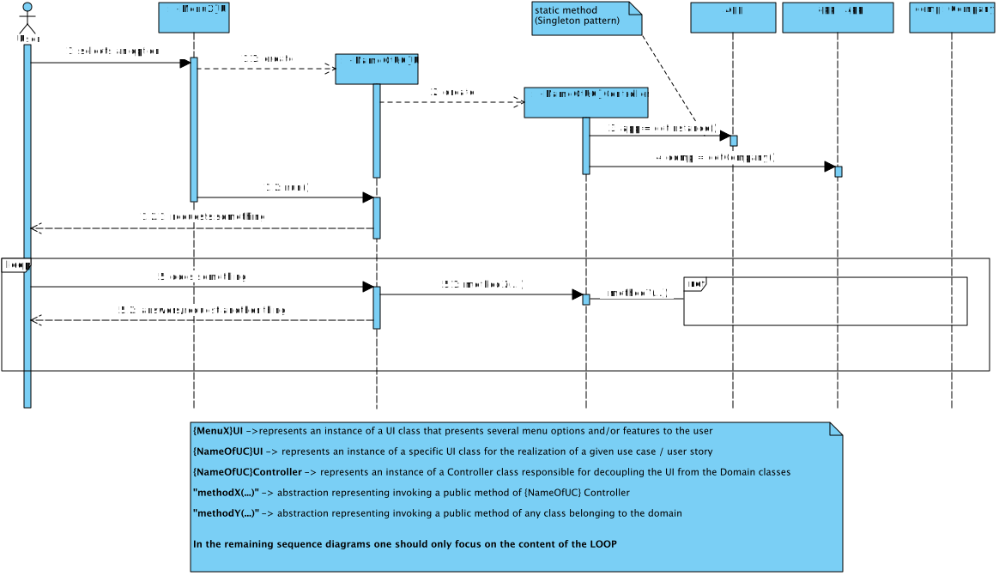
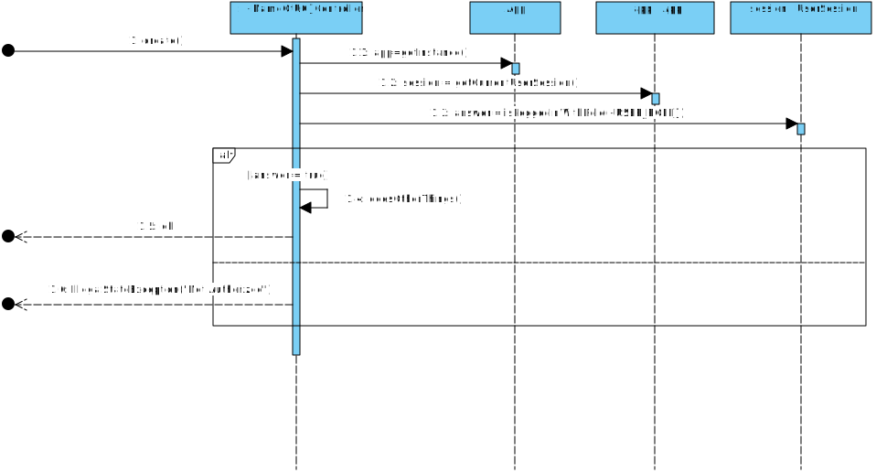

# README #

This repository contains didactic artifacts relevant to the integrative project to be developed during the second semester of the academic year of 2020-2021 in the [Degree in Informatics Engineering (LEI)](http://www.isep.ipp.pt/Course/Course/26) from [Instituto Superior de Engenharia do Porto (ISEP)](http://www.isep.ipp.pt).

In particular, it has:

* [The team members and task assignment during Sprints](docs/README.md)
* A template to capture and systematize evidence of applying properly the Software Development Process, namely regarding the activities of Engineering Requirements, OO Analysis and Design
* Source code available to students as a starting point
* General description of how the provided application works (and it is structured).

### Application Overview

The following sequence diagram graphically represents the intended flow for the application where there is a clear separation (decoupling) between the domain classes and the user interaction classes (_user interface_). This decoupling is performed by classes with the suffix _Controller_.

 

The execution of some functionalities by users must be preceded and verified by an authorization mechanism based on users' roles.
This verification can be carried out as follows:

