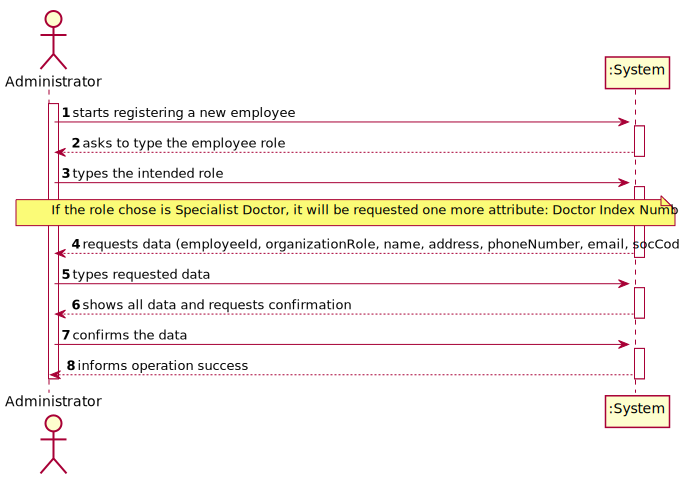
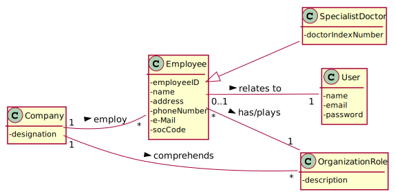
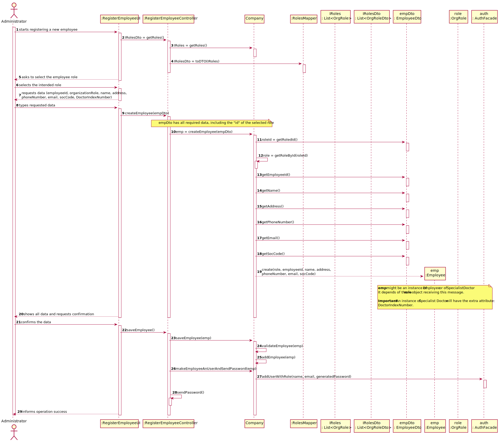
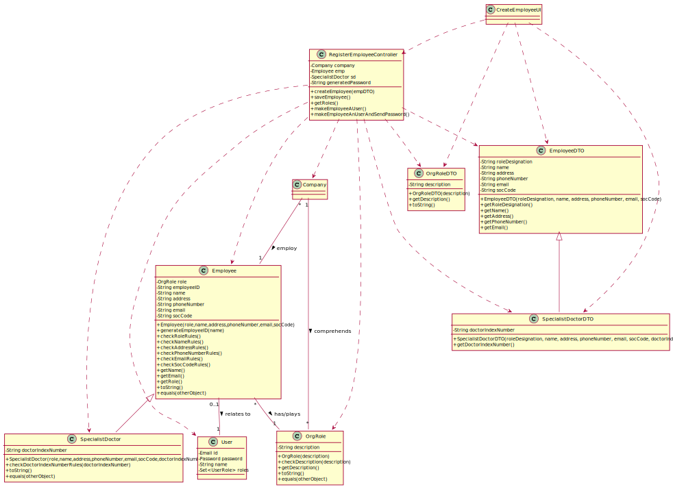

# US 7 - As an administrator, I want to register a new employee

## 1. Requirements Engineering

*In this section, it is suggested to capture the requirement description and specifications as provided by the client as well as any further clarification on it. It is also suggested to capture the requirements acceptance criteria and existing dependencies to other requirements. At last, identfy the involved input and output data and depicted an Actor-System interaction in order to fulfill the requirement.*

### 1.1. User Story Description

As an ***administrator***, I want to **register** a new **employee**

### 1.2. Customer Specifications and Clarifications 

**From the specifications document:**

**From the client clarifications:**

>Q: "Hello,
What kind of information does the company store about their employees and owned laboratories?
Are there common attributes between the roles below? If so, which ones? (i.e. employee ID, TIN, contact info, etc.)
Receptionist,Clinical Chemistry Technologist, Medical Lab Technician, Specialist Doctor, Lab Coordinator, Administrator"
>
>A: "All the roles that exist in the Many Labs company are characterized by the following attributes:  
Employee ID;  
Organization Role;  
Name;  
Address;  
Phone Number;  
E-Mail;  
Standard Occupational Classification (SOC) code.  
The Specialist Doctor has an additional attribute: Doctor Index Number."

>You can read the whole discussion [here](https://moodle.isep.ipp.pt/mod/forum/discuss.php?d=7123).

-

>Q: Relative to registering a new user, how should the system respond in the event of creating a new user with the same attributes of an already existing user?
>
>A: This should be treated as an error. A subset of the attributes of any client are unique.

>You can read the whole discussion [here](https://moodle.isep.ipp.pt/mod/forum/discuss.php?d=7482).

-

>Q: Besides the Acceptance Criteria ("each user must have a single role defined in the system"), are there other criterias we need to take into consideration?
>
>A: Please read the Project Requirements for Sprint B: "Each user must have a single role defined in the system. The "auth" component available on the repository must be reused (without modifications).". In my previous posts you can find other requirements that must be met in order to mark US7 as complete.
>
>Q: When creating a new employee, the attributes "Employee ID" and "Doctor Index Number", are implemented by the administrator or incremented by the system?
>
>A: Only the employee ID should be generated from the initials of the employee name and should include a number. The number has 5 digits and is increases automatically when a new employee is registered in the system. For instance, if the company has 20 employees and wants to register a specialist doctor having the name Ana Maria Santos Moura, then the the employee ID for this specialist doctor should be AMSM00021.

>You can read the whole discussion [here](https://moodle.isep.ipp.pt/mod/forum/discuss.php?d=7547).

-

>Q: Is the administrator an employee? If he/she is, who does him/her register?  
>
>A: Yes. An administrator should be registered when the application starts for first time.
The application can have more than one administrator.

>You can read the whole discussion [here](https://moodle.isep.ipp.pt/mod/forum/discuss.php?d=7666).

-

>Q: When the application is delivered , should it have default employees , ex:administrator,etc.. , or should be completely empty (without any user or employee).
>
>A: One Administrator must be registered before starting the application for the first time.
>
>Q: The apllication can add new employees but can it remove them , for example when one of them is fired ?
>
>A: For now I do not want such feature.
>
>Q: Should we vallidate if a new employee is the same as one that there is already inside the system ? Do we need to vallidate same atributes to check similarities ?
>
>A: Yes. Yes.

>You can read the whole discussion [here](https://moodle.isep.ipp.pt/mod/forum/discuss.php?d=7668).

-

>Q: Are there any other employee roles than the ones specified in the documents?
>
>A: No.
>
>Q: Do these roles have different contracts with ManyLabs (i.e. temporary contract, permanent contract, freelance, etc...)? If so, should this be registered in the system together with the employee role information?
>
>A: Many Labs is known for making only permanent full-time contracts.Therefore, there is no need to register this type of information.
>
>Q: For the role id and respective description should we use any specific format or type?
>
>A: From a previous answer: "All the roles that exist in the Many Labs company are characterized by the following attributes:
Employee ID; Organization Role; Name; Address; Phone Number; E-Mail; Standard Occupational Classification (SOC) code.

>You can read the whole discussion [here](https://moodle.isep.ipp.pt/mod/forum/discuss.php?d=7738).

-

>Q: How should we generate the employee ID? What type and length should it have?
>
>A: The employee ID should be generated from the initials of the employee name and should include a number. The number should have 5 digits and it increases automatically when a new employee is registered in the system. For instance, if the company has 20 employees and the administrator wants to register a specialist doctor with the name Ana Maria Santos Moura, then the the employee ID for this specialist doctor should be AMSM00021.

>You can read the whole discussion [here](https://moodle.isep.ipp.pt/mod/forum/discuss.php?d=7741).

-

>Q: Can an employee have more than a role?
> 
>A: Every user of the application has only one role.

>You can read the whole discussion [here](https://moodle.isep.ipp.pt/mod/forum/discuss.php?d=7755).

-

>Q: I read in a previous post that " The doctor Index Number is introduced by the administrator " , I searched in Goolge and i understood that is lenght is 6 digits . So i want to know if we need to do any validation .
>
>A: It is always a good practice to validate data introduced by the user. For now, it is not necessary to confirm that the code really exists.
>
>Q: I searched about the SOC number and is lenght is 4 digits . Having this in mind , i want to know if this number is introduced by the administrator or generated automatically and if there is any validation to do .
>
>A: It is introduced by the administrator.

>You can read the whole discussion [here](https://moodle.isep.ipp.pt/mod/forum/discuss.php?d=7854).

-

>Q: When registering a new employee should the administrator write or select his role
>
>A: The administrator should write the role when he is registering a new employee.
>
>Q: Assuming that the system should load with all know Roles for ManyLabs (Receptionist, Lab Technician, ...), should we guarantee the "typed" role match to one existent role or should we accept any "typed" role and register the new role in the system?
>
>A: The roles are typed but should be valid roles that exist (are known) in the system. How the system knows the roles should be decided by each team.

>You can read the whole discussion [here](https://moodle.isep.ipp.pt/mod/forum/discuss.php?d=7863).

-

>Q: Regarding the registration of a new employee, which is the organization role's format?
>
>A: Organization Role: a string with no more than 15 characters.

>You can read the whole discussion [here](https://moodle.isep.ipp.pt/mod/forum/discuss.php?d=7928).

-

>Q: Through all the information I have seen, "The Specialist Doctor has an additional attribute: Doctor Index Number". Since these specific role has an extra attribute, do you wish for there to be a new window where it asks for the Doctor Index Number if the employee role is a specialist doctor, or do you want to get all that information in a single window when creating a new employee?
> 
>A: Whenever the Administrator selects to create a Specialist Doctor, the application should ask for the Doctor Index Number.
> **Important: in sprints B and C, the client only wants a console user interface.**

>You can read the whole discussion [here](https://moodle.isep.ipp.pt/mod/forum/discuss.php?d=7944).

-

>Q: Is there any size limit to the employee's name?
>
>A: Employee Name: "a string with no more than 35 characters".
> 
>Q: Is there any validation that needs to be done on the employee's email format and size?
>
>A: The format of an e-mail address is well known. Attribute validation is always a good practice.

>You can read the whole discussion [here](https://moodle.isep.ipp.pt/mod/forum/discuss.php?d=7973).

### 1.3. Acceptance Criteria

* **AC1:**  "Each user must have a single role defined in the system."
* **AC2:**  "The "auth" component available on the repository must be reused (without modifications)"
* **AC3:**  "The employee ID should be generated from the initials of the employee name and should include a number. 
  The number has 5 digits and is increases automatically when a new employee is registered in the system."
* **AC4:**  "The administrator should write the role when he is registering a new employee."
* **AC5:**  "The roles are typed but should be valid roles that exist (are known) in the system."
* **AC6:**  "Organization Role: a string with no more than 15 characters."
* **AC7:**  "Whenever the Administrator selects to create a Specialist Doctor, the application should ask for the Doctor Index Number."
* **AC8:**  "Employee Name: a string with no more than 35 characters."
* **AC9:**  Phone Number must have a 11-digit number.
* **AC10:** Email address should contain "@".

### 1.4. Found out Dependencies

*Identify here any found out dependency to other US and/or requirements.*

### 1.5 Input and Output Data

* Typed data:
    * Employee ID
    * Organization Role
    * Name
    * Adress
    * Phone Number
    * E-mail
    * SOC code
    * Doctor Index Number
* Selected data:

### 1.6. System Sequence Diagram (SSD)



### 1.7 Other Relevant Remarks

It is relevant to mention that in this case there are one special case, if the role is Specialist Doctor.

## 2. OO Analysis

### 2.1. Relevant Domain Model Excerpt



### 2.2. Other Remarks

n/a


## 3. Design - User Story Realization 

### 3.1. Rationale

**The rationale grounds on the SSD interactions and the identified input/output data.**

| Interaction ID | Question: Which class is responsible for... | Answer  | Justification (with patterns)  |
|:-------------  |:--------------------- |:------------|:---------------------------- |
| Step 1: starts registering a new employee  		 |	...interacting with the actor?						 | RegisterEmployeeUI            | Pure Fabrication: there is no reason to assign this responsibility to any existing class in the Domain Model.                              |
|  		 |	...coordinating the US?					 | RegisterEmployeeController            | Pure Fabrication: it refers to the Controller. there is no reason to assign this responsibility to any existing class in the Domain Model.                           |
| 		 |	...instantianting a new Employee?						 | Company            | Creator (Rule 1): in the DM, Company employ Employee.                          |
| Step 2: asks to type the employee role  		 |	...knowing the available Organization Roles?						 | Company            |   IE: in the DM, Company comprehends Organization Roles, therefore knows the available roles.                           |
| 		 |	...validating the typed role?						 | Company            |   IE: in the DM, Company comprehends Organization Roles, therefore knows the available roles and is able to validate them.                                 |
| Step 3: types the intended role 		 |	...saving the typed role?						 |  Employee           |    IE: object created in Step 1 has/plays a Organization Role.                      |
| Step 4: requests data  		 |	...asking the user for this data?					 |   RegisterEmployeeUI          |   IE: responsible for user interaction.                           |
| Step 5: types requested data   		 |	...validating the data locally (e.g.: mandatory vs. non-mandatory data)?						 |    Employee         |    IE: knows its own data.                          |
| 	 |	...saving the inputted data?						 |    Employee         |    IE: The object created in Step 1 has its own data.               |
| Step 6: shows all data and requests confirmation  		 |	...validating the data globally (e.g.: duplicated)?						 |  Company           |  IE: knows all the Employee objects.                            |              
| Step 7: confirms the data 		 |	...saving the created Employee?						 | Company            |  IE: saves all the ClinicalAnalysisLaboratory objects.                            |
| 		 |	...making the created Employee a user of the system?						 | Company            |  IE: has access to the users data through the AuthFacade.                            |
| Step 8: informs operation success	 |	...informing operation success?						 | RegisterEmployeeUI            |   	IE: responsible for user interaction                           |              


### Systematization ##

According to the taken rationale, the conceptual classes promoted to software classes are: 

 * Employee
 * Specialist Doctor
 * Company  
 * OrgRole

Other software classes (i.e. Pure Fabrication) identified: 
 * RegisterEmployeeUI  
 * RegisterEmployeeController
 * SpecialistDoctorDTO
 * EmployeeDTO
 * OrgRoleDTO

## 3.2. Sequence Diagram (SD)



## 3.3. Class Diagram (CD)



# 4. Tests

## Class: EmployeeTest  

**For each attribute** of the Employee, I checked **it is not possible for them to be blank**.  
This encompasses three situations:

* Null
* Empty
* Whitespace

**Test 1:** Check that it is not possible to create an instance of the Employee class with a null name.  
```
@Test(expected = IllegalArgumentException.class)
    public void ensureAC8NameNotNull() {
        Employee instance = new Employee(r1, null, "Morada",
                "1234567890","joana@gmail.com","1234");
    }
```

**Test 2:** Check that it is not possible to create an instance of the Employee class with an empty name. 
```
@Test(expected = IllegalArgumentException.class)
    public void ensureAC8NameNotEmpty() {
        Employee instance = new Employee(r1, "", "Morada",
                "1234567890","joana@gmail.com","1234");
    }
```  

**Test 3:** Check that it is not possible to create an instance of the Employee with a whitespace name.  
```
@Test(expected = IllegalArgumentException.class)
    public void ensureAC8NameNotWhiteSpace() {
        Employee instance = new Employee(r1, " ", "Morada",
                "1234567890","joana@gmail.com","1234");
    }
```

**For each attribute** of the Employee, I checked **they have the right length**.  

**Test 4:** Check that it is not possible to create an instance of the Empoyee a name with more than 35 characters.
```
@Test(expected = IllegalArgumentException.class)
    public void ensureAC8NameHasTheRightLength() {
        Employee instance = new Employee(r1, "abcdefghijklmnopqrstvuxzasdfghjklqejfjgkgnkfgnfkngkfngknkfn",
                "Morada", "1234567890","joana@gmail.com","1234");  
    }
```

**For each necessary attribute** of the Clinical Analysis Laboratory, I checked they **only contain the allowed characters.**  

**Test 5:** Check that it is not possible to create an instance of the Employee with a phone number that doesn't only contain digits.
```
@Test(expected = IllegalArgumentException.class)
    public void ensureAC9PhoneNumberHasOnlyDigits() {
        Employee instance = new Employee(r1, "employee", "Morada",
                "12a3456789","joana@gmail.com","1234");
    }
```

**Test 6:** Check that it is not possible to create an instance of the Employee with an e-mail that doesn't have the right format.  
```
@Test(expected = IllegalArgumentException.class)
    public void ensureAC10EmailHasTheRightFormat() {
        Employee instance = new Employee(r1, "emp", "Morada",
                "1234567890","analamas","1234");
    }
```

Finally, I checked if the **Equals method was functioning properly**.

In order to do that, I had an instance of Employee which would be compared to another instance of that class with every attribute the same **except one**.  
Following next will be one of this tests.

**Test 8**: Check that two Employees are different only because they have a different Soc Code.
```
@Test
    public void ensureNotEqualsObjectsWithDifferentSocCode() {
        Employee object = new Employee(r1,
                "Manuel","Lisboa","9184137881","manuel@gmail.com", "1234");

        Employee objectOnlyWithDifferentEmployeeID = new Employee(r1,
                "Manuel","Lisboa","9184137881","manuel@gmail.com", "1233");

        boolean resultDifferentAddresses = object.equals(objectOnlyWithDifferentEmployeeID);

        Assert.assertFalse(resultDifferentAddresses);
    }
```

I also verified two Employees are **not** equal either if they are from different classes or if one of them is null.

**Test 9**: Check that two objects aren't equal because they are from different classes.

**Test 10**: Check that an Employee isn't equal because it is being compared to a null object. 

## Class: OrgRoleTest

**Test 1:** Check it is not possible to create an instance of organization role with null or empty string values

**For example:**

    @Test(expected = IllegalArgumentException.class)
    public void ensureDescriptionNotNull(){
        OrgRole instance = new OrgRole(null);
    }

**Test 2:** Check it is not possible to create an organization role not following the current criterias.

> * **AC6:**  "Organization Role: a string with no more than 15 characters."

**For example:**

    @Test(expected = IllegalArgumentException.class)
    public void ensureDescriptionNoLongerThan15Chars(){
        OrgRole instance = new OrgRole("The Person Who Talks To The Clients");
    }

**Test 3:** Check if equals method is returning correct values for each equality

**Namely:**
>Same object: true
>Different object and same attributes: true
>Null: false
>Different object and different attributes: false

**For example:**

    @Test
    public void equalsTrue(){
        OrgRole role1 = new OrgRole("Recepcionist");
        OrgRole role2 = new OrgRole("Recepcionist");
        boolean result = role1.equals(role2);
        Assert.assertTrue(result);
    }

## Class: SpecialistDoctor

Before starting the specialist doctor tests, it's useful to create something like this, since the specialist doctors need to be assigned to an organization role, which are known by the company:

    private Company company;
    private OrgRole r1;

    @Before
    public void setUp(){
        company = new Company("Many Labs");
        r1 = new OrgRole("Spec Doctor");
    }

Tests 1 to 29 follow this model:

    @Test(expected = IllegalArgumentException.class)
        public void testName(){
        SpecialistDoctor sd1 = new SpecialistDoctor(specialistDoctorRoleToBeTested, specialistDoctorNameToBeTested, specialistDoctorAddressToBeTested, specialistDoctorPhoneNumberToBeTested, specialistDoctorEmailToBeTested, specialistDoctorSOCCodeToBeTested, specialistDoctorDoctorIndexNumberToBeTested)
    }

The only changes are the value of the sd1 attributes.

**Test 1:** Check that it is not possible to create an instance of the SpecialistDoctor class with null values.

**Test 2:** Check that it is not possible to create an instance of the SpecialistDoctor class with null role.

**Test 3:** Check that it is not possible to create an instance of the SpecialistDoctor class with null name.

**Test 4:** Check that it is not possible to create an instance of the SpecialistDoctor class with null address.

**Test 5:** Check that it is not possible to create an instance of the SpecialistDoctor class with null phone number.

**Test 6:** Check that it is not possible to create an instance of the SpecialistDoctor class with null email.

**Test 7:** Check that it is not possible to create an instance of the SpecialistDoctor class with null SOC code.

**Test 8:** Check that it is not possible to create an instance of the SpecialistDoctor class with null doctor index number.

**Test 9:** Check that it is not possible to create an instance of the SpecialistDoctor class with empty name.

**Test 10:** Check that it is not possible to create an instance of the SpecialistDoctor class with empty address.

**Test 11:** Check that it is not possible to create an instance of the SpecialistDoctor class with empty phone number.

**Test 12:** Check that it is not possible to create an instance of the SpecialistDoctor class with empty email.

**Test 13:** Check that it is not possible to create an instance of the SpecialistDoctor class with emmpty SOC code.

**Test 14:** Check that it is not possible to create an instance of the SpecialistDoctor class with empty doctor index number.

**Test 15:** Check that it is not possible to create an instance of the SpecialistDoctor class with name full of spaces.

**Test 16:** Check that it is not possible to create an instance of the SpecialistDoctor class with address full of spaces.

**Test 17:** Check that it is not possible to create an instance of the SpecialistDoctor class with phone number full of spaces.

**Test 18:** Check that it is not possible to create an instance of the SpecialistDoctor class with email full of spaces.

**Test 19:** Check that it is not possible to create an instance of the SpecialistDoctor class with SOC code full of spaces.

**Test 20:** Check that it is not possible to create an instance of the SpecialistDoctor class with doctor index number full of spaces.

**Test 21:** Check that it is not possible to create an instance of the SpecialistDoctor class with phone number with other characters beside number.

**Test 22:** Check that it is not possible to create an instance of the SpecialistDoctor class with email with invalid format.

**Test 23:** Check that it is not possible to create an instance of the SpecialistDoctor class with SOC code with other characters beside numbers.

**Test 24:** Check that it is not possible to create an instance of the SpecialistDoctor class with name with more than 35 characters.

**Test 25:** Check that it is not possible to create an instance of the SpecialistDoctor class with address with more than 30 characters.

**Test 26:** Check that it is not possible to create an instance of the SpecialistDoctor class with phone number with less than 10 characters.

**Test 27:** Check that it is not possible to create an instance of the SpecialistDoctor class with phone number with more than 10 characters.

**Test 28:** Check that it is not possible to create an instance of the SpecialistDoctor class with SOC code with less than 4 characters.

**Test 29:** Check that it is not possible to create an instance of the SpecialistDoctor class with SOC code with more than 4 characters.

Tests 30 to 31 follow this model:

    @Test
    public void testName(){
	SpecialistDoctor sd1 = new SpecialistDoctor(specialistDoctorRoleToBeTested1, specialistDoctorNameToBeTested1, specialistDoctorAddressToBeTested1, specialistDoctorPhoneNumberToBeTested1, specialistDoctorEmailToBeTested1, specialistDoctorSOCCodeToBeTested1, specialistDoctorDoctorIndexNumberToBeTested1)
	SpecialistDoctor sd2 = new SpecialistDoctor(specialistDoctorRoleToBeTested2, specialistDoctorNameToBeTested2, specialistDoctorAddressToBeTested2, specialistDoctorPhoneNumberToBeTested2, specialistDoctorEmailToBeTested2, specialistDoctorSOCCodeToBeTested2, specialistDoctorDoctorIndexNumberToBeTested2)
	boolean result = sd1.equals(sd22);
	Assert.assertExpectedResult(result);
    }

The only changes are the testName, the attributes of sd1 and sd2, and the ExpectedResult (True or False).

**Test 30:** Check that the equals method returns true if the two compares specialist doctors have equal objects.

**Test 31:** Check that the equals method returns false if the two compared specialist doctors have different objects.

Tests 32 to 33 follow this mode:

    @Test
    public void testName(){
	SpecialistDoctor sd1 = new SpecialistDoctor(specialistDoctorRoleToBeTested1, specialistDoctorNameToBeTested1, specialistDoctorAddressToBeTested1, specialistDoctorPhoneNumberToBeTested1, specialistDoctorEmailToBeTested1, specialistDoctorSOCCodeToBeTested1, specialistDoctorDoctorIndexNumberToBeTested1)
	boolean result = sd1.equals(x);
	Assert.assertExpectedResult(result);
    }

The only changes are the testName, the x object (which is sd1 for test 32 and null for test 33), and the ExpectedResult (True or False).

**Test 32:** Check that the equals method returns true when the two compared specialist doctors are the same.

**Test 33:** Check that the equals method returns false if one of the two compared specialist doctors is null.


### Class: CompanyTest  

**Test 1**: Check that the Employee created successfully will be user of the system.  

```
@Test
    public void makeEmployeeAnUserWithNewRoleToTheSystem() {
        Employee obj = company.createEmployee(new EmployeeDTO("Med Lab Tech",
                "Afonso","Lisboa","1234567890","afonso@gmail.com",
                "1234"));
        Employee obj2 = company.createEmployee(new EmployeeDTO("Med Lab Tech",
                "Afonso","Lisboa","0987654321","afonso@gmail.com",
                "1234"));

        boolean save = company.makeEmployeeAUser(obj, "1234567890");
        Assert.assertTrue(save);
    }
```

An analogous test was made to make sure the Employee could also be created with an already **existent role** in the system.  

**To save an Employee**, tests were made to make sure there aren't:  

 * Employees with the same e-mail  
 * Null Employees  
 * Repeated Employees

**Test 2**: Check that an Employee is created successfuly.  

```
@Test
    public void createEmployee() {

        Employee expObj = new Employee(r2,
                "Afonso","Lisboa","1234567890","afonso@gmail.com",
                "1234");

        EmployeeDTO empDTO = new EmployeeDTO("Med Lab Tech",
                "Afonso","Lisboa","1234567890","afonso@gmail.com",
                "1234");

        Employee obj = company.createEmployee(empDTO);

        Assert.assertEquals(expObj, obj);
    }
```

An analagous test was made for the creation of a **Specialist Doctor**.

# 5. Construction (Implementation)

## Class RegisterEmployeeController  

```
public boolean createEmployee(EmployeeDTO empDTO) {
        if (empDTO.getRoleDesignation().equalsIgnoreCase(Constants.ROLE_SPECIALIST_DOCTOR))
            this.emp = this.company.createSpecialistDoctor((SpecialistDoctorDTO) empDTO);
        else
            this.emp = this.company.createEmployee(empDTO);
        return this.company.validateEmployee(emp);
    }

    public boolean saveEmployee(){
        return this.company.saveEmployee(emp);
    }

    public List<OrgRoleDTO> getRoles() {
        List<OrgRole> roles = this.company.getRoles();
        OrgRoleMapper mapper = new OrgRoleMapper();
        return mapper.toDTO(roles);

    }

    public boolean makeEmployeeAUser(){
        this.generatedPassword = PasswordUtils.generateRandomPassword();
        if(this.generatedPassword != null)
            return this.company.makeEmployeeAUser(emp, generatedPassword);
        return false;
    }

    public boolean makeEmployeeAnUserAndSendPassword() throws IOException {
        if(!makeEmployeeAUser())
            return false;
        return PasswordUtils.writePassword(generatedPassword, emp.getEmail());
    }
```

## Class Company  

```
public boolean createEmployee(EmployeeDTO empDTO) {
        if (empDTO.getRoleDesignation().equalsIgnoreCase(Constants.ROLE_SPECIALIST_DOCTOR))
            this.emp = this.company.createSpecialistDoctor((SpecialistDoctorDTO) empDTO);
        else
            this.emp = this.company.createEmployee(empDTO);
        return this.company.validateEmployee(emp);
    }

    public boolean saveEmployee(){
        return this.company.saveEmployee(emp);
    }
    
    public boolean validateEmployee(Employee emp) {
        if(emp == null)
            return false;
        return !this.empList.contains(emp);
    }
    
    public boolean addUserRole(Employee emp) {
        return this.getAuthFacade().addUserRole(emp.getRole().getDescription(), emp.getRole().getDescription());
    }
    
    public boolean makeEmployeeAUser(Employee emp, String generatedPassword){
        boolean success = this.authFacade.addUserWithRole(emp.getName(), emp.getEmail(), generatedPassword, emp.getRole().getDescription());
        if(!success){
            addUserRole(emp);
            return this.authFacade.addUserWithRole(emp.getName(), emp.getEmail(), generatedPassword, emp.getRole().getDescription());
        }
        return success;
    }
    
    public List<OrgRole> getRoles() {
        return new ArrayList<>(roles);
    }

    /**
     * Get Organization Role according to the its description
     * @param roleDescription
     * @return Organization Role reference
     */
    private OrgRole getRoleByDescription(String roleDescription) {
        for (OrgRole role : roles) {
            if(role.getDescription().equalsIgnoreCase(roleDescription)){
                return role;
            }
        }
        throw new UnsupportedOperationException("Organization Role not found with given description: " + roleDescription);
    }
```


# 6. Integration and Demo

 * To create an Employee, it is necessary to know the roles available in the system.  
 * Therefore, in order to reduce coupling, it was created a OrgRoleDto.    
 * Employee also has many arguments passing through layers, therefore a DTO could make the maintenance easier.  
 * The password for the user is generated and sent (written in a file) by an method in PasswordUtils since it is
not a responsability of any of domain classes to generate a password or send out data. Respecting Pure Fabrication.
Also being reused in US3.
 * The roles are being added through bootstrap.   


# 7. Observations

The Company class is getting too much responsability assigned to it. Therefore, creating an EmployeeStore will be taken into consideration in the future to reduce coupling.


