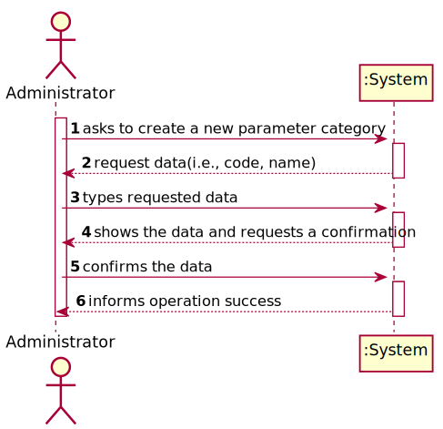
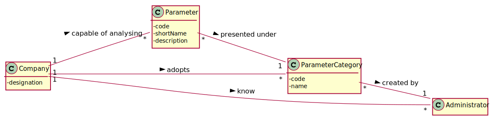
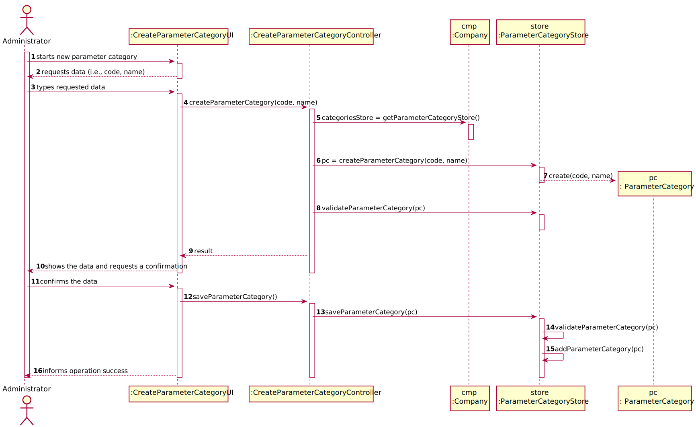
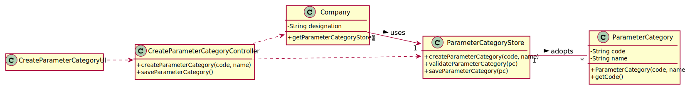

# US 11 - to specify a new parameter category

## 1. Requirements Engineering


### 1.1. User Story Description


As an administrator, I want to specify a new parameter category.


### 1.2. Customer Specifications and Clarifications 


**From the specifications document:**

> “Blood tests are frequently characterized by measuring several parameters which for presentation/reporting purposes are organized by categories. For example, parameters such as the number of Red Blood Cells (RBC), White Blood Cells (RBC) and Platelets (PLT) are usually presented under the blood count (Hemogram) category.”


> “Regardless, such tests rely on measuring one or more parameters that can be grouped/organized by categories.”


**From the client clarifications:**

> **Question:** "What are the information related to a Parameter Category?"
> 
> **Answer:** "Each category has a name and a unique code. There are no subcategories."

>Read the whole answer [here](https://moodle.isep.ipp.pt/mod/forum/discuss.php?d=7318#p9859).

> **Question:** "You have said in a previous post that each category has a name and an unique code. What specifies each of those? How many characters composes a name and a code for a test type category, for example?"
> 
> **Answer:** "The format of the attributes of one category are:
               Name: is a string with no more than 10 characters;
               Code: are five alphanumeric characters. The code is unique and is not automatically generated.
               Both attributes are mandatory.
               There are no subcategories."

>Read the whole answer [here](https://moodle.isep.ipp.pt/mod/forum/discuss.php?d=7898).


### 1.3. Acceptance Criteria


* **AC1:** Code is mandatory, unique and must have 5 alphanumeric characters.
* **AC2:** Name is a string with at maximum 10 characters.


### 1.4. Found out Dependencies


* No dependencies were found.


### 1.5 Input and Output Data


**Input Data:**

* Typed data:
	* code
	* name
	
* Selected data:
	* (none)


**Output Data:**

* (In)Sucess of the operation

### 1.6. System Sequence Diagram (SSD)





### 1.7 Other Relevant Remarks

This US will be held mostly in the beginning of the business, but occasionally during it as well, probably when there's a necessity for creating a new test type.


## 2. OO Analysis

### 2.1. Relevant Domain Model Excerpt 





### 2.2. Other Remarks

n/a


## 3. Design - User Story Realization 

### 3.1. Rationale

**The rationale grounds on the SSD interactions and the identified input/output data.**

| Interaction ID | Question: Which class is responsible for... | Answer  | Justification (with patterns)  |
|:-------------  |:--------------------- |:------------|:---------------------------- |
| Step 1: asks to create a new parameter category |	... interacting with the actor? | CreateParameterCategoryUI | Pure Fabrication: there is no reason to assign this responsibility to any existing class in the Domain Model. |
|       	   	 |	... coordinating the US? | CreateParameterCategoryController | Controller |
|       	   	 |	... instantiating a new Parameter Category? | Administrator | Creator: in the DM Company adopts a Parameter Category. |
| Step 2: request data(i.e., code, name) |	...asking the user for this data? | CreateParameterCategoryUI | IE: Responsable for user interaction. |
| Step 3: types requested data | ...validating the input data locally? | ParameterCategory | IE: Knows its own data. |
|                | ...saving the input data? | ParameterCategory | IE: It has its own data. |
| Step 4: shows the data and requests a confirmation | ...showing the data and requesting a confirmation? | CreateParameterCategoryUI | IE: responsible for user interaction |
| Step 5: confirms the data |	... validating the data globally (e.g.: duplicated)? | ParameterCategoryStore | IE: knows all the ParameterCategory objects |
|       	   	 |	...saving the created parameter category? | ParameterCategoryStore | IE: adopts/records all the ParameterCategory objects |
| Step 6: informs operation success |	... informing operation success? | CreateParameterCategoryUI | IE: responsible for user interaction |


### Systematization 

According to the taken rationale, the conceptual classes promoted to software classes are: 

 * Administrator
 * Company
 * ParameterCategory

Other software classes (i.e. Pure Fabrication) identified: 

 * ParameterCategoryStore
 * CreateParameterCategoryUI  
 * CreateParameterCategoryController

## 3.2. Sequence Diagram (SD)





## 3.3. Class Diagram (CD)





# 4. Tests

**Test 1:** Check that it is not possible to create an instance of the Parameter category with null values. 

	 @Test(expected = IllegalArgumentException.class)
     public void ensureNullArgsNotAllowed() {
        System.out.println("ensureNullArgsNotAllowed");
        ParameterCategory pc = new ParameterCategory(null, null);
     }
	
**Test 2:** Check if it's not possible to create a Parameter category with empty field for each attribute.
**For Example:**

    @Test(expected = IllegalArgumentException.class)
    public void ensureCodeIsNotEmpty() {
        System.out.println("ensureCodeIsNotEmpty");

        ParameterCategory pc = new ParameterCategory("", "TESTE");
    }
    
**Test 3:** Check if it is not possible to create a Client with each attribute's lenght not following the specified criteria.
> **AC1:** Code is mandatory, unique and must have 5 alphanumeric characters.
>
> **AC2:** Name is a string with at maximum 10 characters.

*Example (Tests of right and left limits):*

    @Test(expected = IllegalArgumentException.class)
    public void ensureCodeIsNotMoreThan5Chars() {
       System.out.println("ensureCodeIsNotMoreThan5Chars");

       ParameterCategory pc = new ParameterCategory("MORETHEN5", "TESTE");
    }

    @Test(expected = IllegalArgumentException.class)
    public void ensureCodeIsNotLessThan5Chars() {
       System.out.println("ensureCodeIsNotLessThan5Chars");

       ParameterCategory pc = new ParameterCategory("LESS", "TESTE");
    }
 
 **Test 4:** Check if it is not possible to create a parameter category with code having non alphanumeric characteres
 
 *Namely aceptance criteria 1: Code is mandatory, unique and must have 5 alphanumeric characters.*
 
    @Test(expected = IllegalArgumentException.class)
    public void ensureCodeIsAlphanumeric() {
        System.out.println("ensureCodeIsAlphanumeric");
    
        ParameterCategory pc = new ParameterCategory("@!$%#", "TESTE");
    } 

**Test 5:** Check if it equals method is returning true for same code and false for other similarities

 *For Example:*
 
    @Test
    public void equalsTrue(){
        ParameterCategory pc1 = new ParameterCategory("HEM02", "Hemogram");
        ParameterCategory pc2 = new ParameterCategory("HEM02", "Covid19");
        boolean result = pc1.equals(pc2);
        Assert.assertTrue(result);
    }
##Parameter category Store

**Test 6:** Check if it is possible to create and save an parameter category in the store successfully

 *For Example:*
 
    @Test
    public void createParameterCategory() {
        ParameterCategory expObject = new ParameterCategory("code1","hemogram");
        ParameterCategory obj = parameterCategoryStore.createParameterCategory("code1", "hemogram");

        Assert.assertEquals(expObject, obj);

    }

    @Test
    public void ensureDifferentParameterCategoriesAreSaved() {
        ParameterCategory pc1 = new ParameterCategory("code1", "hemogram");
        parameterCategoryStore.saveParameterCategory(pc1);
        ParameterCategory pc2 = new ParameterCategory("code2","categorie2");

        boolean result = parameterCategoryStore.saveParameterCategory(pc2);

        Assert.assertTrue(result);
    }

**Test 7:** Check if it is not possible to save a repeated or null parameter category

 *For Example:*
 
     @Test
     public void ensureNullParameterCategoryIsNotSaved() {
    
         boolean result = parameterCategoryStore.saveParameterCategory(null);
    
         Assert.assertFalse(result);
     }
     
**Test 8:** Check if it is not possible to get an inexistent parameter category

 *For Example:*

     @Test(expected = UnsupportedOperationException.class)
    public void ensureGetWithInvalidParameterCategoryCodeThrowsException() {
        ParameterCategory pc1 = parameterCategoryStore.createParameterCategory("code1","categorie1");
        ParameterCategory pc2 = parameterCategoryStore.createParameterCategory("code2","categorie2");
        parameterCategoryStore.saveParameterCategory(pc1);
        parameterCategoryStore.saveParameterCategory(pc2);
        List<String> codeList = new ArrayList<String>();
        codeList.add("code1");
        codeList.add("codee");

        parameterCategoryStore.getCategoriesByCode(codeList);
    }


# 5. Construction (Implementation)

## Class CreateParameterCategoryController  
```
public boolean createParameterCategory(String code, String name) {
        ParameterCategoryStore store = this.company.getParameterCategoryStore();
        this.pc = store.createParameterCategory(code, name);
        return store.validateParameterCategory(pc);
    }

    public boolean saveParameterCategory() {
        ParameterCategoryStore store = this.company.getParameterCategoryStore();
        return store.saveParameterCategory(pc);
    }
```

## Class ParameterCategoryStore
```
public ParameterCategory createParameterCategory(String code, String name){
        return new ParameterCategory(code, name);
    }

   
    public boolean validateParameterCategory(ParameterCategory pc){
        if (pc == null)
            return false;
        return !this.parameterCategoriesList.contains(pc);
    }

   
    public boolean saveParameterCategory(ParameterCategory pc){
        if (!validateParameterCategory(pc))
            return false;
        return this.parameterCategoriesList.add(pc);
    }

    
    public List<ParameterCategory> getCategoriesByCode(List<String> parameterCategoryCodes) {
        List<ParameterCategory> selectedCategories = new ArrayList<>();
        for (String item : parameterCategoryCodes) {
            selectedCategories.add(getCategoryByCode(item));
        }
        return selectedCategories;
    }

    
    public ParameterCategory getCategoryByCode(String code) {
        for (ParameterCategory pc : parameterCategoriesList) {
            if(pc.getCode().equalsIgnoreCase(code)){
                return pc;
            }
        }
        throw new UnsupportedOperationException("Parameter Category not found!");
    }
```

# 6. Integration and Demo 


To reduce the responsabilities assigned to the Company, it was created a ParameterCategoryStore in order to reduce coupling.


# 7. Observations

No relevant observations.


