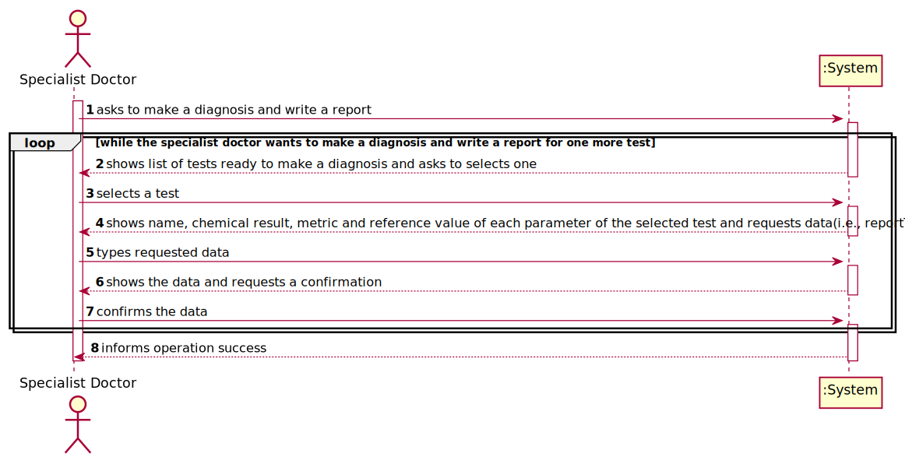
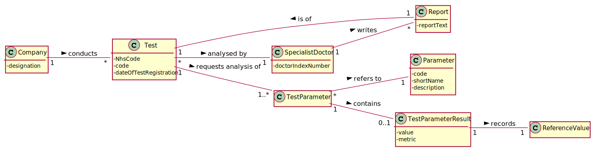
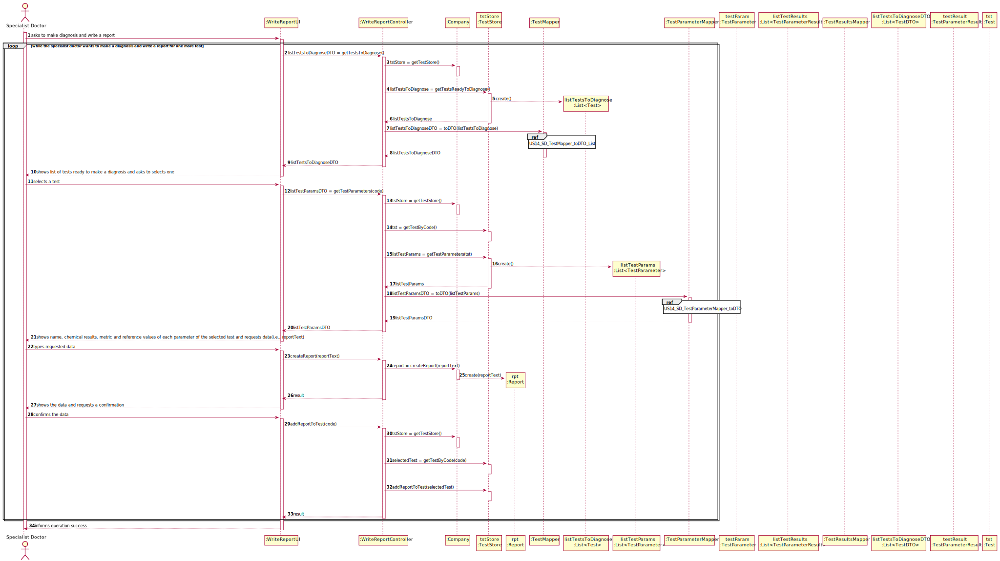
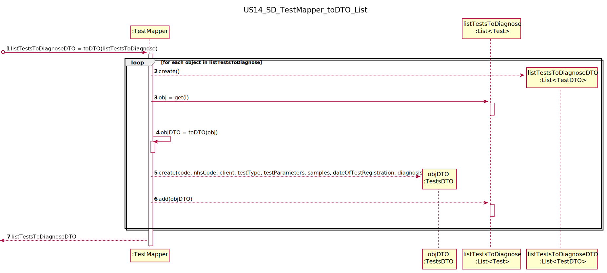
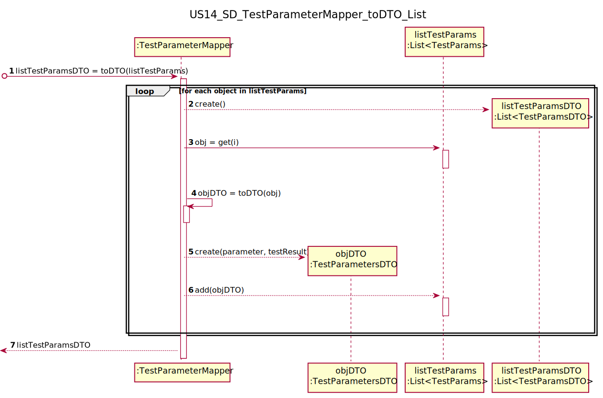
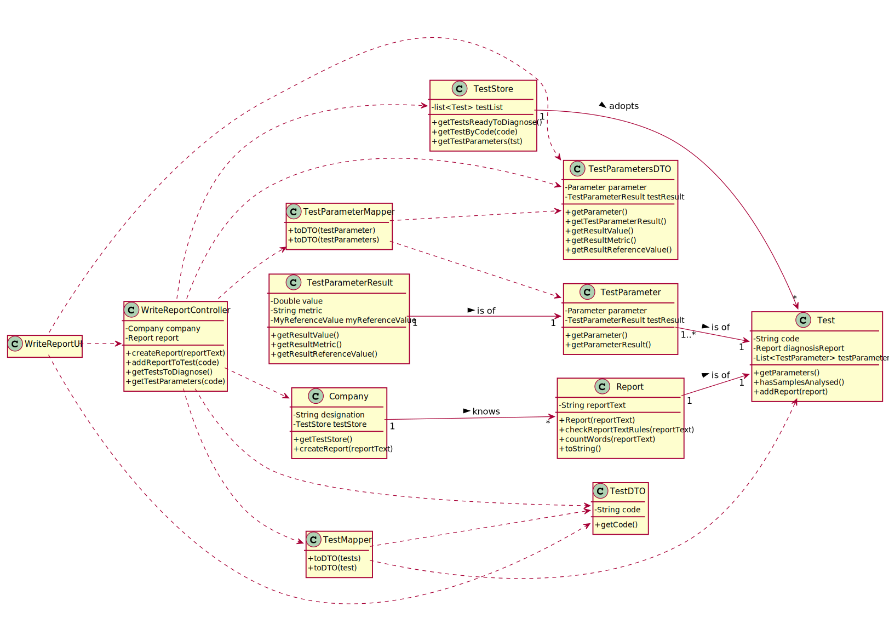
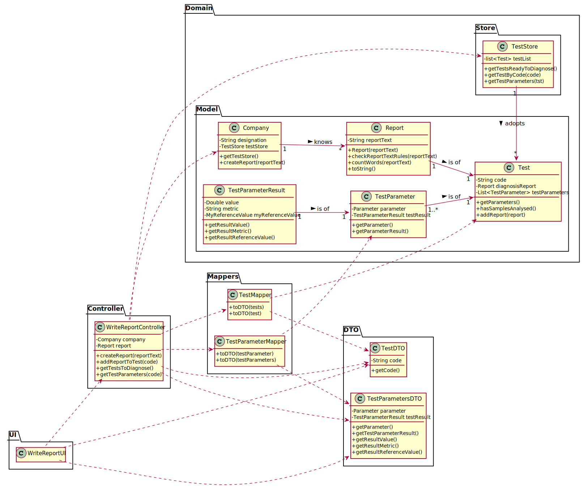
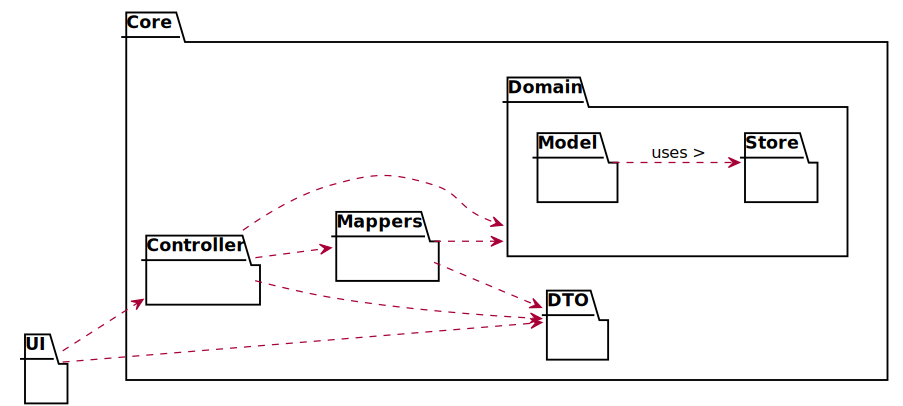
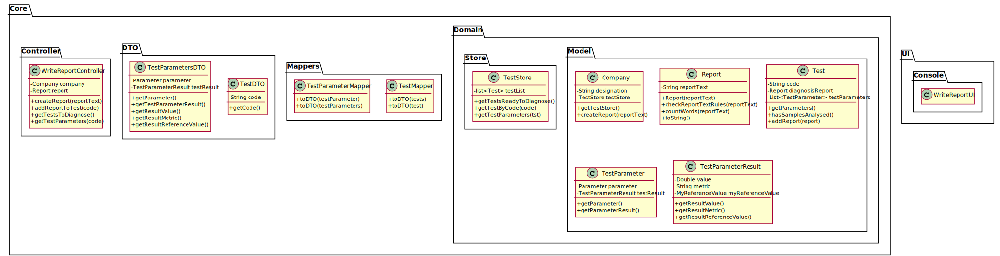

# US 14 - to make a diagnosis and write a report for a given test

## 1. Requirements Engineering

### 1.1. User Story Description

As a specialist doctor, I intend to make the diagnosis and write a report for a given test.

### 1.2. Customer Specifications and Clarifications

**From the specifications document:**

> "At the company's headquarters, the clinical chemistry technologist receives the samples (delivered
by a courier) and performs the chemical analysis, recording the results in the software application.
After completing the chemical analysis, the results of all chemical analyses are analysed by a
specialist doctor who makes a diagnosis and writes a report that afterwards will be delivered to the
client."

> "To facilitate and simplify the validation work performed by the specialist doctor, the application
uses an external module that is responsible for doing an automatic validation using test reference
values."
 

> "After the specialist doctor has completed the diagnosis, the results of the clinical analyses and the
report become available in the system and must be validated by the laboratory coordinator."

**From the client clarifications:**

> **Question:** Regarding the tests that the Specialist Doctor can write a report about. Should the SD chose from a list of tests? and Should him only receive a list of test that have completed all the previous steps?
>
> **Answer:** The system shows all tests ready (that have completed all the previous steps) to make the diagnosis, and the Specialist Doctor selects one test. Then, the Specialist Doctor writes the report for the selected test.

>Read the whole answer [here](https://moodle.isep.ipp.pt/mod/forum/discuss.php?d=8250#p10889).

-

> **Question:** Is there a limit of characters for the report, and the diagnosis that will be made by the Specialist Doctor?
>
> **Answer:** Yes, at most 400 words.

>Read the whole answer [here](https://moodle.isep.ipp.pt/mod/forum/discuss.php?d=8182#p10891).

-

> **Question:** What characterizes a diagnosis? What it needs to have in it to be a valid diagnosis?
> 
> **Answer:** The report contains the diagnosis. The report is free text and should have no more than 400 words.

>Read the whole answer [here](https://moodle.isep.ipp.pt/mod/forum/discuss.php?d=8292#p10897).

-

> **Question:** Can the Specialist Doctor edit a report once it has already been written? If yes, in what occasion should he be able to edit? Can he edit after the Laboratory Coordinator has already approved the report?
> 
> **Answer:** No. No.

>Read the whole answer [here](https://moodle.isep.ipp.pt/mod/forum/discuss.php?d=8268#p10898).

-

> **Question:** Once the specialist doctor decides to write the report for a given test, should the results of the chemical analysis and the reference values be presented on the screen? If not, how should the specialist doctor access the data related to the diagnosis he needs to make?
> 
> **Answer:** After selecting a test (to make the diagnosis/report) the results of the chemical analysis and the reference values should be presented on the screen. Then the Specialist Doctor should write the report.

>Read the whole answer [here](https://moodle.isep.ipp.pt/mod/forum/discuss.php?d=8497#p11183).

-

> **Question:** While in the "Make a diagnosis and write a report" option of the main menu, should the specialist doctor be able to make a diagnosis and write a report for more than one test? Or does he need to exit and enter the "Make a diagnosis and write a report" option every time he wants to make a new diagnosis and write a new report?
> 
> **Answer:** After writing a report the SD can choose to write other reports without leaving the use case.

>Read the whole answer [here](https://moodle.isep.ipp.pt/mod/forum/discuss.php?d=8497#p11183).

-

> **Question:** Although it was not asked for, should we order the list of tests to be displayed by date of chemical analysis older to newer?
> 
> **Answer:** Sorting is not required in this sprint.

>Read the whole answer [here](https://moodle.isep.ipp.pt/mod/forum/discuss.php?d=8571#p11358).

-

> **Question:** What kind of validation should the external module do? Should it show the test reference values next to the test parameter results for the Specialist Doctor [and Clinical chemistry technologist] to validate it by himself?
> 
> **Answer:** The system should "show the test reference values next to the test parameter results".

>Read the whole answer [here](https://moodle.isep.ipp.pt/mod/forum/discuss.php?d=8643#p11369).

### 1.3. Acceptance Criteria

* **AC1:** The system shows all the tests ready to make the diagnosis.
* **AC2:** The specialist doctor selects one test.
* **AC3:** The report contains the diagnosis.
* **AC4:** The report is free text and should have no more than 400 words.

### 1.4. Found out Dependencies

* There is a dependency to "US4: Register a test to be performed to a registered client" since the specialist doctor must associate the results of the clinical analyses and the report available in the system to the respective test.
* There is a dependency to "US7: Register a new employee" since the specialist doctor must be registered in the application and login in order to make the results of the clinical analyses and the report available in the system.

### 1.5 Input and Output Data

**Input Data:**

* Typed data:
    * report

* Selected data:
    * test to make the diagnosis

**Output Data:**

* List of tests ready to make the diagnosis
* (In)Sucess of the operation

### 1.6. System Sequence Diagram (SSD)

### 1.7 Other Relevant Remarks

The present US is held many times during the business. As the Company works in the analysis/testing field, it's crucial to analyse the test results and make a report, with the diagnosis, for the client.

## 2. OO Analysis

### 2.1. Relevant Domain Model Excerpt

### 2.2. Other Remarks

n/a

## 3. Design - User Story Realization

### 3.1. Rationale

**The rationale grounds on the SSD interactions and the identified input/output data.**

| Interaction ID | Question: Which class is responsible for... | Answer  | Justification (with patterns)  |
|:-------------  |:--------------------- |:------------|:---------------------------- |
| Step 1: asks to make a diagnosis and make a report |	... interacting with the actor? | WriteReportUI | Pure Fabrication: there is no reason to assign this responsibility to any existing class in the Domain Model. |
| | ... coordinating the US? | WriteReportController | Controller |
| Step 2: shows list of tests ready to make a diagnosis and asks to selects one | ... knowing the tests to show? | TestStore | Pure Fabrication: for coupling reasons. There is no reason to assign this responsibility to any existing class in the Domain Model. |
| | ... knowing the TestStore? | Company | Pure Fabrication: Company knows the TestStore.
| Step 3: selects a test | ... temporarily keeping the selected test? | WriteReportUI | The selected test needs to be temporarily saved, since the report will only be added to it later. |
| Step 4: shows name, chemical result, metric and reference value of each parameter of the selected test and requests data(i.e., reportText) | ... data to show? | TestStore | Pure Fabrication: for coupling reasons. There is no reason to assign this responsibility to any existing class in the Domain Model. |
| | ... knowing the TestStore? | Company | Pure Fabrication: Company knows the TestStore.
| |	... asking the user for this data? | WriteReportUI | IE: is responsible for the user interaction. |
| Step 5: types requested data | ... saving the inputted data? | Report | IE: report has its own data. |
| Step 6: shows the data and requests a confirmation | ... showing all data and requesting a confirmation? | WriteReportUI | IE: is responsible for user interactions. |              
| Step 7: confirms the data | ... adding the created report to the selected test? | TestStore | IE: owns all its tests | 
| | ... knowing the TestStore? | Company | Pure Fabrication: Company knows the TestStore.
| Step 8: informs operation success | ... informing operation success? | WriteReportUI | IE: is responsible for user interactions. |

### Systematization ##

According to the taken rationale, the conceptual classes promoted to software classes are:

* Company
* Report

Other software classes (i.e. Pure Fabrication) identified:
* WriteReportUI
* WriteReportController
* TestsMapper
* TestsDTO
* TestStore

## 3.2. Sequence Diagram (SD)

### 3.2.1 Sequence Diagram

### 3.2.2 Partial Sequence Diagram I

### 3.2.3 Partial Sequence Diagram II

## 3.3. Class Diagram (CD)

### 3.3.1 Class Diagram

### 3.3.2 Class Diagran With Packages

## 3.4. Package Diagram (PD)

### 3.4.1 Package Diagram With Associations

### 3.4.2 Package Diagram

# 4. Tests

# 4.1 Report

Tests 1 to 3 follow this model:

    @Test(expected = IllegalArgumentException.class)
    public void testName(){
        Report report = new Report(reportText);
    }

The only changes are the testName and the attributes of the Report.

**Test 1:** Check that it is not possible to create an instance of the Report class with null report text.

**Test 2:** Check that it is not possible to create an instance of the Report class with empty report text.

**Test 3:** Check that it is not possible to create an instance of the Report class with report text with more than 400 words.

**Test 4:** Check that it is possible to create an instance of the Report class with report text with 400 words.

# 5. Construction (Implementation)

## Class WriteReportController

    //...Omitted

    public boolean createReport(String reportText){
        this.report = company.createReport(reportText);
        return (report != null);
    }

    //...Omitted

    public void addReportToTest(String code){
        TestStore tstStore = this.company.getTestStore();
        Test tst = tstStore.getTestByCode(code);
        tst.addReport(report);
    }

    //...Omitted

    public List<TestDTO> getTestsToDiagnose(){
        TestStore tstStore = this.company.getTestStore();
        List<Test> testsToDiagnose = tstStore.getTestsReadyToDiagnose();
        TestMapper mapper = new TestMapper();
        return mapper.toDTO(testsToDiagnose);
    }

    //...Omitted

    public List<TestParametersDTO> getTestParameters(String code){
        TestStore tstStore = this.company.getTestStore();
        Test tst = tstStore.getTestByCode(code);
        List<TestParameter> testParameters = tstStore.getTestParameters(tst);
        TestParameterMapper mapper = new TestParameterMapper();
        return mapper.toDTO(testParameters);
    }

    //...Omitted

## Class TestStore

    //...Omitted

    public List<Test> getTestsReadyToDiagnose() {
        List<Test> listTestsReadyToDiagnose = new ArrayList<>();

        for (Test test : testList) {
            if (test.hasSamplesAnalysed() && (test.getDiagnosisReport() == null))
                listTestsReadyToDiagnose.add(test);
        }
        return listTestsReadyToDiagnose;
    }

    //...Omitted

    public Test getTestByCode(String code) {
        for (Test tst : getTestsReadyToDiagnose()) {
            if (tst.getCode().equalsIgnoreCase(code)) {
                return tst;
            }
        }
        throw new UnsupportedOperationException("Test not found in ready to diagnose list!");
    }

    //...Omitted

# 6. Integration and Demo

To write a report, it is necessary to know the list of tests ready to receive a diagnosis
in the system. Therefore, in order to reduce coupling, it was used a TestDTO
as well as a TestMapper to process the data and convert the list of tests ready
to receive a diagnosis to a DTO.

When writing a report, it is also necessary for the Specialist Doctor to know the name and 
results of the selected test's parameters. Therefore, in order to reduce coupling, it was 
used a TestParametersDTO as well as a TestParameterMapper to process the data and convert 
the list of test parameters to a DTO.

# 7. Observations

n/a