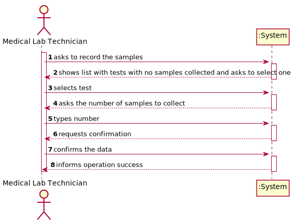
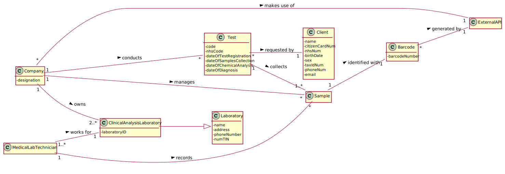
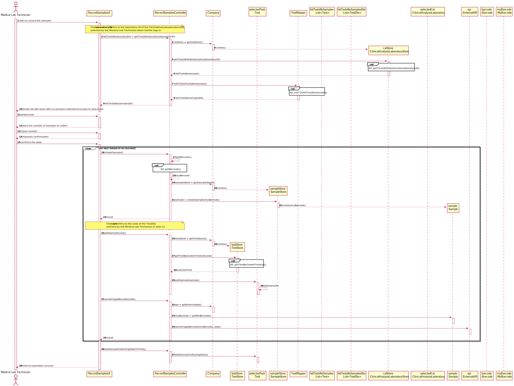
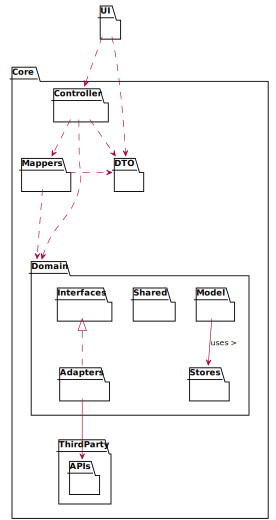
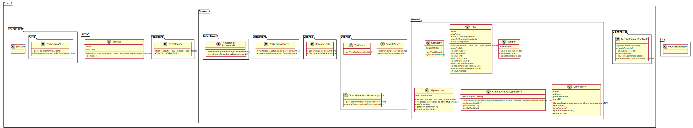
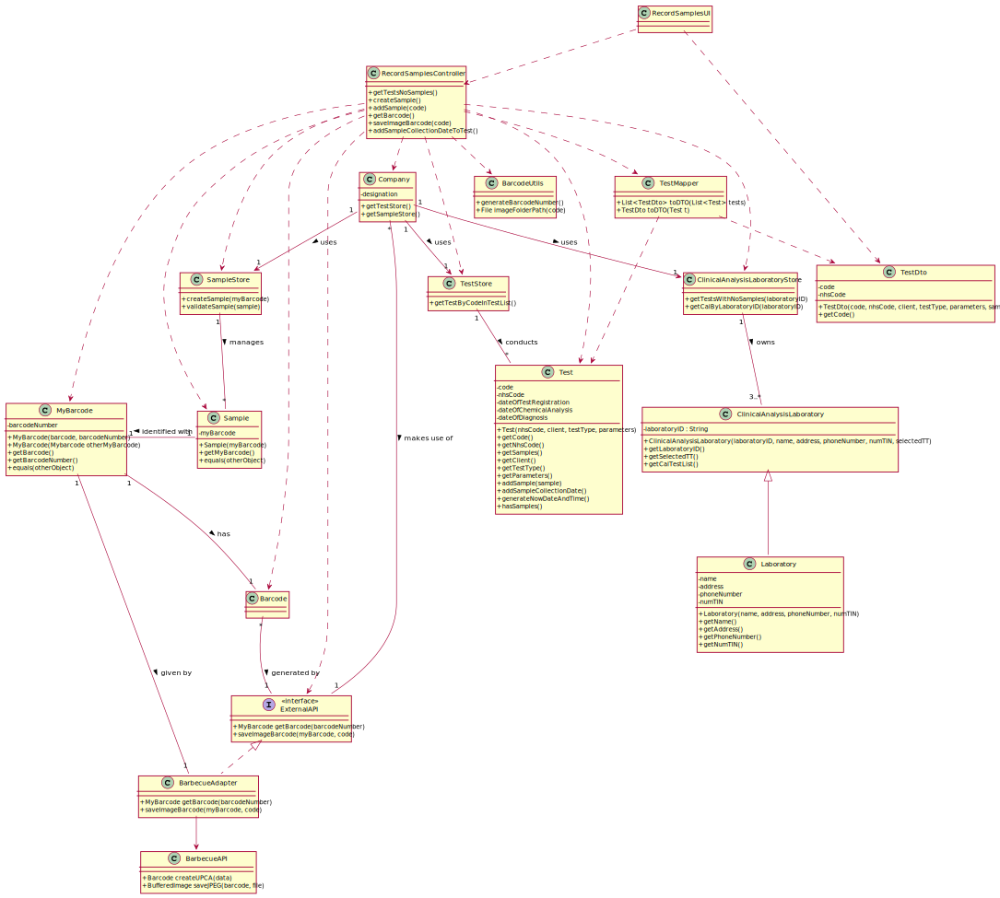

# US 005 - Record the samples collected

## 1. Requirements Engineering

*In this section, it is suggested to capture the requirement description and specifications as provided by the client as well as any further clarification on it. It is also suggested to capture the requirements acceptance criteria and existing dependencies to other requirements. At last, identfy the involved input and output data and depicted an Actor-System interaction in order to fulfill the requirement.*


### 1.1. User Story Description

As a Medical Lab Technician, I want to record the samples collected in the scope of a
given test.

### 1.2. Customer Specifications and Clarifications

**From the specifications document:**  

> All the tests (clinical blood tests and Covid-19 tests) performed by the network of laboratories are registered locally by the medical lab technicians who collect the samples.  
> 
> The samples are sent daily to the chemical laboratory where the chemical analysis are performed, and results obtained.  
> 
> When sampling (blood or swab) the medical lab technician records the samples in the system, associating the samples with the client/test, and identifying each sample with a barcode that is automatically generated using an external API. 

**From the client clarifications:**  

>**Q:** Our team, in order to implement the correct methods in our work, needs to know what's the data type that is returned by the External API Module that barcodes the sample.  
>**A:** The external API generates a Universal Product Code (UPC) code.  

You can read the whole discussion [here](https://moodle.isep.ipp.pt/mod/forum/discuss.php?d=7334).

> **Q:** What kind of attributes should a sample have?  
> **A:** Each sample is associated with a test. A sample has only one attribute, a barcode number (UPC) that is a sequential number and is automatically generated by the system. Each sample has a unique barcode number.  
> 
> **In US5, the medical lab technician checks the system and see all tests for which there are no samples collected. The medical lab technician selects a test and the system asks for the number of samples to collect.**  
> 
> **Q:** Can a test have more than one sample?  
> **A:** Yes.  
> 
> **Q:** We didn't fully understand what will the API do in this US, so here's out interpretation from the US, correct us if we're wrong please: The API will be generated randomly and the API is an attribute from the sample.  
> **A:** The API will be used to generate/print barcodes.

You can read the whole discussion [here](https://moodle.isep.ipp.pt/mod/forum/discuss.php?d=8244).  

> **Q:** After the barcodes are generated. The concept-reality link would be, for example to stick each barcode into each sample?  
> **A:** Yes. **Each generated barcode should be saved in a folder as a jpeg file.**  

You can read the whole discussion [here](https://moodle.isep.ipp.pt/mod/forum/discuss.php?d=8437).  

> **Q:** It was answered in one of the previous questions that the sample only has one attribute, the barcode, however the description of the project also mentions a date of collection of the samples, is this date supposed to be an attribute of the test and not of the sample itself?  
> **A:** Yes. The system should record the date (DD/MM/YYYY) and time (HH:MM) when the sample is collect made. The date and time are automatically generated by the system when the barcode is issued.  
> 
> **Q:** If there were multiple samples for a single test, would there be only one collection date for all of them?  
> **A:** A: Only one collection date and time for a test.  

You can read the whole discussion [here](https://moodle.isep.ipp.pt/mod/forum/discuss.php?d=8450#p11178).  

> **Q**: What is supposed to show to the Medical Lab Technician when he selects the pretended test?  
> **A**: Firstly, the Medical Lab Technician checks the system to see the tests/clients that need to be done. Before selecting a test, the Medical Lab Technician checks/see the name of the client and all the test data (test attributes, test type, collection method, parameters, etc.). Then, the Medical Lab Technician selects one test/client and the system asks for the number of samples to collect. Next, the system generates the barcodes to put in the samples.  

You can read the whole discussion [here](https://moodle.isep.ipp.pt/mod/forum/discuss.php?d=8583#p11362).  

> **Q**: We are aware that both the receptionist and the MLT are two employees that may work on different labs. As such, do you want that Tests become associated to a specific Lab?  
> **A**: A: Yes.  
> 
> **Q**: This means that, when the receptionist creates a new Test, this test will only be "visible" for that specific LAB (for the receptionist and the MLT only), which means that all other roles (Chemistry Technologist, Specialist Doctor and the Laboratory Coordinator) will be able to see a list of all the tests performed in any lab.  
> **A**: **Yes. The test will only be visible for that specific LAB and for all those working in the Chemical Laboratory.**  

You can read the whole discussion [here](https://moodle.isep.ipp.pt/mod/forum/discuss.php?d=8596#p11375).  


### 1.3. Acceptance Criteria

**AC1:** The system should support several barcode APIs. The API to use is
defined by configuration.  
**AC2:** Each sample is associated with a test.  
**AC3:** Each generated barcode should be saved in a folder as a jpeg file.  

### 1.4. Found out Dependencies

There is a dependency to:  

 * **"US007 Register a new Employee"** since at least a Medical Lab Technician must be registered as a user in the system.  
 * **"US004 Register a test to be performed to a registered client"** since at least a test must be registered in the system in order to associate the samples to the test.  

### 1.5 Input and Output Data

**Input Data:**

* Typed data:
    * number of samples to collect

* Selected data:
    * selecting a test for which samples need to be collected

**Output Data:**

* List of existing tests for which there are no samples collected
* (In)Success of the operation


### 1.6. System Sequence Diagram (SSD)




### 1.7 Other Relevant Remarks  
 
* The barcode identifier is a UPC code.


## 2. OO Analysis

### 2.1. Relevant Domain Model Excerpt 
*In this section, it is suggested to present an excerpt of the domain model that is seen as relevant to fulfill this requirement.* 



### 2.2. Other Remarks

n/a


## 3. Design - User Story Realization 

### 3.1. Rationale

**The rationale grounds on the SSD interactions and the identified input/output data.**

| Interaction ID | Question: Which class is responsible for... | Answer  | Justification (with patterns)  |
|:-------------  |:--------------------- |:------------|:---------------------------- |
| Step 1: asks to record the samples  		                                                              |	...interacting with the actor?						                                                                      | RecordSamplesUI                    | Pure Fabrication: there is no reason to assign this responsibility to any existing class in the Domain Model.                                                                             |
|                                                                                                         |	...coordinating the US?						                                                                              | RecordSamplesController            | Pure Fabrication: it refers to the Controller. there is no reason to assign this responsibility to any existing class in the Domain Model.                                                |
| Step 2: shows list with tests for which there are no samples collected and asks to select one  		  |	...knowing who has the responsability to show the tests?						                                          | Company                            | Pure fabrication (to achieve High Coesion + Low Coupling): Company uses ClinicalAnalysisLaboratoryStore.                                                                                  |
|                                                                                                  		  |	...knowing the tests for which there are no samples collected?						                                      | ClinicalAnalysisLaboratoryStore    | IE: ClinicalAnalysisLaboratoryStore stores all of the Clinical Analysis Laboratory objects.                                                                                               |
|                                                                                                  		  |	...knowing in which Clinical Analysis Laboratory the Med Lab Technician works?					                          | ClinicalAnalysisLaboratoryStore    | IE: ClinicalAnalysisLaboratoryStore stores all of the Clinical Analysis Laboratory objects.                                                                                               |
|                                                                                                  		  |	...knowing who has the responsability to process the data and convert the Types of Test to Dto?						      | TestMapper                         | Pure Fabrication: to reduce coupling. There is no reason to assign this responsibility to any existing class in the Domain Model.                                                         |
| Step 3: selects test  		                                                                          |	...saving the selected Test Dto?				                                                                          | RecordSamplesUI                    | HC+LC: to reduce coupling, the selected Test is saved in a Dto in the UI, whose code will be used to get the corresponding Test object from the Domain Model.                             |
| Step 4: asks the number of samples to collect                                                    		  |	...asking the user for this data?						                                                                  | RecordSamplesUI                    | IE: responsible for user interaction.                                                                                                                                                     |
| Step 5: types the number                                             		                              |						                                                                                                      |                                    |                                                                                                                                                                                           |
| Step 6: requests confirmation                                        		                              |	...asking the user for this data?					                                                                      | RecordSamplesUI                    | IE: responsible for user interaction.                                                                                                                                                     |
| Step 7: confirms the data                                                                               |	...knowing who instantiates a new Sample?					                                                              | Company                            | Pure fabrication (to achieve High Coesion + Low Coupling): Company uses SampleStore.                                                                                                      |
|                                                                                                         |	...instantiating a new Sample?						                                                                      | SampleStore                        | Creator (Rule 2): SampleStore stores/records all the Sample objects.                                                                                                                      |
|                                                            		                                      |	...generating the barcodes for the samples?						                                                          | ExternalAPI                        | IE: in the DM, a Barcode is generated by an ExternalAPI.                                                                                                                                  |
|                                                        	                                         	  |	...generating the barcode number?				                                                                          | BarcodeUtils                       | Pure Fabrication: this functionality is external to our system.                                                                                                                           |   
|                                                        	                                         	  |	...saving the generated barcodes?				                                                                          | MyBarcode                          | Adapter Pattern: to allow every Adapter class to return the same type of object.                                                                                                          |   
|                                                        	                                         	  |	...knowing which API generates the barcode?					                                                              | Company                            | IE: in the DM, Company makes use of an ExternalAPI.                                                                                                                                       |   
|                                                        	                                         	  |	...making the system support several barcode APIs?			                                                              | ExternalAPI                        | Protected Variations: to create a stable interface around the point of variation - the existence of different APIs.                                                                       |  
|                                                        	                                         	  |	...making different barcode APIs compatible?			                                                                  | ExternalAPIAdapterX                | Adapter Pattern: to convert requests made in accordance to our system. One adapter per ExternalAPI.                                                                                       |
|                                                                                                         |	...adding the samples to the selected Test?						                                                    	  | Test                               | IE: in the DM, Test collects Samples.                                                                                                                                                     |
|                                                                                                         |	...saving the barcode images into a folder?					                                                    	      | ExternalAPI                        | IE: in the DM, a Barcode is generated by an ExternalAPI.                                                                                                                                  |
| Step 8: informs operation success  		                                                              |	...informing operation success?						                                                                      | RecordSamplesUI                    | IE: responsible for user interaction.                                                                                                                                                     |              


### Systematization ##

According to the taken rationale, the conceptual classes promoted to software classes are: 

 * Sample
 * Company  
 * Test  

Other software classes (i.e. Pure Fabrication) identified:  

 * RecordSamplesUI  
 * RecordSamplesController  
 * TestStore  
 * SampleStore 
 * ClinicalAnalysisLaboratoryStore    
 * TestMapper  
 * ExternalAPI  
 * ExternalAPIAdapterX
 * BarcodeUtils  
 * MyBarcode

## 3.2. Sequence Diagram (SD)

  

### 3.2.1 Partial Sequence Diagrams  

#### 3.2.1.1 SD_getTestsWithNoSamples(laboratoryCode)  

.svg)  

#### 3.2.1.2 SD_toDTO(listTestsNoSamples)  

.svg)  

#### 3.2.1.3 SD_getBarcode()  

.svg)  

#### 3.2.1.4 SD_getTestByCodeInTestList()  

.svg)


## 3.3 Packages Diagrams  

### 3.3.1 Package Diagram - low in details with main associations  

  

### 3.3.2 Package Diagram - classes in packages  

  

## 3.4. Class Diagram (CD)



# 4. Tests 

Before starting to implement the tests, it was practical to **create a text fixture**, because most tests require a commmon set of objects. Therefore:

* I declared instance variables for the common objects.
* I initialized these objects in a public void SetUp method annotated with  @Before, so that JUnit framework invokes that method before each test runs.

### **Class**: SampleTest  

```
@Before
    public void setUp() throws BarcodeException {
        barcode = BarcodeFactory.createUPCA("12345678901");
        myBarcode = new MyBarcode(barcode, "12345678901");
        otherMyBarcode = new MyBarcode(barcode, "0000000000");
    }
``´  
```

**Test 1:** Check that a Sample is different from an object of a different class.  

```
@Test
    public void ensureEqualsMethodObjectsFromDifferentClasses() {

        Sample s1 = new Sample(myBarcode);
        boolean resultDifferentClasses = s1.equals(myBarcode);
        Assert.assertFalse(resultDifferentClasses);
    }
```

**Test 2:** Check that a Sample is different from Null.  

```
@Test
    public void ensureEqualsMethodNullObjectNotEqualToExistingObject() {
        Sample s1 = new Sample(myBarcode);
        Sample s2 = null;
        boolean resultWithNull = s1.equals(s2);
        Assert.assertFalse(resultWithNull);
    }
```  

**Test 3:** Check that two Samples are equal.  

```
@Test
    public void twoDifferentSamples() {

        Sample s1 = new Sample(myBarcode);
        Sample s2 = new Sample(otherMyBarcode);

        boolean result = s1.equals(s2);

        Assert.assertFalse(result);
    }
```  

### **Class**: MyBarcodeTest  

The test for the class MyBarcode were **similar** to the class Sample.  

### **Class**: SampleStoreTest  

```
@Before
    public void setUp() throws BarcodeException {
        barcode = BarcodeFactory.createUPCA("12345678901");
        myBarcode = new MyBarcode(barcode, "12345678901");
    }
```

**Test 1:** Check that it creates correctly the Sample.  

```
@Test
    public void createSample() {
        SampleStore sampleStore = new SampleStore();
        Sample expObj = new Sample(myBarcode);
        Sample obj = sampleStore.createSample(myBarcode);

        Assert.assertEquals(expObj, obj);
    }
```  

**Test 2:** Check that a null Sample is not validated.

```
@Test
    public void ensureNotPossibleNullSample() {
        SampleStore sampleStore = new SampleStore();
        Sample obj = null;
        boolean result = sampleStore.validateSample(obj);

        Assert.assertFalse(result);
    }
```  

**Test 3:** Check that a valid Sample is saved.

```
@Test
    public void ensureAValidSampleIsSaved() {
        SampleStore sampleStore = new SampleStore();
        Sample obj = sampleStore.createSample(myBarcode);

        boolean result = sampleStore.validateSample(obj);

        Assert.assertTrue(result);

    }
```

### **Class**: ClinicalAnalysisLaboratoryStoreTest  

In this class, it was tested the useful method for this US - **getTestsWithNoSamples** and **getCalByCode**.  

**Test 1:** Checks if tests with no samples are being found correctly.
```
@Test 
    public void ensureTestsWithNoSamplesAreFound(){
        TestStore testStore = this.company.getTestStore();
        ClinicalAnalysisLaboratoryStore calStore = this.company.getCalStore();
        
        //omitted...
  
        testStore.saveTest(test);
        testStore.saveTest(test2);
        testStore.saveTest(test3);
  
        ClinicalAnalysisLaboratory cal = new ClinicalAnalysisLaboratory("MEL23",
                "BMAC","Bragança","97777378811","1234567890", selectedTT);
        cal.getCalTestList().add(test);
        cal.getCalTestList().add(test2);
        cal.getCalTestList().add(test3);
        this.company.getCalStore().saveClinicalAnalysisLaboratory(cal);


        List<app.domain.model.Test> calTestList = calStore.getTestsWithNoSamples(cal.getLaboratoryID());
        List<app.domain.model.Test> expectedCalTestList = new ArrayList<>();
        expectedCalTestList.add(test);
        expectedCalTestList.add(test2);
        expectedCalTestList.add(test3);


        Assert.assertEquals(calTestList, expectedCalTestList);
    }
```

**Test 2:** Checks that the exception is thrown if no Clinical Analysis Laboratory with the provided laboratory ID exists.  

```
    @Test(expected = UnsupportedOperationException.class)
    public void ensureNoCalIsFoundWithInexistentLabID() {
        ClinicalAnalysisLaboratoryStore calStore = this.company.getCalStore();

        ClinicalAnalysisLaboratory cal = new ClinicalAnalysisLaboratory("MEL23",
                "BMAC","Bragança","97777378811","1234567890", selectedTT);

        calStore.getCalByCode(cal.getLaboratoryID());

    }
```


# 5. Construction (Implementation)

## Class RecordSamplesController  

```
    public boolean createSample() throws ClassNotFoundException, InstantiationException, BarcodeException, IllegalAccessException, IOException, OutputException {
    MyBarcode myBarcode = getBarcode();
    SampleStore sampleStore = this.company.getSampleStore();
    this.sample = sampleStore.createSample(myBarcode);
    return sampleStore.validateSample(sample);
    }

    public boolean addSample(String code) throws ClassNotFoundException, InstantiationException, IllegalAccessException, BarcodeException {
        TestStore testStore = this.company.getTestStore();
        this.selectedTest = testStore.getTestByCodeInTestList(code);
        return selectedTest.addSample(sample);
    }

    public List<TestDTO> getTestsNoSamples(String laboratoryID) {
        ClinicalAnalysisLaboratoryStore calStore = this.company.getCalStore();
        List<Test> listTestsNoSamples = calStore.getTestsWithNoSamples(laboratoryID);

        TestMapper mapper = new TestMapper();
        return mapper.toDTO(listTestsNoSamples);
    }

    public MyBarcode getBarcode() throws IllegalAccessException, ClassNotFoundException, InstantiationException, BarcodeException {
        ExternalAPI api = this.company.getExternalAPI();
        String barcodeNumber = BarcodeUtils.generateBarcodeNumber();
        return api.getBarcode(barcodeNumber);
    }

    public void saveImageBarcode(String code) throws IllegalAccessException, ClassNotFoundException, InstantiationException, IOException, OutputException {
        ExternalAPI api = this.company.getExternalAPI();
        MyBarcode myBarcode = this.sample.getMyBarcode();
        api.saveImageBarcode(myBarcode, code);
    }

    public void addSampleCollectionDateToTest() {
        this.selectedTest.addSampleCollectionDate();
    }
```

## Class SampleStore  

```
    public Sample createSample(MyBarcode myBarcode) {
    return new Sample(myBarcode);
    }

    public boolean validateSample(Sample sample) {
        if (sample == null)
            return false;
        return true;
    }
```    

## Class Company  

```
//omitted...

public ExternalAPI getExternalAPI() throws IllegalAccessException, InstantiationException, ClassNotFoundException {
String className = App.getInstance().getBarcodeClassNameConfig();
Class<?> oClass = Class.forName(className);
return (ExternalAPI) oClass.newInstance();
}
```

## Class Sample  

```
    private MyBarcode myBarcode;

    public Sample(MyBarcode myBarcode) {
        this.myBarcode = new MyBarcode(myBarcode);
    }

    public MyBarcode getMyBarcode() {
        return new MyBarcode(myBarcode);
    }

    //omitted equals...
``` 

## Class MyBarcode  

```
    private Object barcode;
    private String barcodeNumber;
    private static int totalBarcodes = 1;
    
    public MyBarcode(Object barcode, String barcodeNumber) {
        this.barcode = barcode;
        this.barcodeNumber = barcodeNumber;
        totalBarcodes++;
    }

    public MyBarcode(MyBarcode otherMyBarcode) {
        barcode = otherMyBarcode.barcode;
        barcodeNumber = otherMyBarcode.barcodeNumber;
    }

    public Object getBarcode() {
        return barcode;
    }

    public String getBarcodeNumber() {
        return barcodeNumber;
    }

    //omitted... 
```    

## Class ExternalAPI  
```
public interface ExternalAPI {
    public abstract MyBarcode getBarcode(String barcodeNumber) throws BarcodeException;

    public abstract void saveImageBarcode(MyBarcode myBarcode, String code) throws IOException, OutputException;
}
```  

## Class BarbecueAdapter  
```
    @Override
    public MyBarcode getBarcode(String barcodeNumber) throws BarcodeException {
        Barcode barcode = BarcodeFactory.createUPCA(barcodeNumber);
        return new MyBarcode(barcode, barcodeNumber);
    }

    @Override
    public void saveImageBarcode(MyBarcode myBarcode, String code) throws IOException, OutputException {
        File imageFolderPath = BarcodeUtils.imageFolderPath(code);
        Barcode barcode = (Barcode) myBarcode.getBarcode();
        barcode.setPreferredBarHeight(100);
        File imgFile = new File(imageFolderPath + "/barcode" + barcode.getData() + ".jpeg");
        BarcodeImageHandler.saveJPEG(barcode, imgFile);
    }
```

In this class, it was used a method from **BarcodeUtils** which returns de path for which the barcodes will be saved in.  


# 6. Integration and Demo 

To record the Samples Collected of a Test, it is necessary to know the list of tests for which there are no samples collected in the Clinical Analysis Laboratory the Medical Lab Technician works.  

Therefore, in order to reduce coupling, it was created a TestDto as well as a TestMapper to process the data and convert the list of tests with no samples to a Dto.    


# 7. Observations

By knowing the Adapter Pattern and its advantages, each time the system needed to invoke a method which needed a certain API, I would apply the mentioned Patter in order facilitate the maintenance of our system if changes in API occur.  


