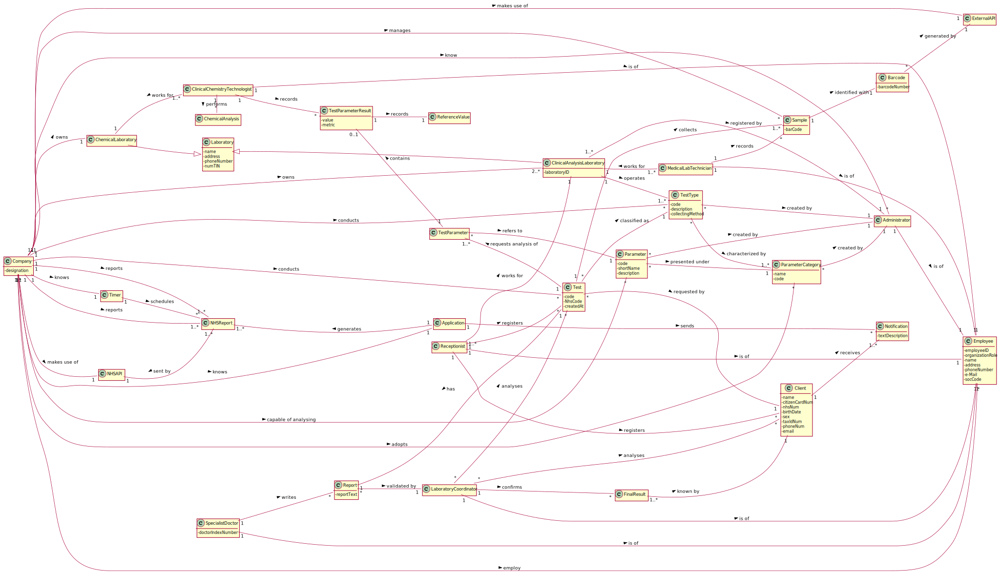

# OO Analysis #

The construction process of the domain model is based on the client specifications, especially the nouns (for _concepts_) and verbs (for _relations_) used. 

## Rationale to identify domain conceptual classes ##
To identify domain conceptual classes, start by making a list of candidate conceptual classes inspired by the list of categories suggested in the book "Applying UML and Patterns: An Introduction to Object-Oriented Analysis and Design and Iterative Development". 

### _Conceptual Class Category List_ ###

**Business Transactions**

* Test;

---

**Transaction Line Items**

* Sample;
* Final Result;
* Chemical Result;
* Diagnosis;

---

**Product/Service related to a Transaction or Transaction Line Item**

* Parameter:
* Notification;

---

**Transaction Records**

* Report (Specialist Doctor);
* NHS Report;

--- 

**Roles of People or Organizations**

* Client;
* Administrator;
* Receptionist;
* Medical lab technician;
* Clinical chemistry technologist;
* Specialist doctor;
* Laboratory coordinator;
* Timer;

---

**Places**

* Laboratory;
* Clinical Analysis Laboratory;
* Chemical Laboratory;
* Application;

---

**Noteworthy Events**

* Chemical Analysis;

---

**Physical Objects**

*

---

**Descriptions of Things**

* Type of Test;
* Category;

---

**Catalogs**

*  

---

**Containers**

*  Employee

---

**Elements of Containers**

*  

---

**Organizations**

* Company;

---

**Other External/Collaborating Systems**

* NHS API;

---

**Records of finance, work, contracts, legal matters**

* 

---

**Financial Instruments**

* 

---

**Documents mentioned/used to perform some work/**

* Lab order;

---

### **Rationale to identify associations between conceptual classes**

An association is a relationship between instances of objects that indicates a relevant connection and that is worth of remembering, or it is derivable from the List of Common Associations: 

* **_A_** is physically or logically part of **_B_**
* **_A_** is physically or logically contained in/on **_B_**
* **_A_** is a description for **_B_**
* **_A_** known/logged/recorded/reported/captured in **_B_**
* **_A_** uses or manages or owns **_B_**
* **_A_** is related with a transaction (item) of **_B_**
* etc.

| Concept (A) 		|  Association   	|  Concept (B) |
|----------	   		|:-------------:		|------:       |
| Company 	| performs		 | Test  |
|  | conducts | TestType |
|  |owns |Laboratory|
|  | reports | NHS Report |
|  | knows | Application |
| | knows | Timer
| | makes use of | NHSAPI
| Chemical Laboratory | is of | Laboratory |
| Clinical Analysis Laboratory | is of | Laboratory|
|  Parameter	| presented under  		 	| Category  |
|  | created by         | Administrator
|  Category	| created by		 	| Administrator |
| Test	| requested by 		 	| Client |
|  | is of | TestType|
|  | collects | Sample|
|  | requestes analysis of | Parameter|
|Receptionist | registers | Client |
|  | is of | Employee|
| | registers | Test |
| | works for | Clinical Analysis Laboratory |
|Medical Lab Technician | is of | Employee|
| | records the | Samples |
| | works for | Clinical Analysis Laboratory |
|Clinical chemistry technologist| works for | Chemical Laboratory|
|  | is of | Employee|
| | performs |Chemical analysis|
| | records |Chemical result|
|Chemical Result| is analysed by| Specialist doctor|
|Specialist doctor |  makes | Diagnosis |
|  | is of | Employee|
| | writes| Report|
|Diagnosis | is validated by | Laboratory Coordinator |
|Report| is validated by | Laboratory Coordinator|
|Laboratory Coordinator| confirms | Final Result |
|  | is of | Employee|
| | analysis | Test
| | analysis | Client
|Client| receives |Notification|
|Final Result | is known by | Client|
|NHS API |receives |NHS Report|
|Application | generates | NHS Report|
| | sends | Notification|
|Daily Covid-19 Data | is a part of | NHS Report|
|Forecast | is a part of | NHS Report|
|TestType | is characterized by | Parameter|
| | knows | Company |
| Employee | works for | Company|
| Administrator | is of | Employee|
| Lab Order | originates | Test|
| | is provided by |Client|

 

## Domain Model

