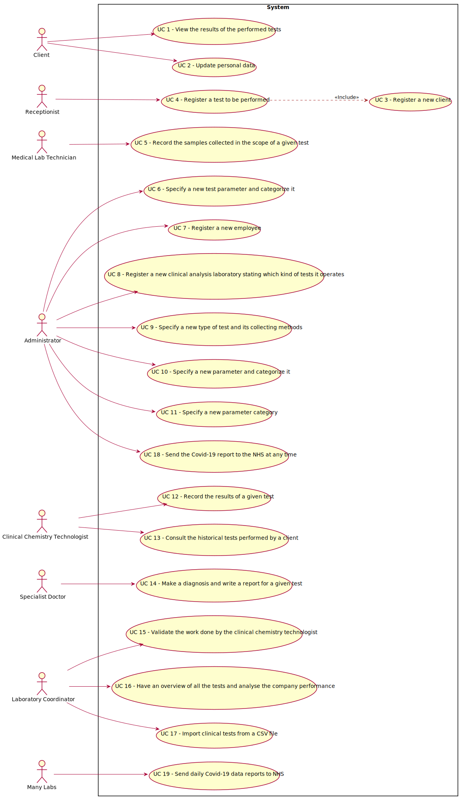

# Use Case Diagram (UCD)

**In the scope of this project, there is a direct relationship of _1 to 1_ between Use Cases (UC) and User Stories (US).**

However, be aware, this is a pedagogical simplification. On further projects and curricular units might also exist _1 to N **and/or** N to 1 relationships between US and UC.

**For each UC/US, it must be provided evidences of applying main activities of the software development process (requirements, analysis, design, tests and code). Gather those evidences on a separate file for each UC/US and set up a link as suggested below.**

# Use Cases / User Stories
| UC/US  | Description                                                               |                   
|:----|:------------------------------------------------------------------------|
| US1 | [As a client, I want to access the application to view the results of the tests I have performed.]()   |
| US2 | [As a client, I want to update my personal data]()  |
| US3 | [As a receptionist of the laboratory, I want to register a client.](US_3/US3_RegisterClient.md)|
| US4 | [As a receptionist of the laboratory, I intend to register a test to be performed to a registered client.](US_4/US_4.md)|
| US5 | [As a medical lab technician, I want to record the samples collected in the scope of a given test.](US_5/US5_RecordSamples.md)|
| US6 | [As an administrator, I want to specify a new test parameter and categorize it.](US4.md)|
| US7 | [As an administrator, I want to register a new employee.](US_7/US7_RegisterEmployee.md)|
| US8 | [As an administrator, I want to register a new clinical analysis laboratory stating which kind of test(s) it operates.](US_8/US8_RegisterNewClinicalAnalysisLaboratory.md)|
| US9 | [As an administrator, I want to specify a new type of test and its collecting methods.](US_9/US_9.md)|
| US10 | [As an administrator, I want to specify a new parameter and categorize it.](US_10/US10_CreateCategorizeParameter.md)|
| US11 | [As an administrator, I want to specify a new parameter category.](US_11/US11_CreateParameterCategory.md)|
| US12 | [As a clinical chemistry technologist, I intend to record the results of a given test.]()|
| US13 | [As a clinical chemistry technologist, I intend to consult the historical tests performed by a particular client and to be able to check tests details/results.]()|
| US14 | [As a specialist doctor, I intend to make the diagnosis and write a report for a given test.](US_14/US14_MakeDiagnosisWriteTestReport.md)|
| US15 | [As a laboratory coordinator, I want to validate the work done by the clinical chemistry technologist and specialist doctor.]()|
| US16 | [As a laboratory coordinator, I want to have an overview of all the tests performed by Many Labs and analyse the overall performance of the company.](US_16/US16_OverviewTestsAnalysePerformance.md)
| US17 | [As a laboratory coordinator, I want to import clinical tests from a CSV file.](US_17/US_17.md)
| US18 | [As an Administrator I want to send the Covid-19 report to the NHS at any time.]()
| US19 | [The Many Labs company wants to send to the NHS daily reports of Covid-19 data, including the number of observed values and estimated values.](US_19/US19_SendDailyReportsToNHS.md)