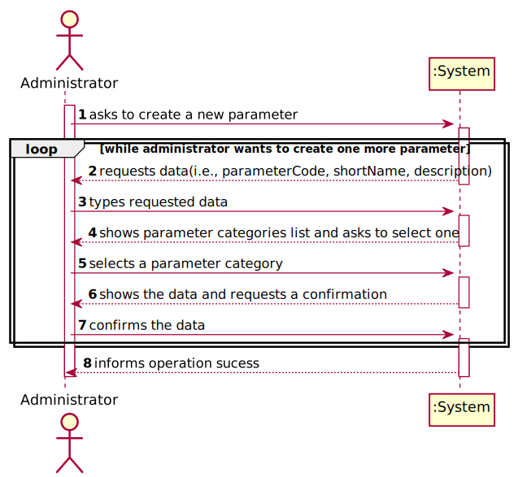
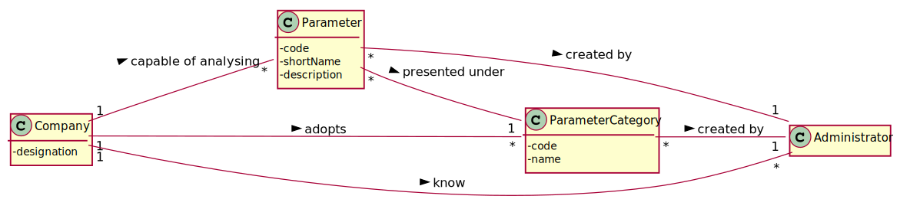
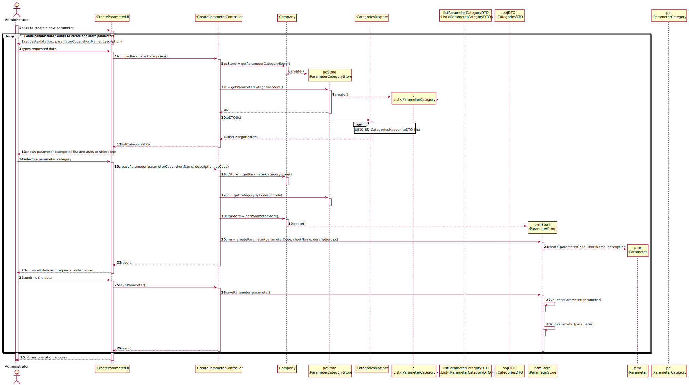
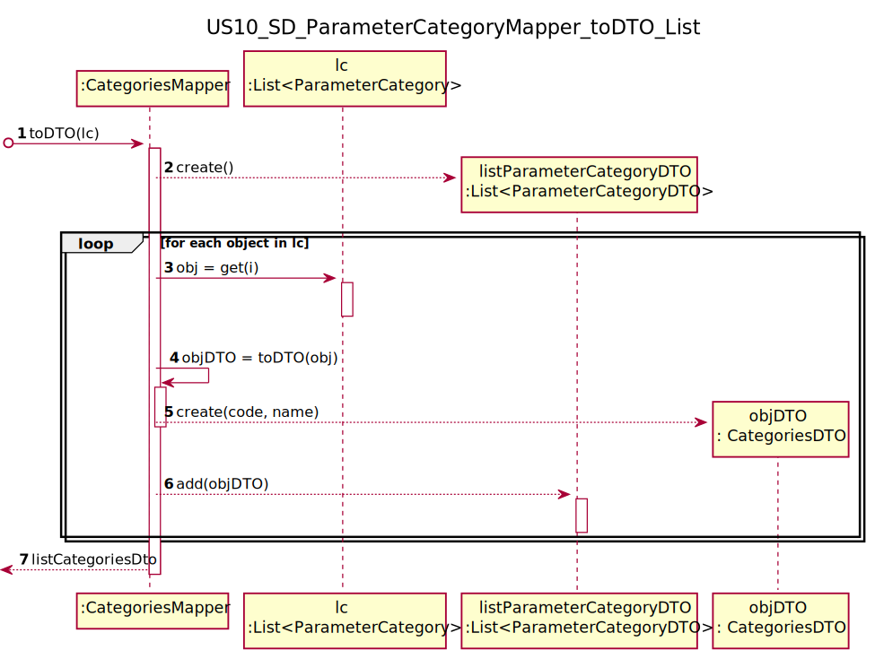
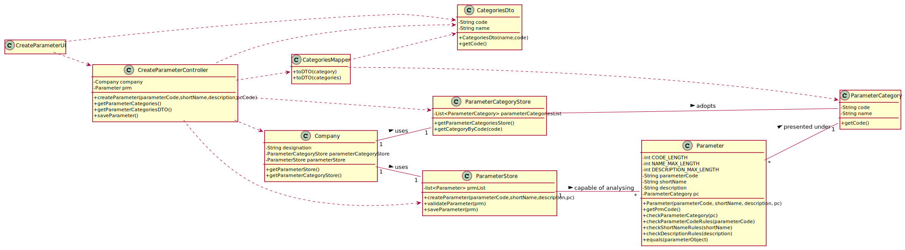
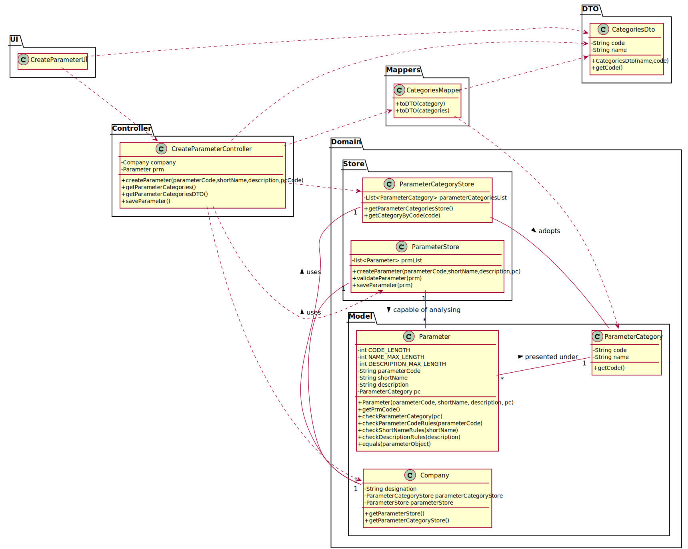
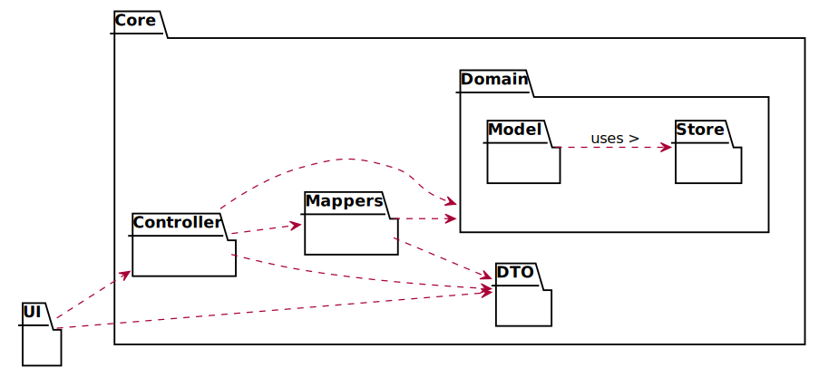

# US 10 - to specify a new parameter and categorize it

## 1. Requirements Engineering

### 1.1. User Story Description

As an administrator, I want to specify a new parameter and categorize it.

### 1.2. Customer Specifications and Clarifications 

**From the specifications document:**

> "Blood tests are frequently characterized by measuring several parameters which for presentation/reporting purposes are organized by categories. For example, parameters such as the number of Red Blood Cells (RBC), White Blood Cells (WBC) and Platelets (PLT) are usually presented under the blood count (Hemogram) category."

> “Regardless, such tests rely on measuring one or more parameters that can be grouped/organized by categories.”

> "Covid tests are characterized by measuring a single parameter stating whether it is a positive or a negative result"

**From the client clarifications:**

> **Question:** "What is the data that characterize a parameter? Should we follow the same data as the parameter category, for example, would each parameter have its own code, description and NHS identifier?"
>  
> **Answer:** "Each parameter is associated with one category. Each parameter has a Code, a Short Name and a Description.
> The Code are five alphanumeric characters. The Short Name is a String with no more than 8 characters. The Description is a String with no more than 20 characters."

>Read the whole answer [here](https://moodle.isep.ipp.pt/mod/forum/discuss.php?d=7507#p10106).

-

> **Question:** "Is there any acceptance criteria for these data other than those shown in the US11 of the parameter category?"
>  
> **Answer:** "The Code are five alphanumeric characters. The Short Name is a String with no more than 8 characters. The Description is a String with no more than 20 characters."

>Read the whole answer [here](https://moodle.isep.ipp.pt/mod/forum/discuss.php?d=7507#p10106).

-

> **Question:** "Can a parameter be classified in more than one parameter category?"
> 
>  **Answer:** "No. Each parameter has only one category. There are no subcategories."

>Read the whole answer [here](https://moodle.isep.ipp.pt/mod/forum/discuss.php?d=7749#p10124).

-

> **Question:** "Does the client want to specify more than one new parameter at a time?"
>
> **Answer:** "Yes."

>Read the whole answer [here](https://moodle.isep.ipp.pt/mod/forum/discuss.php?d=7616#p10189).

-

> **Question:** "When a new parameter is specified, should there always be a category it falls under prior to its specification and subsequent categorization?"
>
> **Answer:** "Each parameter is associated with one category."

>Read the whole answer [here](https://moodle.isep.ipp.pt/mod/forum/discuss.php?d=7616#p10189).

-

> **Question:** "Does the administrator need to log in order to create a parameter and categorize it?"
>
> **Answer:** "Yes"

>Read the whole answer [here](https://moodle.isep.ipp.pt/mod/forum/discuss.php?d=7639#p10195).

-

> **Question:** "Is the categorization of a parameter mandatory or optional?"
>
> **Answer:** "Yes."

>Read the whole answer [here](https://moodle.isep.ipp.pt/mod/forum/discuss.php?d=7649#p10196).

-

> **Question:** "How does the assignment of a parameter category works? Does he have to select the category or he have the option to create in the moment?"
>
> **Answer:** "There exists a user story to specify a new parameter category. Therefore, the administrator should select one category when creating a parameter."

>Read the whole answer [here](https://moodle.isep.ipp.pt/mod/forum/discuss.php?d=7649#p10196).

-

> **Question:** "The administrator needs to be logged in to execute his role?"
>
> **Answer:** "Yes."

>Read the whole answer [here](https://moodle.isep.ipp.pt/mod/forum/discuss.php?d=7666#p10200).

-

> **Question:** "Is the administrator an employee? If he/she is, who does him/her register?"
>
> **Answer:** "Yes. An administrator should be registered when the application starts for first time.
The application can have more than one administrator."

>Read the whole answer [here](https://moodle.isep.ipp.pt/mod/forum/discuss.php?d=7666#p10200).

-

> **Question:** "Is the code of a parameter the same as its respective category? Or can they be different?"
> 
> **Answer:** "No, they are different things."

>Read the whole answer [here](https://moodle.isep.ipp.pt/mod/forum/discuss.php?d=8041#p10534).

-

> **Question:** "Will the administrator give the reference values for the new parameter?"
> 
> **Answer:** "In Sprint C we will make available an API that returns the reference values."

>Read the whole answer [here](https://moodle.isep.ipp.pt/mod/forum/discuss.php?d=8041#p10534).

-

> **Question:** "In the lab order, the information displayed is indeed the Test Type and the Parameters or should it be Test Type and the Parameter Categories instead?"
> 
> **Answer:** "From a previous post: "Each Test type should have a set of categories. Each category should be choosen from a list of categories". From other previous post: "Each parameter is associated with one category"."

>Read the whole answer [here](https://moodle.isep.ipp.pt/mod/forum/discuss.php?d=7842#p10410).

-

> **Question:** "When specifying more than one parameter at the same time, all that parameters will be categorized to one single category or should I ask the category to each parameter?"
> 
> **Answer:** "You should always ask the category of each parameter."

>Read the whole answer [here](https://moodle.isep.ipp.pt/mod/forum/discuss.php?d=7888#p10394).

### 1.3. Acceptance Criteria

* **AC1:** "The Code are five alphanumeric characters."
* **AC2:** "The Short Name is a String with no more than 8 characters."
* **AC3:** "The Description is a String with no more than 20 characters."
* **AC4:** "Each parameter has only one category."
* **AC5:** The client wants to specify more than one new parameter at a time.
* **AC6:** "You should always ask the category of each parameter."

### 1.4. Found out Dependencies

* There is a dependency to "US 11 To specify a new parameter category" since the parameter categories must exist to categorize new parameters.

### 1.5 Input and Output Data

**Input Data:**

* Typed data:
	* parameter code
	* short name
	* description
	
* Selected data:
	* Parameter category

**Output Data:**

* List of existing parameter categories
* (In)Sucess of the operation

### 1.6. System Sequence Diagram (SSD)

### 1.7 Other Relevant Remarks

The present US is held mainly in the beginning of the business. As the Company works in the analysis/testing field, it's crucial to create the parameters to be analysed/tested, in order to start the business. Other than that, this US will play an important role everytime the company decides to start performing a new type of analysis or test.

## 2. OO Analysis

### 2.1. Relevant Domain Model Excerpt 

### 2.2. Other Remarks

n/a

## 3. Design - User Story Realization 

### 3.1. Rationale

**The rationale grounds on the SSD interactions and the identified input/output data.**

| Interaction ID | Question: Which class is responsible for... | Answer  | Justification (with patterns)  |
|:-------------  |:--------------------- |:------------|:---------------------------- |
| Step 1: asks to create a new parameter |	... interacting with the actor? | CreateParameterUI | Pure Fabrication: there is no reason to assign this responsibility to any existing class in the Domain Model. |
|       	   	 |	... coordinating the US? | CreateParameterController | Controller |
|       	   	 |	... instantiating a new Parameter? | Administrator | Creator: in the DM a Parameter is presented under a Parameter Category, which company adopts. |
| Step 2: request data(i.e., parameterCode, shortName, description) | ...asking the user for this data? | CreateParameterUI | IE: Responsable for user interaction. |
| Step 3: types requested data | ...temporarily keeping the inputted data? | CreateParameterUI | The data needs to be temporarily saved, since it will only be used later.  |
| Step 4: shows parameter categories list and asks to select one |	...knowing the parameter categories to show? | ParameterCategoryStore | Pure Fabrication: for coupling reasons. There is no reason to assign this responsibility to any existing class in the Domain Model. |
| | ... knowing the parameterCategoryStore | Company | Pure Fabrication: company knows the parameterCategoryStore.
| Step 5: selects a	parameter category | ... temporarily keeping the selected category? | CreateParameterUI | The parameter category needs to be temporarily saved, since it will only be used later.  |
| | ... saving all the inputed data? | Parameter | IE: owns its data.
| Step 6: shows all data and requests confirmation | ... showing all data and requesting confirmation? | CreateParameterUI | IE: is responsible for user interactions.|
| Step 7: confirms the data | ... validating all data? | ParameterStore | IE: knows all its parameters.|
| 			  	 |	... saving the created parameter? | ParameterStore |  IE: owns all its parameters.|
| Step 8: informs operation	success | ... informing operation success?| CreateParameterUI  | IE: is responsible for user interactions.  |

### Systematization ##

According to the taken rationale, the conceptual classes promoted to software classes are: 

 * Company
 * Parameter

Other software classes (i.e. Pure Fabrication) identified: 

 * CreateParameterUI  
 * CreateParameterController
 * CategoriesMapper
 * CategoriesDTO
 * ParameterCategoryStore
 * ParameterStore

## 3.2. Sequence Diagram (SD)

## 3.3. Class Diagram (CD)

## 3.4. Package Diagram (PD)

# 4. Tests

## 4.1. Parameter

Before starting the parameter tests, it's useful to create something like this, 
since the parameters need to be assigned to a parameter category:

    private ParameterCategory p1;

	@Before
    public void setUp() {
        p1 = new ParameterCategory(desiredParameterCategoryCode,desiredParameterCategoryName);
    }

Tests 1 to 15 follow this model:

	@Test(expected = IllegalArgumentException.class)
    public void testName(){
        Parameter prm = new Parameter(parameterCodeToBeTested, shortNameToBeTested, descriptionToBeTested, parameterCategoryToBeTested);
    }

The only changes are the testName and the attributes of the prm.

**Test 1:** Check that it is not possible to create an instance of the Parameter class with null values.

**Test 2:** Check that it is not possible to create an instance of the Parameter class with null parameter code.

**Test 3:** Check that it is not possible to create an instance of the Parameter class with empty parameter code.

**Test 4:** Check that it is not possible to create an instance of the Parameter class with parameter code with less than 5 chars.

**Test 5:** Check that it is not possible to create an instance of the Parameter class with parameter code with more than 5 chars.

**Test 6:** Check that it is not possible to create an instance of the Parameter class with parameter code full os spaces.

**Test 7:** Check that it is not possible to create an instance of the Parameter class with null name.

**Test 8:** Check that it is not possible to create an instance of the Parameter class with empty name.

**Test 9:** Check that it is not possible to create an instance of the Parameter class with name with more than 8 chars.

**Test 10:** Check that it is not possible to create an instance of the Parameter class with name full of spaces.

**Test 11:** Check that it is not possible to create an instance of the Parameter class with null description.

**Test 12:** Check that it is not possible to create an instance of the Parameter class with empty description.

**Test 13:** Check that it is not possible to create an instance of the Parameter class with description with more than 20 chars.

**Test 14:** Check that it is not possible to create an instance of the Parameter class with description full of spaces.

**Test 15:** Check that it is not possible to create an instance of the Parameter class with null parameter category.

Tests 16 to 18 follow this model:

	@Test
    public void testName(){
		Parameter parameter1 = new Parameter(parameterCodeToBeTested1, shortNameToBeTested1, descriptionToBeTested1, parameterCategoryToBeTested1);
		Parameter parameter2 = new Parameter(parameterCodeToBeTested2, shortNameToBeTested2, descriptionToBeTested2, parameterCategoryToBeTested2);
		boolean result = parameter1.equals(parameter2);
		Assert.assertExpectedResult(result);
	}

The only changes are the testName, the attributes of parameter1 and parameter2, 
and the ExpectedResult (True or False).

**Test 16:** Check that the equals method returns true if the two compared parameters have equal objects.

**Test 17:** Check that the equals method returns false if the two compared parameters have different objects.

**Test 18:** Check that the equals method returns true if the two compared parameters have the same parameter code.

Tests 19 to 20 follow this model:

	@Test
    public void testName(){
		Parameter parameter1 = new Parameter(parameterCodeToBeTested1, shortNameToBeTested1, descriptionToBeTested1, parameterCategoryToBeTested1);
		boolean result = parameter1.equals(x);
		Assert.assertExpectedResult(result);
	}

The only changes are the testName, the x object (which is parameter1 for test 19 and null for test 20), 
and the ExpectedResult (True or False).

**Test 19:** Check that the equals method returns true if the two compared parameters are the same.

**Test 20:** Check that the equals method returns false if one of the two compared parameters is null.

## 4.2. ParameterStore

Before starting the parameter store tests, it's useful to create something like 
this, since the parameters need to be assigned to a parameter category, which
are on a list:
	
	private ParameterCategory p1;
	private ParameterCategory p2;
	private Company company = new Company(companyName);
	private List<ParameterCategory> pcList;

    @Before
    public void setUp() {
		pcList = new ArrayList<>();
		p1 = new ParameterCategory(desiredParameterCategoryCode1,desiredParameterCategoryName1);
		p2 = new ParameterCategory(desiredParameterCategoryCode2,desiredParameterCategoryName2);
		pcList.add(p1);
		pcList.add(p2);
    }

Since the parameter store tests (tests 21 to 25) are very different between them 
and don't follow any model, there's no generic example to be shown.

**Test 21:** Check if the parameter store is being created correctly with no elements.

    @Test
    public void ensureParameterStoreIsBeingCreatedCorrectlyWithNoElements() {
        ParameterStore ps1 = new ParameterStore();
        Parameter[] result = ps1.toArray();
        Assert.assertEquals(0, result.length);
    }

**Test 22:** Check if the parameter store is being created correctly with some elements.

    @Test
    public void ensureParameterStoreIsBeingCreatedCorrectlyWithSomeElements() {
        ParameterStore ps1 = new ParameterStore();
        Parameter parameter1 = ps1.createParameter("RBC01", "RBC", "Red Blood Cells", p1);
        ps1.saveParameter(parameter1);
        Parameter parameter2 = ps1.createParameter("WBC01", "WBC", "White Blood Cells", p1);
        ps1.saveParameter(parameter2);
        Parameter parameter3 = ps1.createParameter("PLT01", "PLT", "Platelets", p1);
        ps1.saveParameter(parameter3);
        Parameter parameter4 = ps1.createParameter("PCOD1", "NAME", "Description", p2);
        ps1.saveParameter(parameter4);
        Parameter[] result = ps1.toArray();
        Assert.assertEquals(4, result.length);
    }

**Test 23:** Check if the parameter is being created correctly.

    @Test
    public void ensureParameterIsBeingCreatedCorrectly() {
        Parameter expected = new Parameter("RBC01", "RBC", "Red Blood Cells", p1);
        ParameterStore parameterStore = company.getParameterStore();
        Parameter actual = parameterStore.createParameter("RBC01", "RBC", "Red Blood Cells", p1);
        Assert.assertEquals(expected, actual);
    }

**Test 24:** Check that it is not possible to save a parameter with repeated objects.

    public void ensureParameterIsNotSavedRepeatedWithSameObject() {
        Parameter parameter1 = company.getParameterStore().createParameter("RBC01", "RBC", "Red Blood Cells", p1);
        Parameter parameter2 = company.getParameterStore().createParameter("RBC01", "RBC", "Red Blood Cells", p1);
        ParameterStore parameterStore = company.getParameterStore();
        parameterStore.saveParameter(parameter1);
        boolean result = parameterStore.saveParameter(parameter2);
        assertFalse(result);
    }

**Test 25:** Check that it is not possible to save a null parameter.

    @Test
    public void ensureParameterIsNotSavedIfNull() {
        ParameterStore parameterStore = company.getParameterStore();
        assertFalse(parameterStore.saveParameter(null));
    }

# 5. Construction (Implementation)

## Class CreateParameterController

	//...Omitted

    public boolean createParameter(String parameterCode, String shortName, String description, String pcCode){
        ParameterCategoryStore parameterCategoryStore = this.company.getParameterCategoryStore();
        ParameterCategory pc = parameterCategoryStore.getCategoryByCode(pcCode); //vai buscar a cat através do code | o getCategoryByCode está na store
        ParameterStore parameterStore = this.company.getParameterStore();
        this.prm = parameterStore.createParameter(parameterCode, shortName, description, pc);
        return parameterStore.validateParameter(prm);
    }

	//...Omitted

    public boolean saveParameter(){
        ParameterStore parameterStore = this.company.getParameterStore();
        return parameterStore.saveParameter(prm);
    }

	//...Omitted

## Class ParameterStore

	//...Omitted	

    public Parameter createParameter(String parameterCode, String shortName, String description, ParameterCategory pc){
        return new Parameter(parameterCode, shortName, description, pc);
    }

	//...Omitted

	    public boolean validateParameter(Parameter prm){
        if (prm == null)
            return false;
        return !this.prmList.contains(prm);
    }

	//...Omitted

    public boolean saveParameter(Parameter prm){
        if (!validateParameter(prm))
            return false;
        return this.prmList.add(prm);
    }

	//...Omitted

# 6. Integration and Demo

To create a parameter, it is necessary to know the list of parameter categories available
in the system. Therefore, in order to reduce coupling, it was created a CategoriesDTO 
as well as a CategoriesMapper to process the data and convert the list of parameter 
categories to a DTO.

# 7. Observations

n/a