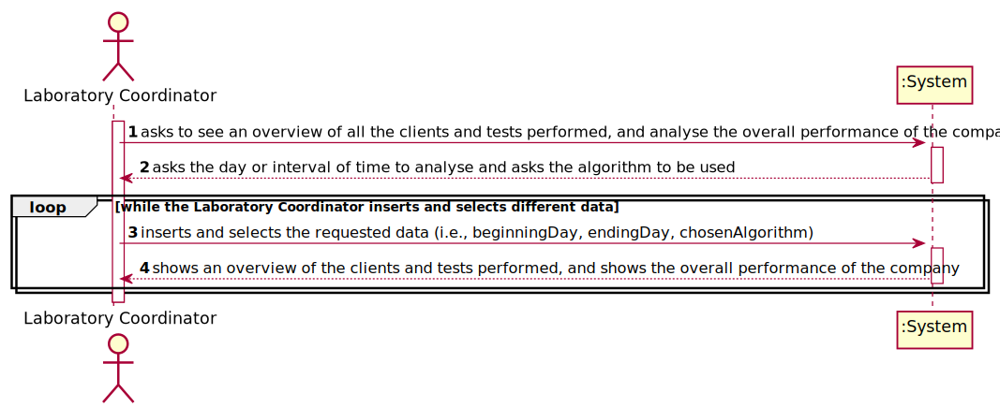
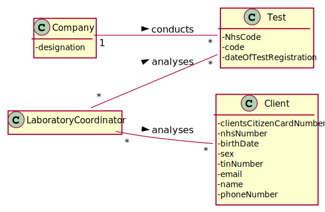
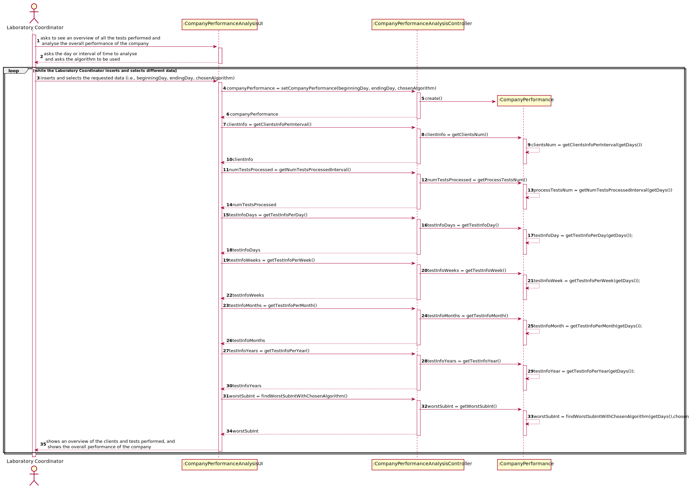
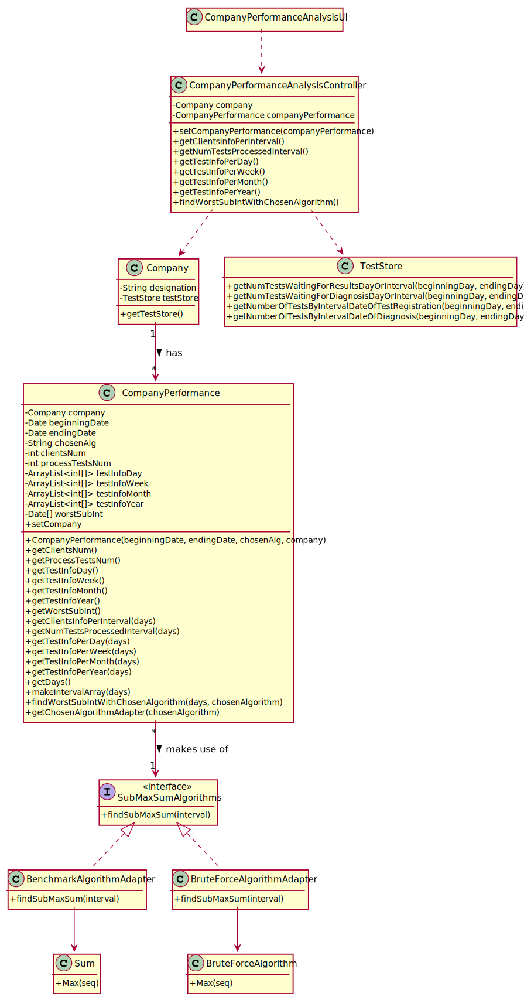
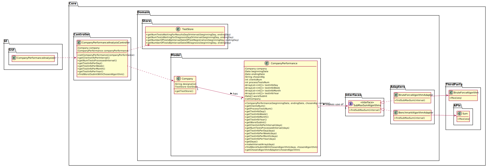
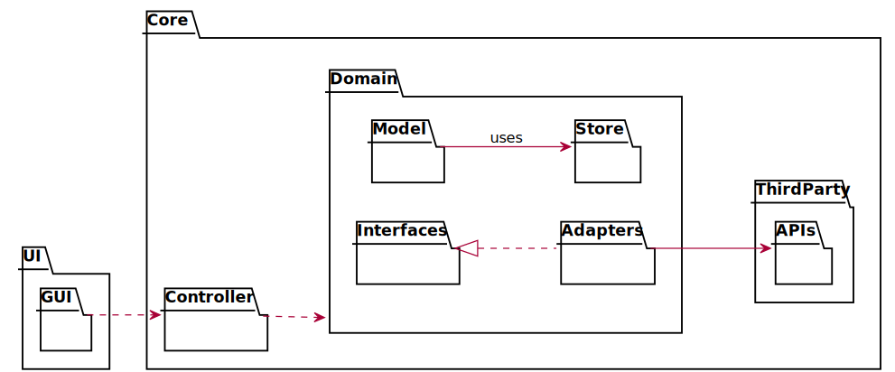
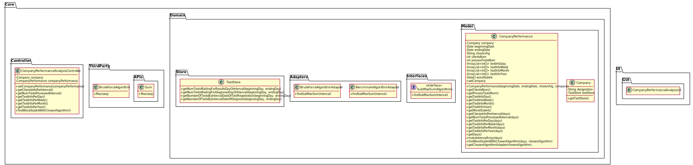

# US 16 - have an overview of all the tests and analyse the company performance

## 1. Requirements Engineering

### 1.1. User Story Description

As a laboratory coordinator, I want to have an overview of all the tests performed
by Many Labs and analyse the overall performance of the company (for instance, check
the sub-intervals in which there were more samples waiting for the result). To facilitate
overall analysis, the application should also display statistics and graphs.

### 1.2. Customer Specifications and Clarifications

**From the specifications document:**

> "...the company wants to decrease the number of tests waiting for its result. To evaluate this, it proceeds as following: for
any interval of time, for example one week (6 working days with 12 working hours per day), the difference between the number 
of new tests and the number of results available to the client during each half an hour period is computed. In that case, 
a list with 144 integers is obtained, where a positive integer means that in such half an hour more tests were processed 
than results were obtained, and a negative integer means the opposite. Now, the problem consists in determining what
the contiguous subsequence of the initial sequence is, whose sum of their entries is maximum. 
This will show the time interval, in such week, when the company was less effective in responding."

> "So, the application should implement a brute force algorithm (an algorithm which examines each
subsequence) to determine the contiguous subsequence with maximum sum, for any interval of time
registered. The implemented algorithm should be analysed in terms of its worst complexity, and it 
should be compared to a provided benchmark algorithm. The algorithm to be used by the application must be 
defined through a configuration file."

> "The complexity analysis must be accompanied by the observation of the execution time of the
algorithms for inputs of variable size in order to observe the asymptotic behaviour. The time
complexity analysis of the algorithms should be properly documented in the application user
manual (in the annexes) that must be delivered with the application."

**From the client clarifications:**

> **Question:** Should the interval of time considered for the evaluation be asked to the Laboratory Coordinator?
>
> **Answer:** Yes.

>Read the whole answer [here](https://moodle.isep.ipp.pt/mod/forum/discuss.php?d=8831#p11592).

-

> **Question:** How should we ask him the interval of time to be considered? Should we ask him to type a number of days? A number of weeks? Should we give general options like: last week, last month..., for him to select from?
>
> **Answer:** The laboratory coordinator should introduce two dates that define an interval, the beginning date and the end date. This interval will be used to find the contiguous subsequence with maximum sum.

>Read the whole answer [here](https://moodle.isep.ipp.pt/mod/forum/discuss.php?d=8831#p11592).

-

> **Question:** What is the meaning of "overview" here? Should the laboratory coordinator see the number of tests waiting for samples, the number of tests waiting for results, the number of tests waiting for diagnoses... Or should he see the information available for each one of the tests in the application?
>
> **Answer:** The laboratory coordinator should be able to check the number of clients, the number of tests waiting for results, the number of tests waiting for diagnosis and the total number of tests processed in the laboratory in each day, week, month and year. Moreover, the laboratory coordinator should be able to check the contiguous subsequence with maximum sum.

>Read the whole answer [here](https://moodle.isep.ipp.pt/mod/forum/discuss.php?d=8831#p11592).

-

> **Question:** When referring to "the application should also display statistics and graphs" is it up to the team to decide which API or resource should be used to generate graphs and statistics, or do you prefer something specific?
>
> **Answer:** With JavaFX you can draw high quality graphs and there is no need to use other tools.

>Read the whole answer [here](https://moodle.isep.ipp.pt/mod/forum/discuss.php?d=8869#p11682).

-

> **Question:** After the Laboratory Coordinator types the requested data and views the analysis of the company performance, should he be able to re-type different data and view the results for a different interval of time and/or algorithm? To make the re-type of the data easier, should there be a "clear" button, that is responsible for clearing the text fields for data entry?
>
> **Answer:**  The laboratory coordinator should be able to explore different parameter values (settings) and check the results. Each team should prepare a simple and intuitive interface that requires a minimum number of interactions with the user.

>Read the whole answer [here](https://moodle.isep.ipp.pt/mod/forum/discuss.php?d=8901#p11695).

-

> **Question:** Can we assume that every day in the interval defined by the coordinator is a working day with 12 working hours each?
>
> **Answer:** Yes.

>Read the whole answer [here](https://moodle.isep.ipp.pt/mod/forum/discuss.php?d=8906#p11696).

-

> **Question:** If Saturday or Sunday are in the interval should we skip them or count them also as working days?
>
> **Answer:** Sunday is not a working day. All the other days of the week are working days.

>Read the whole answer [here](https://moodle.isep.ipp.pt/mod/forum/discuss.php?d=8906#p11696).

-

> **Question:** Is there any specific hour to start filling the 144 integers list?
>
> **Answer:** A working day is from 8h00 to 20h00.

>Read the whole answer [here](https://moodle.isep.ipp.pt/mod/forum/discuss.php?d=8906#p11696).

-

> **Question:** Does the laboratory coordinator also select the amount of working hours per day? Or should we just consider it as 12 working hours/day?
>
> **Answer:** The lab coordinator does not select the amount of working hours per day. Please consider 12 working hours per day.

>Read the whole answer [here](https://moodle.isep.ipp.pt/mod/forum/discuss.php?d=8959#p11887).

-

> **Question:** The elements used in the algorithm refer to a half-hour interval?
>
> **Answer:** Yes.

>Read the whole answer [here](https://moodle.isep.ipp.pt/mod/forum/discuss.php?d=8964#p11898).

-

> **Question:** How do we obtain the number to be used in the algorithm do we subtract tests that got a result in that interval and the tests registered?
>
> **Answer:** Yes.

>Read the whole answer [here](https://moodle.isep.ipp.pt/mod/forum/discuss.php?d=8964#p11898).

-

> **Question:** Regarding US16, when the laboratory coordinator "analyses the overall performance of the company", is the analysis purely looking at the results? Or should he write any type of report based on the results for the interval he is seeing?
>
> **Answer:** You should only identify the time interval where there was a delay in the response (the maximum subsequence).

>Read the whole answer [here](https://moodle.isep.ipp.pt/mod/forum/discuss.php?d=8963#p11899).

-

> **Question:** On the project description is written that "The algorithm to be used by the application must be defined through a configuration file", but on the requirements is written that "the laboratory coordinator should have the ability to dynamically select the algorithm to be applied from the ones available on the system". Should we discard the configuration file and add an option on th program to select one of the available algorithms?
>
> **Answer:** Developing an application, like the one we are developing during the Integrative Project, is a dynamic process and the best teams are those who are prepared to react to change quickly. Moreover, the latest client requests/requirements are those that should be considered. Typically, a client updates the requirements throughout the project development.
Please consider the requirements introduced at the beginning of Sprint D. The laboratory coordinator should have the ability to dynamically select the algorithm to be applied from the ones available on the system (either the benchmark algorithm provided in moodle or the brute-force algorithm to be developed by each team).

>Read the whole answer [here](https://moodle.isep.ipp.pt/mod/forum/discuss.php?d=8931#p11901).

-

> **Question:** When you say tests waiting results are you referring to tests with samples collected but not analyzed yet? If so, and considering the csv file does not have an explicit date for when the sample is collected, which date should we use?
> 
> **Answer:** You should use the test registration date (Test_Reg_DateHour).

>Read the whole answer [here](https://moodle.isep.ipp.pt/mod/forum/discuss.php?d=9169#p12111).

-

> **Question:** What is the total number of tests processed in the laboratory? Is it the number of tests that were given results in that time span or is it the number of tests that were validated in that time span?
>
> **Answer:** The total number of tests processed in the laboratory is the total number of tests that were validated by the laboratory coordinator.

>Read the whole answer [here](https://moodle.isep.ipp.pt/mod/forum/discuss.php?d=9198#p12184).

-

> **Question:** What are the statistics that require a graph, could you specify, please.
>
> **Answer:**  In a previous post I asked: "The laboratory coordinator should be able to check the number of clients, the number of tests waiting for results, the number of tests waiting for diagnosis and the total number of tests processed (tests validated) in the laboratory in each day, week, month and year. The system should show these statistics for a given interval that should be selected/defined by the user".
The application should present these statistics using four graphs/charts, one for each time resolution (day, week, month and year).
In a previous post I also said: "Moreover, the application should also show to the laboratory coordinator the total number of clients and the total number of validated tests that exist in the system.". There is no need to show these information using a graph/chart.

>Read the whole answer [here](https://moodle.isep.ipp.pt/mod/forum/discuss.php?d=9204#p12186).

### 1.3. Acceptance Criteria

* **AC1:** To facilitate overall analysis, the application should display 
  statistics and graphs.
* **AC2:** While evaluating the performance the laboratory 
  coordinator should have the ability to dynamically select the algorithm to be
  applied from the ones available on the system (the benchmark algorithm provided
  in moodle, and the brute-force algorithm to be developed).
* **AC3:** Support for easily adding other similar algorithms is required.

### 1.4. Found out Dependencies

* There is a dependency to "US4: As a receptionist of the laboratory, I intend to 
  register a test to be performed to a registered client." since the app needs to have 
  tests in it, so that the company can have a performance and the Laboratory Coordinator 
  can have an overview of the company tests.

* There is a dependency to "US7: Register a new employee" since the Laboratory Coordinator must 
  be registered in the application and login in order to have an overview of all the tests 
  and analyse the company performance.

### 1.5 Input and Output Data

**Input Data:**

* Typed data:
    * interval of time or day to be analysed

* Selected data:
    * type of time to analyse (interval of time or day)
    * algorithm to use

**Output Data:**

* overview of all the tests performed
* overall performance of the company

### 1.6. System Sequence Diagram (SSD)

### 1.7 Other Relevant Remarks

The present US is held many times during the business. As the Company wants to decrease 
the number of tests waiting for its result, it's crucial for the Laboratory Coordinator 
to frequently have an overview of all the tests performed and analyse the overall 
performance of the company. In this way, he can find the days when the company 
performance was less effective and figure out the cause of it.

## 2. OO Analysis

### 2.1. Relevant Domain Model Excerpt

### 2.2. Other Remarks

n/a

## 3. Design - User Story Realization

### 3.1. Rationale

**The rationale grounds on the SSD interactions and the identified input/output data.**

| Interaction ID | Question: Which class is responsible for... | Answer  | Justification (with patterns)  |
|:-------------  |:--------------------- |:------------|:---------------------------- |
| Step 1: asks to see an overview of all the clients and tests performed, and analyse the overall performance of the company |	... interacting with the actor? | CompanyPerformanceAnalysisUI | Pure Fabrication: there is no reason to assign this responsibility to any existing class in the Domain Model. |
| | ... coordinating the US? | CompanyPerformanceAnalysisController | Controller |
| | ... checking the company performance? | Laboratory Coordinator | Creator
| Step 2: asks the day or interval of time to analyse and asks the algorithm to be used | ... asking the user for this data? | CompanyPerformanceAnalysisUI | IE: is responsible for user interactions. |
| Step 3: inserts and selects the requested data (i.e., beginningDay, endingDay, chosenAlgorithm) | ... knowing all the tests? | TestStore | Pure Fabrication: for coupling reasons. There is no reason to assign this responsibility to any existing class in the Domain Model. |
| | ... knowing the test info to show? | CompanyPerformance | IE: owns its data |
| | ... knowing all the clients? | ClientStore | Pure Fabrication: for coupling reasons. There is no reason to assign this responsibility to any existing class in the Domain Model. |
| | ... knowing client info to show? | CompanyPerformance | IE: owns its data |
| | ... knowing the TestStore? | Company | Pure Fabrication: Company knows the TestStore |
| | ... knowing the subsequence with maximum sum? | CompanyPerformance | IE: owns its data |
| | ... using the inputted data? | CompanyPerformanceAnalysisController | Controller |
| Step 4: shows an overview of the clients and tests performed, and shows the overall performance of the company | ... knowing the data to show? | CompanyPerformanceAnalysisController | Controller |
| | ... showing the data? | CompanyPerformanceAnalysisUI | Pure Fabrication: there is no reason to assign this responsibility to any existing class in the Domain Model. |

### Systematization ##

According to the taken rationale, the conceptual classes promoted to software classes are:

* Company
* CompanyPerformance

Other software classes (i.e. Pure Fabrication) identified:
* CompanyPerformanceAnalysisController
* CompanyPerformanceAnalysisUI
* TestStore

## 3.2. Sequence Diagram (SD)

## 3.3. Class Diagram (CD)

### 3.3.1 Class Diagram

### 3.3.2 Class Diagram With Packages

## 3.4. Package Diagram (PD)

### 3.4.1 Package Diagram With Associations

### 3.4.2 Package Diagram

# 4. Tests

Tests 1-2 from 4.1 and tests 3-4 from 4.2 follow this model:

    @Test
    public void checkIfSubMaxSumIsFound(){
        int[] obtainedSubMaxSum = chosenAlgorithmAdapter.findSubMaxSum(example);
        Assert.assertArrayEquals(expectedSubMaxSum, obtainedSubMaxSum);
    }

## 4.1 BenchmarkAlgorithmAdapterTest

**Test 1-2:** Check if the contiguous subsequence with maximum sum is being successfully found, using the BenchmarkAlgorithm.

**Test A2-H2:** Check the runtime of the Benchmark algorithm, for different array sizes.

## 4.2 BruteForceAlgorithmAdapterTest

**Test 3-4:** Check if the contiguous subsequence with maximum sum is being successfully found, using the BruteForceAlgorithm.

**Test A1-H1:** Check the runtime of the Brute-Force algorithm, for different array sizes.

## 4.3 TestStoreTest

Tests 5-6 are made following this process:
* create different tests in different "parts" of the testing process
* manually count the number of the tests in the desired condition
* compare the manually counted number with the number returned by the method to be tested

**Test 5:** Check if the number of tests waiting for results on a specific day or interval is being correctly counted.

**Test 6:** Check if the number of tests waiting for diagnosis on a specific day or interval is being correctly counted.

# 5. Construction (Implementation)

## 5.1 CompanyPerformanceAnalysisController

    //...Omitted

    private CompanyPerformance companyPerformance;

    public void setCompanyPerformance(Date beginningDay, Date endingDay, String chosenAlgorithm) throws ClassNotFoundException, IllegalAccessException, InstantiationException {
        this.companyPerformance = new CompanyPerformance(beginningDay, endingDay, chosenAlgorithm);
    }

    public boolean createCompanyPerformance(Date beginningDate, Date endingDate, String chosenAlg) {
      this.companyPerformance = company.createCompanyPerformance(beginningDate,endingDate,chosenAlg);
      return (companyPerformance != null);
    }

    //...Omitted

    public int getClientsInfoPerInterval() {
        return companyPerformance.getClientsNum();
    }

    //...Omitted

The logic used in the "getClientsInfoPerInterval" method above, is similar to the one used in the following methods:
* public int getNumTestsProcessedInterval() ;
* public ArrayList<int[]> getTestInfoPerDay() ;
* public ArrayList<int[]> getTestInfoPerWeek() ;
* public ArrayList<int[]> getTestInfoPerMonth() ;
* public ArrayList<int[]> getTestInfoPerYear() ;
* public Date[] findWorstSubIntWithChosenAlgorithm() .

## 5.2 SubMaxSumAlgorithms

    //...Omitted

    int[] findSubMaxSum(int[] interval);

    //...Omitted

## 5.3 BenchmarkAlgorithmAdapter

    //...Omitted

    @Override
    public int[] findSubMaxSum(int[] interval){
        return Sum.Max(interval);
    }

    //...Omitted

## 5.4 BruteForceAlgorithmAdapter

    //...Omitted

    @Override
    public int[] findSubMaxSum(int[] interval){
        return BruteForceAlgorithm.Max(interval);
    }

    //...Omitted

## 5.5 BruteForceAlgorithm

    //...Omitted

    public static int[] Max(int[] seq){
        ArrayList<Integer> subMaxSum = new ArrayList<>();
        int sumValue = 0;
        int num = 0;
        for (int i = 0; i < seq.length; i++) {
            for (int j = 0; j < seq.length; j++) {
                if (i<j) {
                    for (int k = i; k <= j; k++) {
                        num=num+seq[k];
                    }
                    if (num > sumValue) {
                        subMaxSum.clear();
                        for (int l = i; l <= j; l++) {
                            subMaxSum.add(seq[l]);
                        }
                        sumValue=num;
                    }
                    num=0;
                }
            }
        }
        int[] finalSubMaxSum = new int[subMaxSum.size()];
        for (int i = 0; i < finalSubMaxSum.length; i++) {
            finalSubMaxSum[i] = subMaxSum.get(i).intValue();
        }
        return finalSubMaxSum;
    }

    //...Omitted

## 5.6 TestStore

    //...Omitted

    public int getNumTestsWaitingForResultsDayOrInterval(Date beginningDay, Date endingDay){ //mesmo dia, mas 8:00 e 19:59
        int num = 0;
        Date date1, date2;
        for (Test test : testList) {
            date2 = test.getDateOfSamplesCollection();
            date1 = test.getDateOfChemicalAnalysis();
            if (date2!=null) {
                if ((date2.before(beginningDay) && (date1==null || date1.after(beginningDay))) ||
                date2.equals(beginningDay) ||
                        (date2.after(beginningDay) && date2.before(endingDay))){
                    num++;
                }
            }
        }
        return num;
    }

    //...Omitted

The logic used in the method above, is also used in the following method:
* public int getNumTestsWaitingForDiagnosisDayOrInterval(Date beginningDay, Date endingDay) .

The "getNumberOfTestsByIntervalDateOfTestRegistration" method gets the number of tests 
that were registered between the desired interval of time.

The "getNumberOfTestsByIntervalDateOfDiagnosis" method gets the number of tests that 
were validated between the desired interval of time.

## 5.7 CompanyPerformance

    //...Omitted

    public CompanyPerformance(Date beginningDate, Date endingDate, String chosenAlg, Company company) {
        this.company=company;
        this.beginningDate=beginningDate;
        this.endingDate=endingDate;
        this.chosenAlg=chosenAlg;
        this.clientsNum=getClientsInfoPerInterval(getDays());
        this.processTestsNum=getNumTestsProcessedInterval(getDays());
        this.testInfoDay=getTestInfoPerDay(getDays());
        this.testInfoWeek=getTestInfoPerWeek(getDays());
        this.testInfoMonth=getTestInfoPerMonth(getDays());
        this.testInfoYear=getTestInfoPerYear(getDays());
        this.worstSubInt=findWorstSubIntWithChosenAlgorithm(getDays(),chosenAlg);
    }

    //...Omitted

    public Date[] findWorstSubIntWithChosenAlgorithm(ArrayList<Date> days, String chosenAlgorithm) {
        int[] interval = makeIntervalArray(days); //EX: 14/01/2020 AT 08:00:00 - 16-02-2020 AT 19:59:59
        String algorithmClass = getChosenAlgorithmAdapter(chosenAlgorithm);
        Class<?> oClass = null;
        try {
            oClass = Class.forName(algorithmClass);
        } catch (ClassNotFoundException e) {
            e.printStackTrace();
        }
        SubMaxSumAlgorithms subMaxSumAlgorithm = null;
        try {
            subMaxSumAlgorithm = (SubMaxSumAlgorithms) oClass.newInstance(); //NÃO ESTÁ A FUNCIONAR PQ ELE ESTÁ A SAIR NULL, COMO NA LINHA EM QUE É INICIADO COMO NULL
        } catch (InstantiationException e) {
            e.printStackTrace();
        } catch (IllegalAccessException e) {
            e.printStackTrace();
        }
        int[] worstSubInt = subMaxSumAlgorithm.findSubMaxSum(interval);
        //...Omitted
        Date[] limits = new Date[2];
        if (worstSubInt.length!=0) {
            //...Omitted
            if (quant != startIndex) {
                //...Omitted
                limits[0] = (Date)resultFor0.clone();
            }
            //...Omitted
            if (quant != endIndex) {
                //...Omitted
            }
            limits[1] = (Date)resultFor1.clone();
        }else{
            limits[0]=null;
            limits[1]=null;
        }
        return limits;
    }

    //...Omitted

    public String getChosenAlgorithmAdapter(String chosenAlgorithm) {
        String chosenAlgorithmAdapter;
        if(chosenAlgorithm.equals("Benchmark Algorithm"))
            chosenAlgorithmAdapter = Constants.BENCHMARK_ALGORITHM_ADAPTER;
        else
            chosenAlgorithmAdapter = Constants.BRUTEFORCE_ALGORITHM_ADAPTER;

        return chosenAlgorithmAdapter;
    }

    //...Omitted

# 6. Integration and Demo

In order to reduce duplicated and complicated code, I made sure to use an Interface and Adapter Classes.

# 7. Observations

n/a