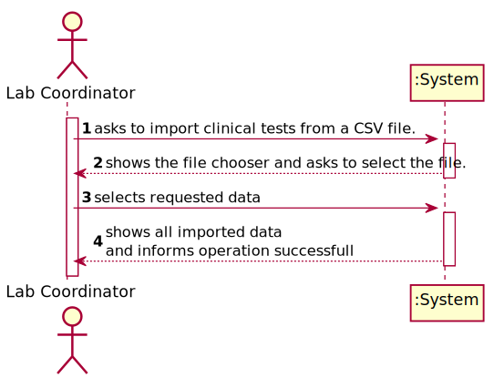
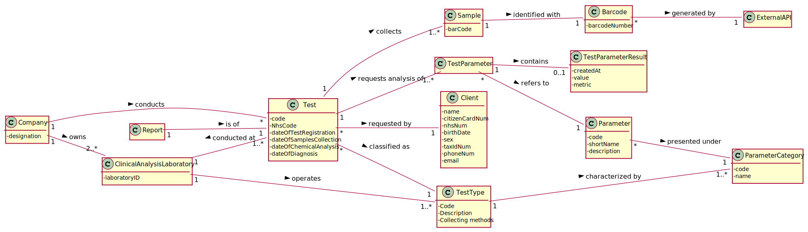
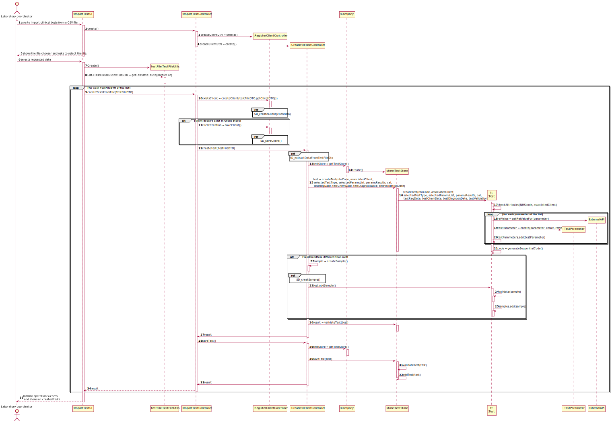
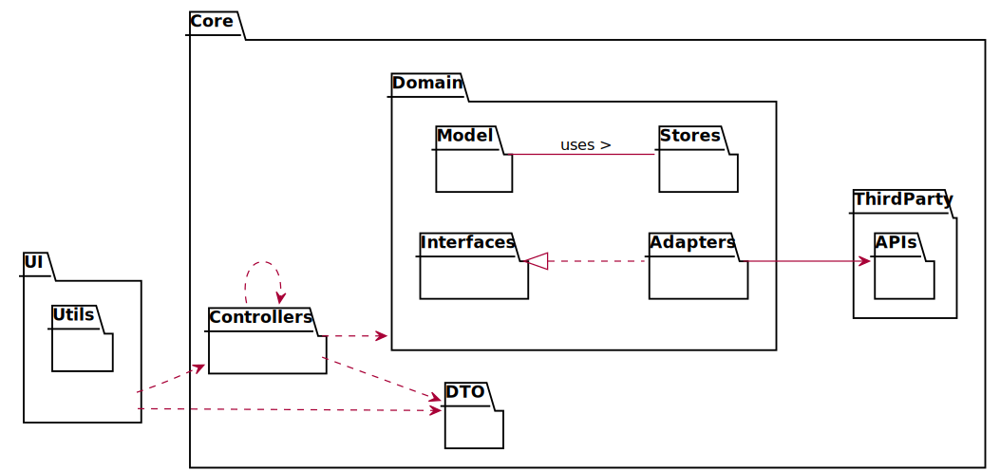
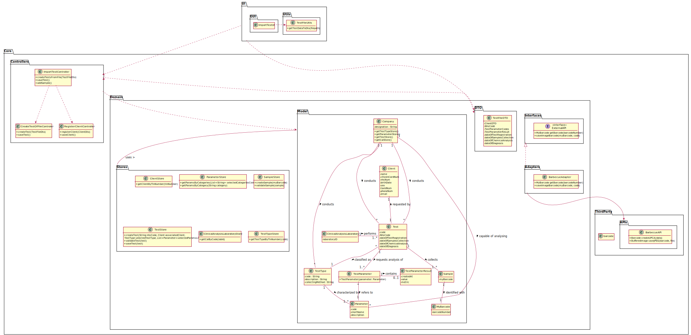
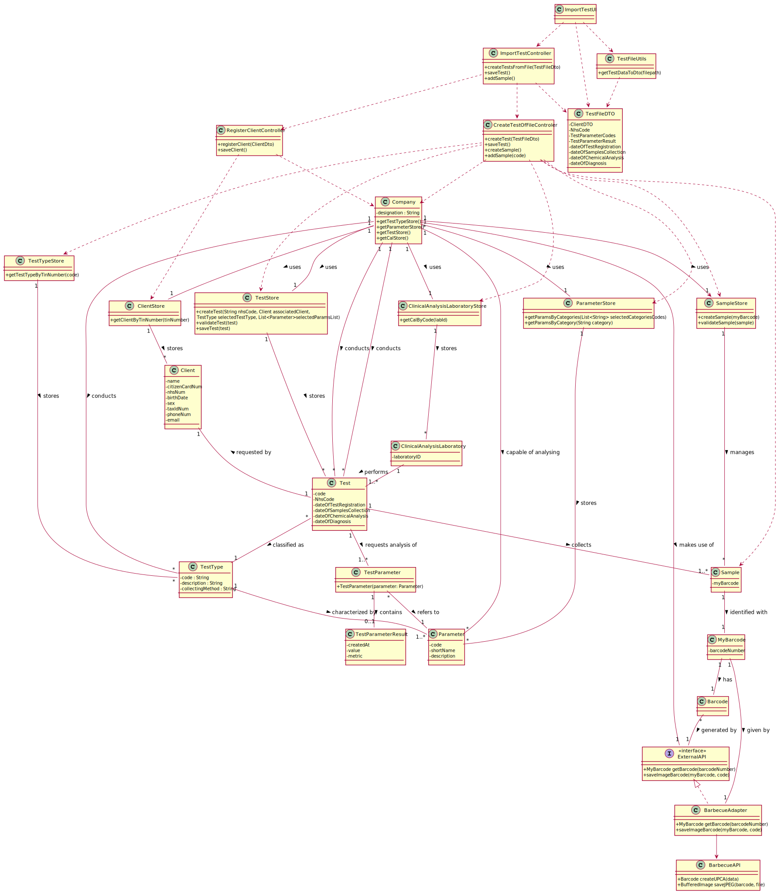

# US 17 - As a laboratory coordinator, I want to import clinical tests from a CSV file.

## 1. Requirements Engineering

### 1.1. User Story Description

As a **laboratory coordinator**, I want to import **clinical tests** from a CSV file.

### 1.2. Customer Specifications and Clarifications 

 **From the client clarifications:**
 
 delegate with other controllers, read file in UI, full constructor
 
 >Q1: Will the CSV files always have the same format as the ones available on moodle?
 >
 >A1: Yes. But we can have more categories and parameters for each type of test.
>
>Q1 Link [here](https://moodle.isep.ipp.pt/mod/forum/discuss.php?d=8883).
>
>Q2: If some kind of data is wrong, what should happen should we just ignore the line where it is located?
>
>A2: The application should not load tests that have incorrect attribute values. The application should identify the tests that have incorrect values and it should continue loading all valid tests that exist in the file. A message should be sent to the console to identify the tests/lines that have incorrect values.
>
>Q2 Link [here](https://moodle.isep.ipp.pt/mod/forum/discuss.php?d=8960).
>
>Q3: Should we show the data that the laboratory coordinator is importing?
>
>A3:  Yes, it should show all the data that was imported at that time.
>
>Q3 Link [here](https://moodle.isep.ipp.pt/mod/forum/discuss.php?d=8883).
>
>Q: How should we fill the remaining data that's not mentioned in the CSV? Should it go as null or should we insert some random value?
> For example, the sample barcode, which is useful. Or the category code, which I mentioned in the question above.They are not in the CSV... should we insert some random value?
>
>A: If the information is not available in the system for a given test, that test should not be loaded into the system. If the information available in the CSV file is correct but incomplete, then, to load the tests that are correct (but incomplete) each team should first create the entities/instance in the system.
    Regarding the barcode, if the "Test_Chemical_DateHour" attribute is not available in the CSV file for a given test, then the barcode should not be generated. If the "Test_Chemical_DateHour" attribute is available in the CSV file, then the a barcode number is automatically generated by the system. Remember that the barcode number is a sequential number that is automatically generated.
    Regarding the "Test_Code" attribute, this is an internal code to identify tests in our company. When loading tests from CSV files, if the code already exists in the system, then the application should generate a new code for the given test (that is being loaded from the CSV file). Remember that the "Test_code" attribute is a sequential number with 12 digits and it is automatically generated.

### 1.3. Acceptance Criteria

* **AC1**: If the file contains invalid data (e.g., a parameter not defined in the system), that data should not be load into the system. An exception should be thrown.

### 1.4. Found out Dependencies

* There is a dependency with "US7 - To register a new employee" since the Laboratory coordinator must be registered in the system.
* There is a dependency with "US3 - To register a new client" since the system must be able to find or register a client.
* There is a dependency with "US4 - To register a new employee" since the system must be able to register a test.

### 1.5 Input and Output Data

* Selected data:
    * CSV file path

### 1.6. System Sequence Diagram (SSD)

### 1.7 Other Relevant Remarks

The present US may not be used frequently since the all tests are supposed to be registered before being conducted.

## 2. OO Analysis

### 2.1. Relevant Domain Model Excerpt 

### 2.2. Other Remarks

n/a

## 3. Design - User Story Realization 

### 3.1. Rationale

**The rationale grounds on the SSD interactions and the identified input/output data.**

| Interaction ID | Question: Which class is responsible for... | Answer  | Justification (with patterns)  |
|:-------------  |:--------------------- |:------------|:----------------------------  |
| Step 1: asks to import clinical tests from a CSV file.     |...Instantiating a new Test?                                                    | TestStore                         | Creator: R1|
|                                                            |...Instantiating a new Client(if needed)?                                       | ClientStore                       | Creator: R1|
|                                                            |...Delegating the actions of the US?                                            | ImportTestController              | Pure Fabrication: it refers to the Controller. there is no reason to assign this responsibility to any existing class in the Domain Model. |
|                                                            |...Coordinating the creation of a test?                                         | CreateTestFromFileController      | Pure Fabrication: it refers to the Controller. there is no reason to assign this responsibility to any existing class in the Domain Model.|
|                                                            |...Coordinating the creation of a client(if needed)?                            | RegisterClientController          | Pure Fabrication: The system already has a Controller class for this use case, promoting the reuse of it.|
| Step 2: Shows the file chooser and asks to select the file.|  n/a                                                                           |                                   |                                              |
| Step 3: selects requested data                             |... process the requested data from the selected file into a TestFileDTO?       | TestFileUtils                     | Pure fabrication: to achieve high cohesion an artificial class that doesn't represent a domain concept may be created. |
|                                                            |... Knowing if the given client exists?                                         | ClientStore                       | IE: Knows all Client objects.|
|                                                            |... instanting a new Client ?(if needed)                                        | ClientStore                       | Creator: R1/2          |
|                                                            |... validating the data locally ?                                               | Client                           | IE: knows its own data |
|                                                            |... validating the data globally?                                               | ClientStore                       | IE: knows all the Client objects|
|                                                            |... Saving the created Client?	                                              | ClientStore                       | IE: adopts/records all the Clients objects|
|                                                            |... instanting a new Test ?                                                     | TestStore                         | Creator: R1/2 .|
|                                                            |... Getting the clinical analysis laboratory associated with labID?             | ClinicalAnalysisLaboratoryStore   | IE: The Clinical Analysis Laboratory store knows it's laboratories.|
|                                                            |... Getting client to be associated from TIN number                             | ClientStore                       | IE: The client store knows it's clients tin numbers.|
|                                                            | ... Getting the TestType associated with given codes?                          | TestTypeStore                     | IE: The TestType store knows its test types|
|                                                            | ...Getting the parameters associated with given codes?                         | ParameterStore                    | IE: The parameter store knows its parameters|
|                                                            |... validating the data locally ?                                               | Test                              | IE: knows its own data. |
|                                                            |... validating the data globally ?                                              | TestStore                         | IE: knows all Test objects |
|                                                            |... saving a new Test ?                                                         | TestStore                         | IE: adopts/records all the Test objects. |
| Step 4: informs operation success                          | ... informing operation success?                                               | ImportTestUI                      | IE: responsible for user interaction|   
|                                                            |... showing all imported tests?                                                 | ImportTestUI                      | IE: reponsible for user interaction |

### Systematization ##

According to the taken rationale, the conceptual classes promoted to software classes are: 

* Test
* Client
* ClinicalAnalysisLAboratory

Other software classes (i.e. Pure Fabrication) identified: 

* TestFileUtils
* TestFileDto
* CreateTestController
* RegisterClientController
* ImportTestController
* TestStore
* ClientStore
* ClinicalAnalysisLaboratoryStore
* ImportTestUI

## 3.2. Sequence Diagram (SD)

*In this section, it is suggested to present an UML dynamic view stating the sequence of domain related software objects' interactions that allows to fulfill the requirement.* 

## 3.3. Packages Diagram - Low in details

### 3.4. Packages Diagram with classes

## 3.5. Class Diagram (CD)

# 4. Tests 

####Most tests of Client and Test creation and validations have been made in previous US's such as US3 and US4 respectively.Leaving few validations to be tested with the creation of a test with all attributes, listed below.

###4.1 Test instances values:

**Test 1:** Ensure that given registration date is not null

**Test 2 :** Ensure that test parameters and test results lists have the same size

# 5. Construction (Implementation)

## Class ImportTestController

    public boolean importTestFromFile(TestFileDTO testFileDTO) throws IllegalAccessException, ClassNotFoundException, InstantiationException, BarcodeException {
        boolean existsClient = clientController.registerClient(testFileDTO.getClientDTO());
        if(existsClient)
            clientController.saveClient();
        testController.createTest(testFileDTO);
        return testController.saveTest();
    }

## Class CreateFullTestController

    public boolean createTest(TestFileDTO testFileDTO) throws IllegalAccessException, InstantiationException, ClassNotFoundException, BarcodeException {
        //...Omited - Attributes extraction from dto and stores calls.

        this.test = testStore.createTest(nhsCode, associatedClient, testType, parameters,results, cal, testRegDate, testChemDate, testDiagnosisDate, testValidationDate);

        if(testChemDate != null){
            Sample sample = createSample();
            test.addSample(sample);
        }

        return testStore.validateTest(test);
    }
    
    public boolean saveTest() {
        TestStore testStore = this.company.getTestStore();
        return testStore.saveTest(test);
    }

    public Sample createSample() throws ClassNotFoundException, InstantiationException, BarcodeException, IllegalAccessException {
        MyBarcode myBarcode = getBarcode();
        SampleStore sampleStore = this.company.getSampleStore();
        return sampleStore.createSample(myBarcode);
    }
    

## Class Test

    public Test(String nhsCode, Client client, TestType testType, List<Parameter> parameters,List<Double> paramsResults,
                    ClinicalAnalysisLaboratory cal, Date testRegDate, Date testChemDate, Date testDiagnosisDate, Date testValidationDate) throws IllegalAccessException, InstantiationException, ClassNotFoundException {
            checkNhsCode(nhsCode);
            checkTestType(testType);
            checkParameters(parameters);
            checkCal(cal);
            checkClient(client);
            checkParameterResults(parameters, paramsResults);
            totalTests++;
            this.code = generateCode();
            this.nhsCode = nhsCode;
            this.client = client;
            this.testType = testType;
            this.testParameters = addTestParameterWithResults(parameters, paramsResults);
            this.cal = cal;
            this.dateOfTestRegistration = (Date)testRegDate.clone();
            this.diagnosisReport = null;
            this.samples = new ArrayList<>();
            this.dateOfSamplesCollection = null;
            this.dateOfChemicalAnalysis = testChemDate == null ? null : (Date)testChemDate.clone();
            this.dateOfDiagnosis = testDiagnosisDate == null ? null : (Date)testDiagnosisDate.clone();
            this.dateOfValidation = testValidationDate == null ? null :(Date)testValidationDate.clone();
        }

    //...Omitted
    
    private String generateCode(){
        return String.format("%012d", totalTests);
    }
    
    private List<TestParameter> addTestParameterWithResults(List<Parameter> parameters, List<Double> results) throws IllegalAccessException, ClassNotFoundException, InstantiationException {
        List<TestParameter> testParametersToBeAdded = new ArrayList<>();
        for(int i = 0; i<parameters.size();i++){
            if(parameters.get(i) == null) throw new IllegalArgumentException("Parameter cannot be null");
            MyReferenceValue refValue = getRefValueOfParameter(parameters.get(i));
            TestParameterResult testResult = new TestParameterResult(results.get(i), "", refValue);
            testParametersToBeAdded.add(new TestParameter(parameters.get(i), testResult));
        }
        return testParametersToBeAdded;
    }

# 6. Integration and Demo 

To import a test from a .CSV file all the data get read from the file in the UI, and passed to a controller in the format of 
a TestFileDto in order to reduce coupling between layers and reduce the number of arguments needed.

The import of a test from a file implicates in the creation of all the clients that are not registered in the system yet. 
Such feature already exists in the system, promoting the reuse of the RegisterClientController. 

# 7. Observations

*In this section, it is suggested to present a critical perspective on the developed work, pointing, for example, to other alternatives and or future related work.*

