# US 019 - Send daily reports to NHS of Covid-19 data

## 1. Requirements Engineering

*In this section, it is suggested to capture the requirement description and specifications as provided by the client as well as any further clarification on it. It is also suggested to capture the requirements acceptance criteria and existing dependencies to other requirements. At last, identfy the involved input and output data and depicted an Actor-System interaction in order to fulfill the requirement.*


### 1.1. User Story Description

The Many Labs company wants to send to the NHS daily reports of Covid-19
data, including the number of observed values and estimated values. Reports should be
generated automatically with historical data and must be sent every day at 6:00 am.

### 1.2. Customer Specifications and Clarifications

**From the specifications document:**  
>[…] NHS […] requires Many Labs to summarize and report Covid-19 data […]  identify the number of Covid-19 tests performed, identify all positive results to Covid-19 tests, **report the total number of Covid-19 cases per day, per week and per month of the year, and send the forecasts for these same time horizons (the number of Covid-19 cases for the following day, next week and next month). The company is also required to generate daily (automatic) reports with the information demanded by the NHS and should send them to the NHS using their API.**”  
> To make the predictions, the NHS contract defines that a linear regression algorithm should be used.  
> The NHS required that both simple linear and multiple linear regression algorithms should be
evaluated to select the best model. 
> The accuracy of the prediction models should be analysed and
documented in the application user manual (in the annexes) that must be delivered with the
application.  
> The algorithm to be used by the application must be defined through a configuration
file.  

**From the client clarifications:**  
> **Q:** I would like to know if will be given a Multiple Linear Regression Class to work, or should it be developed by the groups?  
> **A:** **The Multiple Linear Regression Class should be developed by each team**. In moodle I made available a Java file with Simple Linear Regression.
The teams should not use libraries or other external modules to implement linear regression.  

You can read the whole dicussion [here](https://moodle.isep.ipp.pt/mod/forum/discuss.php?d=8836).  

> **Q**: As the report is generated automatically, should the system generate a notication that the report was sent?  
> **A**: **The application should write the event into a log file**.  

You can read the whole dicussion [here](https://moodle.isep.ipp.pt/mod/forum/discuss.php?d=8894#p11691).  

> **Q**: Regarding US18 and US19, it is only one report containing all the tests performed by Many Labs to be sent each time, correct? Or is it one report per laboratory, for example? Or other option?
> **A**: **The report should contain all the tests made by Many Labs.**
>
> **Q**: In US19, in Sprint D Requirements, it says "The report should include day and week (observed and estimated) values..." and also "Reports...must be sent every day at 6:00 am".
> As the Report is to be automatically sent very early in the morning, do you wish the report to have the data concerning the day before and the last week starting at the day before?  
> **A**: The format of the report should follow the report example that is available in moodle.
>
> **Q**: Should the report contain the data of all the tests with results (with or without report, with or without validation) or contain only the validated tests?  
> **A**: The NHS Covid report should include statistics computed only from **validated tests**.
>
> **Q**: General doubt: Are we going to be able to use more math libraries in order to facilitate the calculus (for example, for confidence intervals) or is the rest of the calculus to be developed by each team?
> **A**: **Each team should implement the classes and methods needed.**  

You can read the whole dicussion [here](https://moodle.isep.ipp.pt/mod/forum/discuss.php?d=8892#p11693).  

> **Q**: From the project description it is known "send the forecasts for these same time horizons (the number of Covid-19 cases for the following day, next week and next month)." In the example report we have in moodle, there is a line that says "// Prediction values". Does this mean that after this line we should put our predictions or it refers to the following table?  
> **A**: Yes, the prediction values are the ones available in the table that we include in the example.  

You can read the whole dicussion [here](https://moodle.isep.ipp.pt/mod/forum/discuss.php?d=8910#p11745).  

> **Q:** The acceptance criteria have "When the system is configured to use the simple linear regression model, the performance of each model should be used to select the best model (the one that uses the number of tests realized or the one that uses the mean age as the independent variable)."  
> And a doubt came to my mind...How it is supposed to evaluate the performance of the Simple Linear Regression for the different independent variables?  
> **A:** **You should apply anova and from the best r2 you can conclude which fits better.**  

You can read the whole dicussion [here](https://moodle.isep.ipp.pt/mod/forum/discuss.php?d=9112#p11872).  

> **Q**: As the report is generated automatically, should the system generate a notication that the report was sent?
> **A**: The application should write the event into a log file.  

You can read the whole dicussion [here](https://moodle.isep.ipp.pt/mod/forum/discuss.php?d=8894).


### 1.3. Acceptance Criteria

**AC1:** The report should include:  
 * day and week (observed and estimated) values;  
 * the regression model used to estimate each value;  
 * R(SLR), R2 and R2 adjusted for SLR and MLR;  
 * hypothesis tests for regression coefficients significance model with Anova.  

**AC2:** Simple linear and multilinear regression models can be used to compute the estimates and corresponding confidence intervals. 

**AC3:** When the system is configured to use the simple linear regression model, **the performance of each model should be used to select the best model** (the one that uses the number of tests realized OR the one that uses the mean age as independent variable). **The best model will be used to make the estimated/expected values that will be send to NHS.** 

**AC4:** The **interval of dates to fit the regression model** and the **number of historical points** (number of days and number of weeks) must be defined through a configuration file. 

**AC5:** **The system should send the report using the NHS API (available in moodle).**  

**AC6:** To **find the critical values for the t-student and Fisher–Snedecor distributions** it should be used the Apache Commons Math Library, version 3.5.  

   

### 1.4. Found out Dependencies

There is a dependency to:

* **"US004 Register a test to be performed to a registered client"**  
* **"US012 Record the results of a given test**  
* **"US014 To make a diagnosis and write a report for a given test**  
* **"US017 Import clinical tests from a CSV file"**

Since all the performed tests **with results and validated** by Many Labs must be recorded in the system in order to send accurate data and forecasts to NHS.  
As our group is of 3 elements, **a validated test means concluding US14**.

### 1.5 Input and Output Data

**Input Data:**

* historical points  
* date interval  
* regression model to be used  
* significance level  
* confidence level

**Output Data:**

* File "NHSReport.txt"


### 1.6. System Sequence Diagram (SSD)

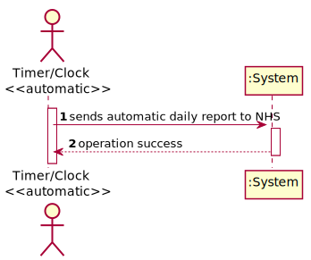


### 1.7 Other Relevant Remarks

N/A

## 2. OO Analysis

### 2.1. Relevant Domain Model Excerpt

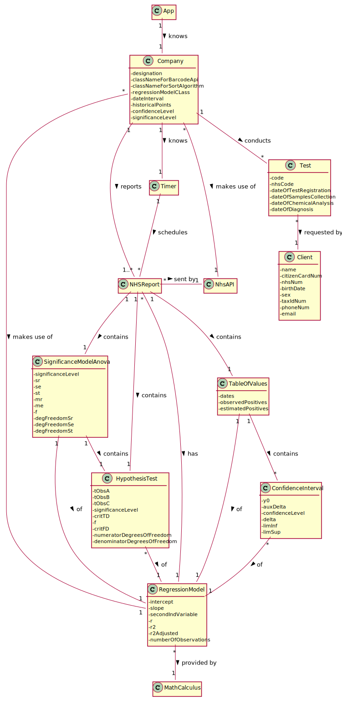

### 2.2. Other Remarks

N/A


## 3. Design - User Story Realization 

### 3.1. Rationale


**The rationale grounds on the SSD interactions and the identified input/output data.**

| Interaction ID | Question: Which class is responsible for... | Answer  | Justification (with patterns)  |
|:-------------  |:--------------------- |:------------|:---------------------------- |
| Step 1: sends automatic daily report to NHS          | ...instantiating a new NHSReport to be sent?                                   | NHSReportStore            | High Cohesion and Low Coupling: NHSReportStore was created to reduce coupling.                             |
|                                       	           | ...validating the NHSReport created?                                           | NHSReportStore            | High Cohesion and Low Coupling: there is no reason to assign this responsibility to any existing class in the Domain Model.                                                           |
|                                       	           | ...being accountable for the task of sending the report?                       | NHSReportTask             | Pure Fabrication: there is no reason to assign this responsibility to any existing class in the Domain Model.                                                                |
|                                       	           | ...scheduling said task?		                                                | Timer                     | IE: in the DM, Timer schedules NHSReport.                                                           |
|                                       	           | ...instantiating a new NHSReportTask?		                                    | Company                   | Creator (Rule 4): Company has the data used to initialize NHSReportTask objects.                    |
|                                       	           | ...instantiating a new Timer?		                                            | Company                   | Creator (Rule 4): Company has the data used to initialize the Timer objects.                        |
|                                       	           | ...knowing which Regression Model to use?		                                | Company                   | IE: in the DM, Company makes use of RegressionModel.                                                |
|                                       	           | ...knowing which API will send the report?		                                | Company                   | IE: in the DM, Company makes use of NhsAPI.                                                         |
|                                       	           | ...making the system support several Regression Models? 	                    | MathCalculus         | Protected Variations: to create a stable interface around the point of variation - the existence of different Regression Models.                       |
|                                       	           | ...enabling different Regression Models to be compatible with the system?      | RegressionModelAdapterX   | Adapter Pattern: to convert requests made in accordance to our system. One adapter per ExternalAPI.                                                    |
|                                       	           | ...saving the information regarding the regression model used?	                | MyRegressionModel         | Adapter Pattern: to allow every Adapter class to return the same type of object.                    |
|                                       	           | ...instantiate a new MyRegressionModel?		                                | MathCalculus           | Adapter Pattern: to allow every Adapter class to return the same type of object.                    |
|                                       	           | ...saving the information regarding the Hypothesis Test?	                    | HypothesisTest            | IE: has its own data.                   |
|                                       	           | ...instantiate a new HypothesisTest?		                                    | MathCalculus           | Adapter Pattern: to allow every Adapter class to return the same type of object.                    |
|                                       	           | ...saving the information regarding the Anova Significance Model?	            | AnovaSignificanceModel    | IE: has its own data.                    |
|                                       	           | ...instantiate a new SignificanceModelAnova?		                            | MathCalculus           | Adapter Pattern: to allow every Adapter class to return the same type of object.                    |
|                                       	           | ...instantiate a new HypothesisTest for the Test for Significance of Regression?    | SignificanceModelAnova         | Creator (Rule 1): SignificanceModelAnova contains HypothesisTest.                   |
|                                       	           | ...calculating the estimated Positives in accordance to the regression model being used?	                                        | MathCalculus    | Adapter Pattern: to allow every Adapter class to return the same type of object.                    |
|                                       	           | ...saving the information regarding a Confidence Interval in accordance to the regression model being used?	                    | ConfidenceInterval | IE: has its own data.                   |
|                                       	           | ...instantiate a new ConfidenceInterval?		                                    | MathCalculus           | Adapter Pattern: to allow every Adapter class to return the same type of object.                    |
|                                       	           | ...calculating the list of Confidence Intervals in accordance to the regression model being used?	                                | RegressionModel    | Adapter Pattern: to allow every Adapter class to return the same type of object.                    |
|                                       	           | ...knowing the number of observed Covid-19 positive tests?	                        | TestStore                 | IE: records/stores all the Tests objects.                                                           |
|                                       	           | ...knowing the number of Covid-19 tests realized in a certain period of time?      | TestStore                 | IE: records/stores all the Tests objects.                                                           |
|                                       	           | ...knowing the mean age of the Clients of Covid-19 tests realized in a certain period of time?             | TestStore                 | IE: records/stores all the Tests objects.                                                           |
|                                       	           | ...saving the information regarding the Tests/Mean Age data and confidence Intervals?	                    | TableOfValues | IE: has its own data.                   |
| Step 2: informs operation success  		           |     |     |    |


The interval of dates to fit the regression model and the
number of historical points (number of days and number of weeks) must be
defined through a configuration file.

### Systematization ##

According to the taken rationale, the conceptual classes promoted to software classes are: 

 * NHSReport  
 * Timer  
 * Company
 * SignificanceModelAnova  
 * TableOfValues
 * HypothesisTest  
 * ConfidenceInterval
 * MathCalculus

Other software classes (i.e. Pure Fabrication) identified:  

 * NHSReportTask
 * NHSReportStore  
 * TestStore
 * RegressionModelAdapterX  
 * MyRegressionModel

## 3.2. Sequence Diagram (SD)

*In this section, it is suggested to present an UML dynamic view stating the sequence of domain related software objects' interactions that allows to fulfill the requirement.* 

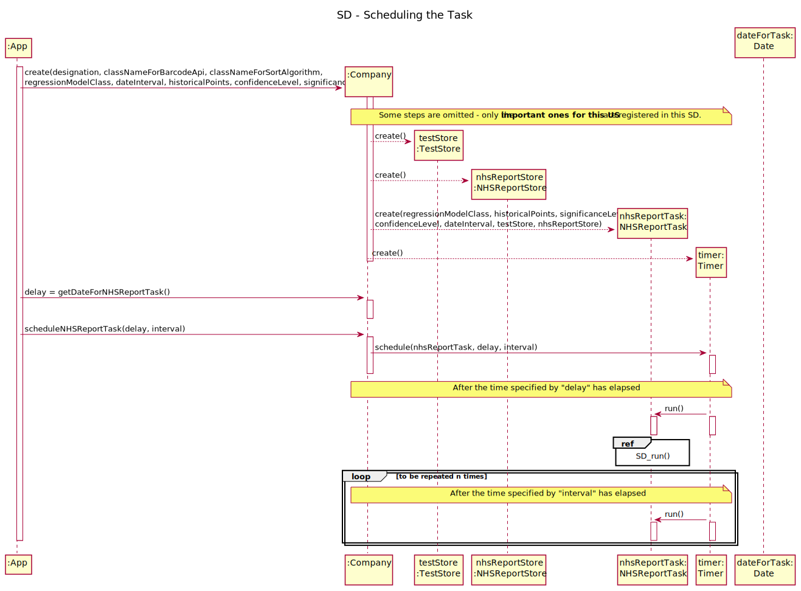  

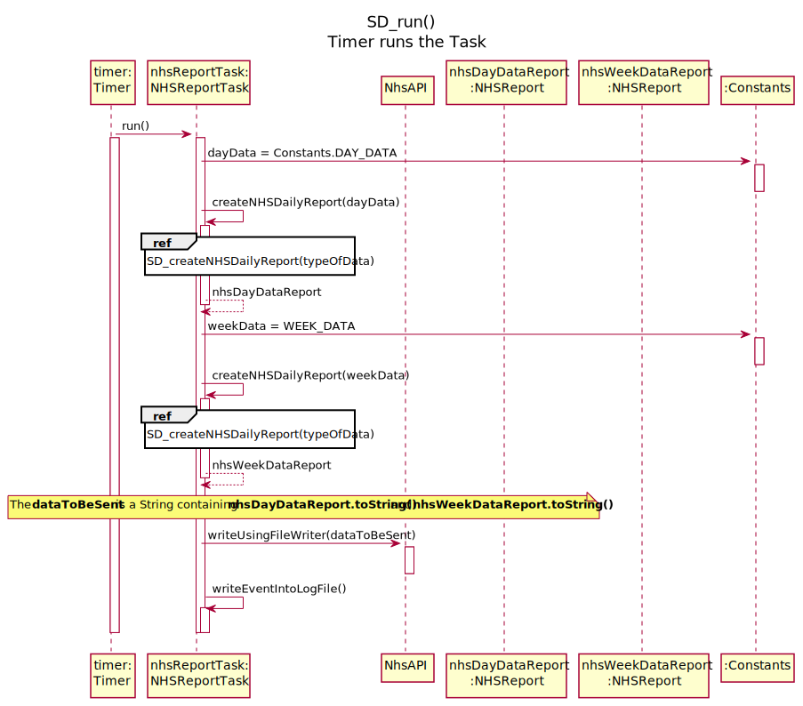

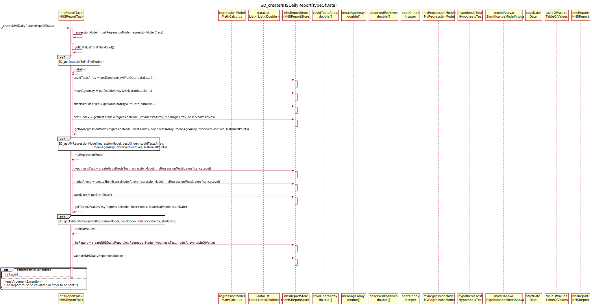  

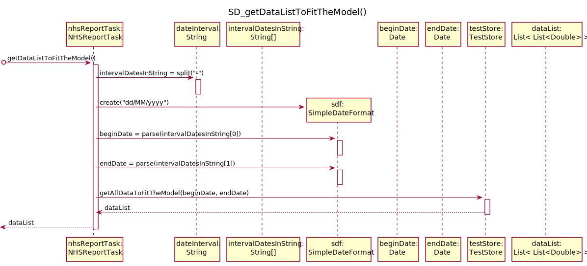

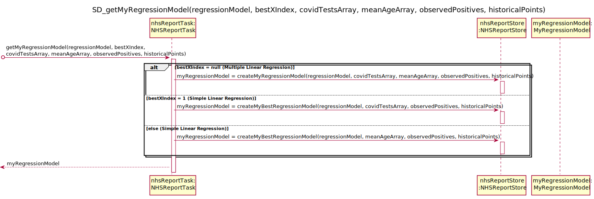

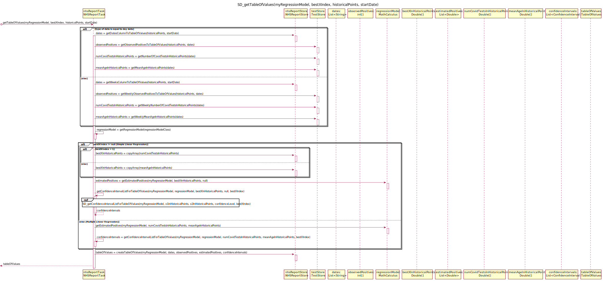

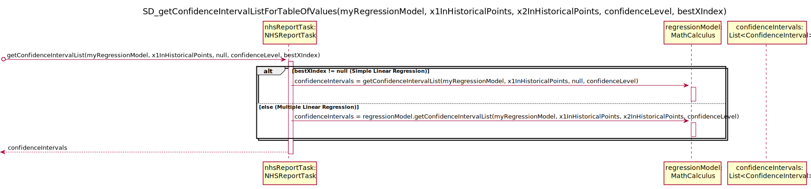

## 3.3 Package Diagram (PD)  

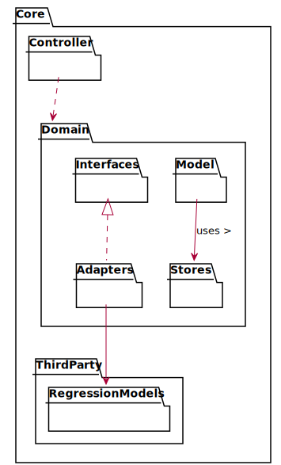

## 3.4. Class Diagram (CD)

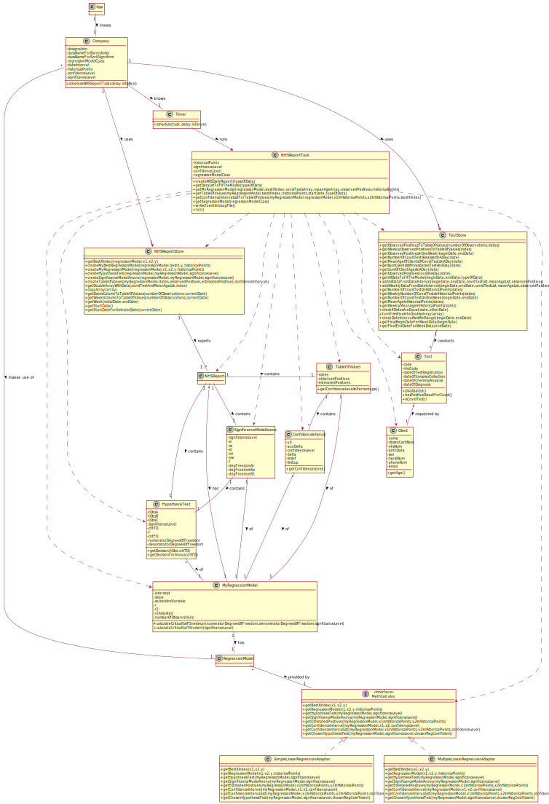


# 4. Tests 

### Class SimpleLinearRegressionAdapterTest and MultipleSimpleLinearRegressionAdapterTest

**Test:** Ensure estimate positive values are correct with a given dataset  
```
@Test
    public void getEstimatedPositives() {
        Locale.setDefault(Locale.ENGLISH); //necessary because Jenkins was configured to put numbers in English format.
        //Ex. 1 TP PL7 MATCP
        double[] x = {825.0, 215.0, 1070.0, 550.0, 480.0, 920.0, 1350.0, 325.0, 670.0, 1215.0};
        double[] y = {3.5, 1.0, 4.0, 2.0, 1.0, 3.0, 4.5, 1.5, 3.0, 5.0};
        Double[] xInDouble = {825.0, 215.0, 1070.0, 550.0, 480.0, 920.0, 1350.0, 325.0, 670.0, 1215.0};
        Double[] yInDouble = {3.5, 1.0, 4.0, 2.0, 1.0, 3.0, 4.5, 1.5, 3.0, 5.0};

        List<String> expectedEstimatedPositives = new ArrayList<>();
        expectedEstimatedPositives.add("3.075863");
        expectedEstimatedPositives.add("0.888933");
        expectedEstimatedPositives.add("3.954221");
        expectedEstimatedPositives.add("2.089952");
        expectedEstimatedPositives.add("1.838993");
        expectedEstimatedPositives.add("3.416451");
        expectedEstimatedPositives.add("4.958058");
        expectedEstimatedPositives.add("1.283297");
        expectedEstimatedPositives.add("2.520168");
        expectedEstimatedPositives.add("4.474065");


        MyRegressionModel myRegressionModel = regressionModel.getRegressionModel(x, null, y, 10);
        List<Double> estimatedPositives = regressionModel.getEstimatedPositives(myRegressionModel, xInDouble, yInDouble);

        /*
         * it was necessary to convert to an Array of String because JUNIT doesn't
         * have an Assert.assertEquals with a delta for Double Arrays
         */

        List<String> estimatedPositivesString = new ArrayList<>();
        DecimalFormat df = new DecimalFormat("#.######");

        for (Double estimatedPositive : estimatedPositives) {
            estimatedPositivesString.add(df.format(estimatedPositive));
        }

        Assert.assertEquals(expectedEstimatedPositives, estimatedPositivesString);
    }
```

**Test:** Ensure confidence interval is correct.  
```
@Test
    public void getConfidenceInterval() {
        //Arrange
        double y0 = 2241.90597157;
        double auxDelta = 22.5859909;
        double confidenceLevel = 0.95;
        ConfidenceInterval expectedConfInt = new ConfidenceInterval(myRegressionModel,y0,auxDelta,confidenceLevel);
        //Act
        ConfidenceInterval confidenceInterval = regressionModel.getConfidenceInterval(myRegressionModel, 80.0, 8.0, confidenceLevel);
        //Assert
        Assert.assertEquals(expectedConfInt, confidenceInterval);
    }
```

For the classes:  

 * ConfidenceInterval  
 * SignificanceModelAnova  
 * TableOfValues  
 * MyRegressionModel  
 * HypothesisTest  

the tests were **similar**. Mostly they were checking if equals method was working properly.

### Example:

### Class MyRegressionModelTest

**Test:** Check if the critical value for F. Snedecor distribution is correct.  
```
@Test
    public void calculateCriticalValFSnedecor() {
        double expected = 4.2565;
        double actual = myRegressionModelWithSLR.calculateCriticalValFSnedecor(2,9,0.05);

        Assert.assertEquals(expected, actual, 0.0001);
    }
```
**Test:** Check if the critical value for T-Student distribution is correct.  
```
@Test
    public void calculateCriticalValTStudentForSLR() {
        double expected = 2.306;
        double actual = myRegressionModelWithSLR.calculateCriticalValTStudent(0.05);

        Assert.assertEquals(expected, actual, 0.0001);
    }
```
 
**Test:** check if equals overwritten equals method is evaluating correctly for  
    a) Objects From Different Classes.  
    b) Null Object Not Equal To Existing Object.  
    c) Equals if all attributes are equals.  
    d) If one of the attributes is not the same, returns false.  

a)  
```
@Test
    public void ensureEqualsMethodObjectsFromDifferentClasses() {
        MyRegressionModel object = new MyRegressionModel(1.2345,0.0045, 2.33,0,900,10, simpleLR);

        boolean result = object.equals(simpleLR);

        Assert.assertFalse(result);
    }
```

b)  
```
@Test
    public void ensureEqualsMethodNullObjectNotEqualToExistingObject() {
        MyRegressionModel object = new MyRegressionModel(1.2345,0.0045, 2.33,0,900,10, simpleLR);
        MyRegressionModel nullObject = null;

        boolean result = object.equals(nullObject);

        Assert.assertFalse(result);
    }
```

c)  
```
@Test
    public void ensureEquals() {
        MyRegressionModel object1 = new MyRegressionModel(1.2345,0.0045, 2.33,0,900,10, simpleLR);
        MyRegressionModel object2 = new MyRegressionModel(1.2345,0.0045, 2.33,0,900,10, simpleLR);

        boolean result = object1.equals(object2);

        Assert.assertTrue(result);
    }
```

d)
```
@Test
    public void ensureNotEqualsWithDifferentIntercept() {
        MyRegressionModel object = new MyRegressionModel(1.2345,0.0045,0,900,10, simpleLR);
        MyRegressionModel differentObject = new MyRegressionModel(1.25,0.0045,0,900,10, simpleLR);

        boolean result = object.equals(differentObject);

        Assert.assertFalse(result);
    }
```


### Class MultipleLinearRegression  

To make sure the class for Multiple Linear Regression I made was functioning properly, I made several tests, such as:  

**Test:** Ensure the method returns the transpose of a matrix correctly.
```
@Test
    public void transposeMatrix() {
        double[][] x = {{1,2,3,1}, {4,5,6,2}, {7,8,9,0}, {1,1,1,1}};
        double[][] expected = {{1,4,7,1}, {2,5,8,1}, {3,6,9,1}, {1,2,0,1}};

        double[][] actual = multipleLR.transposeMatrix(x);

        Assert.assertArrayEquals(expected, actual);
    }
```

**Test:** Ensure the different multiplications work properly:  
            a) Matrix multiplication  
            b) Matrix with Vector multiplication
            c) Vector with vector multiplication
            d) Vector with matrix multiplication


a)
```
@Test
    public void matrixMultiplication() {
        double[][] matrix1 = {{1,2,3,1,1}, {4,5,6,2,1}, {7,8,9,0,1}, {1,1,1,1,1}, {2,3,4,1,1}};
        double[][] matrix2 = {{1,2,3}, {2,3,4}, {1,2,1}, {2,3,4}, {2,3,4}};

        double[][] expected = {{12,20,22}, {26,44,50}, {34,59,66}, {8,13,16}, {16,27,30}};

        double[][] actual = multipleLR.matrixMultiplication(matrix1, matrix2);
    }
```  

b)
```
@Test
    public void matrixWithVectorMultiplication() {
        double[][] matrix = {{1,2,3,1,1}, {4,5,6,2,1}, {7,8,9,0,1}, {1,1,1,1,1}, {2,3,4,1,1}};
        double[] vector = {1,2,1,2,2};

        double[] expected = {12,26,34,8,16};

        double[] actual = multipleLR.matrixWithVectorMultiplication(matrix, vector);

        Assert.assertArrayEquals(expected, actual, 0.0);
    }
```  

c)  
```
@Test
    public void vectorWithVectorMultiplication() {
        double[] vector1 = {1,2,3,4,5,6};
        double[] vector2 = {1,2,1,2,2,5};

        double expected = 56;
        double actual = multipleLR.vectorWithVectorMultiplication(vector1, vector2);

        Assert.assertEquals(expected, actual, 0.0);
    }
```

d) 
```
@Test(expected = IllegalArgumentException.class)
    public void vectorWithMatrixMultiplicationNotPossible() {
        double[] vector = {21,23,56,3};
        double[][] matrix = {{23,1,0,20,3}, {5,6,9,13,0}, {1,2,3,4,5}, {40,8,9,76,7}, {1,2,3,4,5}};

        double[] actual = multipleLR.vectorWithMatrixMultiplication(vector, matrix);
    }
```

**Test:** Ensure it calculaste the mean of an array of values correctly.
```
@Test
    public void mean() {
        double[] values = {20,3,4,5,7,4};
        double expected = 7.16666666;
        double actual = multipleLR.mean(values);

        Assert.assertEquals(expected, actual, 0.0001);

    }
```


# 5. Construction (Implementation)

### Class NHSReportTask  

In this section, it is explicited the **main class** for this US - **NHSReportTask**.

```
public class NHSReportTask extends TimerTask {
    private String regressionModelClass;
    private RegressionModel regressionModel;
    private int historicalPoints;
    private double significanceLevel;
    private double confidenceLevel;
    private String dateInterval;
    private TestStore testStore;
    private NHSReportStore nhsReportStore;
    private NHSReport nhsDayDataReport;
    private NHSReport nhsWeekDataReport;

    public NHSReportTask(String regressionModelClass,
                         String historicalPoints,
                         String significanceLevel,
                         String confidenceLevel,
                         String dateInterval,
                         TestStore testStore,
                         NHSReportStore nhsReportStore) {
        this.regressionModelClass = regressionModelClass;
        this.historicalPoints = Integer.parseInt(historicalPoints);
        this.significanceLevel = Double.parseDouble(significanceLevel);
        this.confidenceLevel = Double.parseDouble(confidenceLevel);
        this.dateInterval = dateInterval;
        this.testStore = testStore;
        this.nhsReportStore = nhsReportStore;
    }

    public NHSReport createNHSDailyReport(String typeOfData) throws ClassNotFoundException, InstantiationException, ParseException, IllegalAccessException {
        this.regressionModel = getRegressionModel(regressionModelClass);
        List<List<Double>> dataList = getDataListToFitTheModel(typeOfData);
        double[] covidTestsArray = nhsReportStore.getDoubleArrayWithData(dataList, 0);
        double[] meanAgeArray = nhsReportStore.getDoubleArrayWithData(dataList, 1);
        double[] observedPositives = nhsReportStore.getDoubleArrayWithData(dataList, 2);
        Integer bestXIndex = nhsReportStore.getBestXIndex(regressionModel, covidTestsArray, meanAgeArray, observedPositives);

        MyRegressionModel myRegressionModel = getMyRegressionModel(regressionModel, bestXIndex, covidTestsArray, meanAgeArray, observedPositives, historicalPoints);
        HypothesisTest hypothesisTest = nhsReportStore.createHypothesisTest(regressionModel, myRegressionModel, significanceLevel);
        SignificanceModelAnova modelAnova = nhsReportStore.createSignificanceModelAnova(regressionModel, myRegressionModel, significanceLevel);

        Date startDate = nhsReportStore.getStartDate();
        TableOfValues tableOfValues = getTableOfValues(myRegressionModel, bestXIndex, historicalPoints, startDate, typeOfData);

        NHSReport nhsReport = nhsReportStore.createNHSDailyReport(myRegressionModel,hypothesisTest,modelAnova,tableOfValues);
        if(nhsReportStore.validateNHSDailyReport(nhsReport))
            return nhsReport;
        else
            throw new IllegalArgumentException("The Report must be validated in order to be sent!");
    }


    public List<List<Double>> getDataListToFitTheModel(String typeOfData) throws ParseException {
        String[] intervalDatesInString = dateInterval.split("-");
        SimpleDateFormat sdf = new SimpleDateFormat("dd/MM/yyyy");
        Date beginDate = sdf.parse(intervalDatesInString[0]), endDate = sdf.parse(intervalDatesInString[1]);
        List<List<Double>> dataList = testStore.getAllDataToFitTheModel(beginDate, endDate, typeOfData);
        return dataList;
    }

    public MyRegressionModel getMyRegressionModel(RegressionModel regressionModel,
                                                  Integer bestXIndex,
                                                  double[] covidTestsArray,
                                                  double[] meanAgeArray,
                                                  double[] observedPositives,
                                                  int historicalPoints) {

        MyRegressionModel myRegressionModel = (bestXIndex == null) ? nhsReportStore.createMyRegressionModel(regressionModel, covidTestsArray, meanAgeArray, observedPositives, historicalPoints) :
                ((bestXIndex == 1) ? nhsReportStore.createMyBestRegressionModel(regressionModel, covidTestsArray, observedPositives, historicalPoints) : nhsReportStore.createMyBestRegressionModel(regressionModel, meanAgeArray, observedPositives, historicalPoints));
        return myRegressionModel;
    }


    public TableOfValues getTableOfValues(MyRegressionModel myRegressionModel,
                                          Integer bestXIndex,
                                          int historicalPoints,
                                          Date startDate,
                                          String typeOfData) throws IllegalAccessException, InstantiationException, ClassNotFoundException, ParseException {

        List<String> dates;
        int[] observedPositives;
        Double[] numCovidTestsInHistoricalPoints;
        Double[] meanAgeInHistoricalPoints;

        if(typeOfData.equalsIgnoreCase(Constants.DAY_DATA)) {
            dates = nhsReportStore.getDatesColumnToTableOfValues(historicalPoints, startDate);
            observedPositives = testStore.getObservedPositivesToTableOfValues(historicalPoints, dates);
            numCovidTestsInHistoricalPoints = testStore.getNumberOfCovidTestsInHistoricalPoints(dates);
            meanAgeInHistoricalPoints = testStore.getMeanAgeInHistoricalPoints(dates);
        } else {
            dates = nhsReportStore.getWeeksColumnToTableOfValues(historicalPoints, startDate);
            observedPositives = testStore.getWeeklyObservedPositivesToTableOfValues(dates);
            numCovidTestsInHistoricalPoints = testStore.getWeeklyNumberOfCovidTestsInHistoricalPoints(dates);
            meanAgeInHistoricalPoints = testStore.getWeeklyMeanAgeInHistoricalPoints(dates);
        }

        this.regressionModel = getRegressionModel(regressionModelClass);

        Double[] bestXInHistoricalPoints;
        List<Double> estimatedPositives;

        List<ConfidenceInterval> confidenceIntervals;

        if(bestXIndex != null) {
            //for Simple Linear Regression
            if(bestXIndex == 1)
                bestXInHistoricalPoints = nhsReportStore.copyArray(numCovidTestsInHistoricalPoints);
            else
                bestXInHistoricalPoints = nhsReportStore.copyArray(meanAgeInHistoricalPoints);
            estimatedPositives = this.regressionModel.getEstimatedPositives(myRegressionModel, bestXInHistoricalPoints, null);
            confidenceIntervals = getConfidenceIntervalListForTableOfValues(myRegressionModel, regressionModel, bestXInHistoricalPoints, null, bestXIndex);
        } else {
            //for Multiple Linear Regression
            estimatedPositives = this.regressionModel.getEstimatedPositives(myRegressionModel, numCovidTestsInHistoricalPoints, meanAgeInHistoricalPoints);
            confidenceIntervals = getConfidenceIntervalListForTableOfValues(myRegressionModel, regressionModel, numCovidTestsInHistoricalPoints, meanAgeInHistoricalPoints, bestXIndex);
        }

        TableOfValues tableOfValues = nhsReportStore.createTableOfValues(myRegressionModel, dates, observedPositives, estimatedPositives, confidenceIntervals);
        return tableOfValues;
    }

    public List<ConfidenceInterval> getConfidenceIntervalListForTableOfValues(MyRegressionModel myRegressionModel,
                                                                              RegressionModel regressionModel,
                                                                              Double[] x1InHistoricalPoints,
                                                                              Double[] x2InHistoricalPoints,
                                                                              Integer bestXIndex) {
        List<ConfidenceInterval> confidenceIntervals;
        if(bestXIndex != null) //for Simple Linear Regression
            confidenceIntervals = regressionModel.getConfidenceIntervalList(myRegressionModel, x1InHistoricalPoints, null, confidenceLevel);
        else //For Multiple Linear Regression
            confidenceIntervals = regressionModel.getConfidenceIntervalList(myRegressionModel, x1InHistoricalPoints, x2InHistoricalPoints, confidenceLevel);
        return confidenceIntervals;
    }

    public RegressionModel getRegressionModel(String regressionModelCLass) throws ClassNotFoundException, IllegalAccessException, InstantiationException {
        Class<?> oClass = Class.forName(regressionModelCLass);
        return (RegressionModel) oClass.newInstance();
    }

    public void writeEventIntoLogFile() throws IOException {
        Logger logger = Logger.getLogger(NHSReportTask.class.getSimpleName());
        FileHandler fh;

        fh = new FileHandler("./NHSReport.log", true);
        logger.addHandler(fh);
        SimpleFormatter formatter = new SimpleFormatter();
        fh.setFormatter(formatter);

        logger.info("NHS Daily Report sent");

        logger.setUseParentHandlers(false);
    }

    static int cont = 0;

    @Override
    public void run() {

            this.nhsDayDataReport = createNHSDailyReport(Constants.DAY_DATA);
            this.nhsWeekDataReport = createNHSDailyReport(Constants.WEEK_DATA);

            File path = new File("./NHSReport/");
            if(!path.exists())
                    path.mkdir();

            String dataToBeSent = String.format("----------------------> DAY DATA <----------------------%n%n%s%n%n" +
                    "----------------------> WEEK DATA <----------------------%n%n%s", this.nhsDayDataReport.toString(), this.nhsWeekDataReport);

            Report2NHS.writeUsingFileWriter(dataToBeSent);
            writeEventIntoLogFile();

        } catch (ClassNotFoundException e) {
            e.printStackTrace();
        } catch (InstantiationException e) {
            e.printStackTrace();
        } catch (ParseException e) {
            e.printStackTrace();
        } catch (IllegalAccessException e) {
            e.printStackTrace();
        } catch (IOException e) {
            e.printStackTrace();
        }

    }
```

# 6. Integration and Demo 

In order to reduce duplicated and complicated code, I made sure to use an Interface and Adapter Classes.


# 7. Observations

A more careful work towards possible exceptions could be done.  
**Due to lack of time**:  
* I was unable to correct the DM regarding the classes SignificanceModelAnova, TableOfValues, HypothesisTest, ConfidenceInterval. They are classes of **Pure Fabrication** and **not** conceptual classes and therefore shouldn't be in the DM.  
* I didn't change the name of the interface in code (in the Documentation it's called MathCalculus and in code RegressionModel).  


