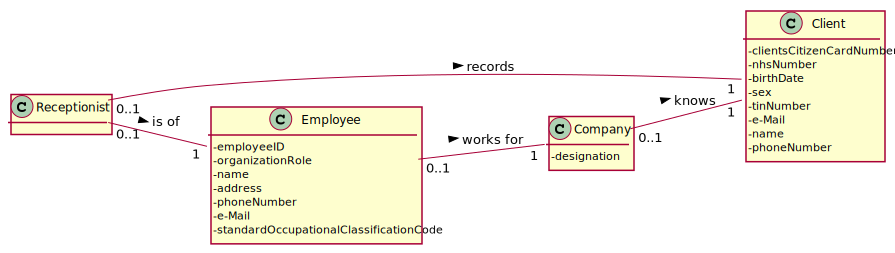
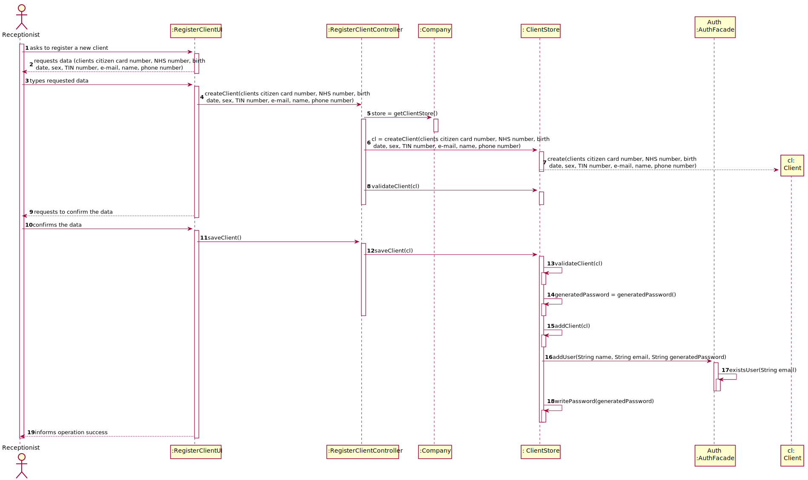
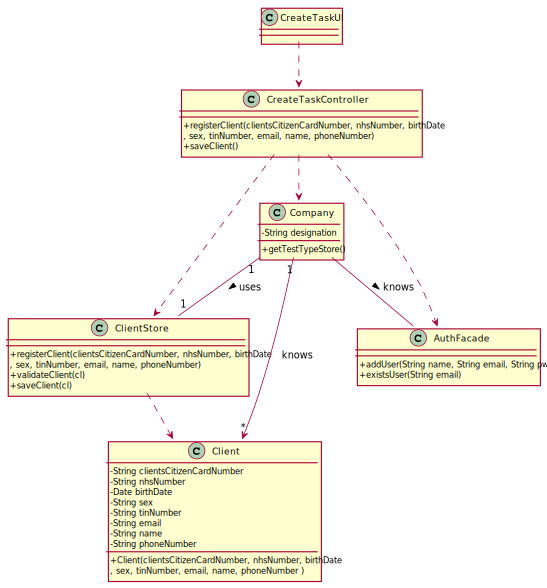

# US 003 - To register a new Client

## 1. Requirements Engineering

### 1.1. User Story Description

As a receptionist of the laboratory, I want to register a client.

### 1.2. Customer Specifications and Clarifications 

**From the specifications document:**

>	In case of a new client, the receptionist registers the client in the application. To register a client, the receptionist needs the client’s citizen card number, National Healthcare Service (NHS) number, birth date, sex, Tax Identification number (TIF), phone number, e-mail and name.

**From the client clarifications:**

> **Question1:** "Are all the fields required/mandatory?"
>  
> **Answer:** "The sex is opcional. All other fields are required."
>
> **Question 1** [here](https://moodle.isep.ipp.pt/mod/forum/discuss.php?d=7563).
-

> **Question2:**  Which type/format should all data have?"
>  
> **Answer:** "Citizen Card" - 16 digit number; "NHS" - 10 digit number; "TIN" - 10 digit number; "Birth day - in which format?" - DD/MM/YYYY; "Sex - should only be Male/Female or include more options." -  Male/Female; "Phone number: which lenght/format?" - 11 digit number

-

> **Question3:** "Since the client will become a system user, how should his password be generated ?"
>  
> **Answer:** "The password should be randomly generated. It should have ten alphanumeric characters"
>
>Question 3 [here](https://moodle.isep.ipp.pt/mod/forum/discuss.php?d=7932).

### 1.3. Acceptance Criteria

* **AC1:** The client must become a system user. The "auth" component
available on the repository must be reused (without modifications);
* **AC2:** The Citizen Card must have 16 digit number;
* **AC3:** The NHS number must have 10 digit;
* **AC4:** The TIN number must have 10 digit;
* **AC5:** The Birth day format must be DD/MM/YY;
* **AC6:** The Sex options must be Male/Female;
* **AC7:** The Phone number must be 11 digit;
* **AC8:** The sex is opcional. All other fields are required.
* **AC9** The name cannot have more than 35 characters.

### 1.4. Found out Dependencies

* There is a dependency to "US7 Register a new employee" since the receptionist must be registered in the application and do the login so he can register the client.

### 1.5 Input and Output Data

**Input Data:**

* Typed data:
	* a clients citizen card number;
	* a NHS number;
	* a birth date;
	* the Sex (optional);
	* a Tax Identification Number (TIN);
	* an e-mail;
    * a name;
    * a phone number;

**Output Data:**

* (In)Success of the operation

### 1.6. System Sequence Diagram (SSD)

**Other alternatives might exist.**

### 1.7 Other Relevant Remarks

n/a

## 2. OO Analysis

### 2.1. Relevant Domain Model Excerpt 

### 2.2. Other Remarks

n/a

## 3. Design - User Story Realization 

### 3.1. Rationale

**SSD - Alternative 1 is adopted.**

| Interaction ID | Question: Which class is responsible for... | Answer  | Justification (with patterns)  |
|:-------------  |:--------------------- |:------------|:---------------------------- |
| Step 1  		 |	... interacting with the actor? | RegisterClientUI   |  Pure Fabrication: there is no reason to assign this responsibility to any existing class in the Domain Model.           |
| 			  		 |	... coordinating the US? | RegisterClientController | Controller                             |
|Step 2: starts new Client | ... instanting a new Client ? | ClientStore | Creator: R1/2|
|Step 3: resquest data | ... n/a | | |
|Step 4: types requested data ? | ... saving the input data ?| Client | IE: The object created in step 2 has its own data|
|Step 5: showns the data and requests a confirmation | ... validating the data locally ? | Client| IE: knows its own data |
| | validating the data globally | ClientStore | IE: knows all the Client objects|
|Step 6: confirms data | ... saving the created client ? | ClientStore | IE: adopts/records all the Clients objects|
|Step 7| ... making the client a user of the system ? | AuthFacade | IE: cf. A&A component documentation.|
|Step 8: informs operation success| ... informing operation success ?| UI| IE:responsible for user interactions |

### Systematization ##

According to the taken rationale, the conceptual classes promoted to software classes are: 

 * Client;
 * Company

Other software classes (i.e. Pure Fabrication) identified: 

 * ClientStore
 * RegisterClientUI  
 * RegisterClientController

## 3.2. Sequence Diagram (SD)

**Alternative 1**

## 3.3. Class Diagram (CD)

**From alternative 1**

# 4. Tests 

##Client Instances

**Test 1:** Check that it is not possible to create an instance of the Client with null values. 

	@Test(expected = IllegalArgumentException.class)
        public void createClientWithNullEntries(){
            new Client(null, null, null, null, null, null, null);
        }
	
**Test 2:** Check if it's not possible to create a Client with empty field for each attribute.
**For Example:**

    @Test(expected = IllegalArgumentException.class)
        public void createClientWithCitizenCardNumberEmpty(){
            new Client("", "1234567890", d1, "Male", "1234567890", "alex@gmail.com", "Alex", "12345678901");
    }
 
**Test 3:** Check if it is not possible to create a Client with each attribute's lenght not following the specified criteria.
>* **AC2:** The Citizen Card must have 16 digit number;
>* **AC3:** The NHS number must have 10 digit;
>* **AC4:** The TIN number must have 10 digit;
>* **AC7:** The Phone number must be 11 digit;]
>* **AC9** The name cannot have more than 35 characters.
*Example (Tests of right and left limits):*

    @Test(expected = IllegalArgumentException.class)
        public void createClientWithCitizenCardNumberWith17Digits() {

        new Client("11111111111111111", "1234567890", d1, "Male", "1234567890", "alex@gmail.com", "Alex", "12345678901");
    }

    @Test(expected = IllegalArgumentException.class)
    public void createClientWithCitizenCardNumberWith15Digits() {

        new Client("111111111111111", "1234567890", d1, "Male", "1234567890", "alex@gmail.com", "Alex", "12345678901");
    }
**Test 4:** Check if it is not possible to create a Client with number attributes having letters.
####Number attributes which are:
>* Citizen Card;
>* NHS number;
>* TIN number;
>* Phone number;
*Example:*

    @Test(expected = IllegalArgumentException.class)
        public void clientWithNhsNumberWithLetters() {
    
            new Client("1234567890123456", "A123456789", d1, "Male", "1234567890", "alex@gmail.com", "Alex", "12345678901");
        }

**Test 5:** Check if it is not possible to create a Client with sex with being nothing but Male of Female.

*Example:*

    @Test(expected = IllegalArgumentException.class)
        public void createClientWithSexWithJustDigits() {
    
            new Client("1234567890123456", "1234567890", d1, "123124", "1111111111", "alex@gmail.com", "Alex", "12345678901");
        }
    
    @Test(expected = IllegalArgumentException.class)
    public void createClientWithSexOtherThanFemaleOrMaleJustLeters() {

        new Client("1234567890123456", "1234567890", d1, "awodkwq", "1111111111", "alex@gmail.com", "Alex", "12345678901");
    }
    
**Test 6:** Check if it is not possible to create a Client with wrong email format.

*Example:*

    @Test(expected = IllegalArgumentException.class)
    public void createClientWithEmailWrong() {
        new Client("1234567890123456", "1234567890", d1, "Male", "1234567890", "alexgmail.com", "Alex", "12345678901");

   }
       
**Test 7:** Check if it is not possible to create a Client with more then 150 years.

*Example:*

    @Test(expected = IllegalArgumentException.class)
    public void createClient150yearsOld() throws ParseException {
       Date d2 = new SimpleDateFormat("dd/MM/yyyy").parse("07/05/1870");
       new Client("1234567891222222", "1234567890", d2, "Male", "1234567890", "alex@gmail.com", "Alex", "12345678901");
    }
   
**Test 8:** Check if Equals method evaluates true for Clients with same citizen card number, tin number, nhs number, email or phone number.

*Example:*

    @Test
    public void equalsTrue() {
       Client c1 = new Client("1234567890123457", "1234567890", d1, "Male", "1234567890", "alex@gmail.com", "Alex", "12345678901");
       Client c2 = new Client("1234567890123456", "1234567890", d1, "Male", "1234567890", "alex@gmail.com", "Alex", "12345678901");
       boolean result = c1.equals(c2);
       Assert.assertTrue(result);
    }
   

##Client Store
**Test 9:** Check if it is not possible to add two repeated Clients in the Client store

*Example:*

    @Test
        public void createClientStoreWithSomeElementsButTwoAreTheSame() throws ParseException {
    
            Date d1 = new SimpleDateFormat("dd/MM/yyyy").parse("08/08/2001");
    
            ClientStore cs1 = new ClientStore();
    
            Client cl1 = cs1.registerClient("1234567890123457","1234567890",d1,"Male","1234567891","alex1@gmail.com","Alex", "12345678901");
            cs1.saveClient(cl1);
    
            Client cl2 = cs1.registerClient("1234567890123457","1234567891",d1,"Female","1234567892","alex2@gmail.com","Alex", "12345678901");
            cs1.saveClient(cl2);
    
            Client cl3 =cs1.registerClient("1234567890123459","1234567892",d1,"Male","1234567893","alex3@gmail.com","Alex", "12345678901");
            boolean c = cs1.saveClient(cl3);
    
    
            Client [] result = cs1.toArray();
            Assert.assertEquals(2, result.length);
    
        }
   

*It is also recommended to organize this content by subsections.* 

# 5. Construction (Implementation)

## Class RegisterClientController 

		public boolean registerClient(String clientsCitizenCardNumber, String nhsNumber, Date birthDate, String sex,
                                      String tinNumber, String email, String name, String phoneNumber) {
            ClientStore store = this.company.getClientStore();
            this.cl = store.registerClient(clientsCitizenCardNumber, nhsNumber, birthDate, sex,
                    tinNumber, email, name, phoneNumber);
            return store.validateClient(cl);
        }

        //...Omitted
        
        public boolean saveClient() {
            ClientStore store = this.company.getClientStore();
            return store.saveClient(cl);
        }
        
        //...Omitted
         
        private boolean makeClientAnUser (){
            this.generatedPassword = PasswordUtils.generateRandomPassword();
            AuthFacade authFacade = this.company.getAuthFacade();
            return authFacade.addUser(cl.getName(), cl.getEmail(), generatedPassword);
        }
            
        public boolean makeClientAnUserAndSendPassword() throws IOException {
            if(makeClientAnUser())
                return PasswordUtils.writePassword(generatedPassword, cl.getEmail());
            return false;
        }

## Class ClientStore

       public Client registerClient(String clientsCitizenCardNumber, String nhsNumber, Date birthDate, String sex,
                                                     String tinNumber, String email, String name, String phoneNumber) {
           return new Client(clientsCitizenCardNumber, nhsNumber, birthDate, sex,
                   tinNumber, email, name, phoneNumber);
       }
       
       public boolean validateClient(app.domain.model.Client cl) {
           if (cl == null)
               return false;
   
           return !this.clientList.contains(cl);
       }
   
       public boolean saveClient(app.domain.model.Client cl) {
           if (!validateClient(cl))
               return false;
           return this.clientList.add(cl);
       }
###

# 6. Integration and Demo 
The password for the user is generated and sent(written in a file) by an method in PasswordUtils since it is
not a responsability of any of domain classes to generate a password or send out data. Respecting Pure Fabrication.
Also being reused in US7.

# 7. Observations

Client have to many arguments passed through layers, a DTO could make the maintenance easier.

