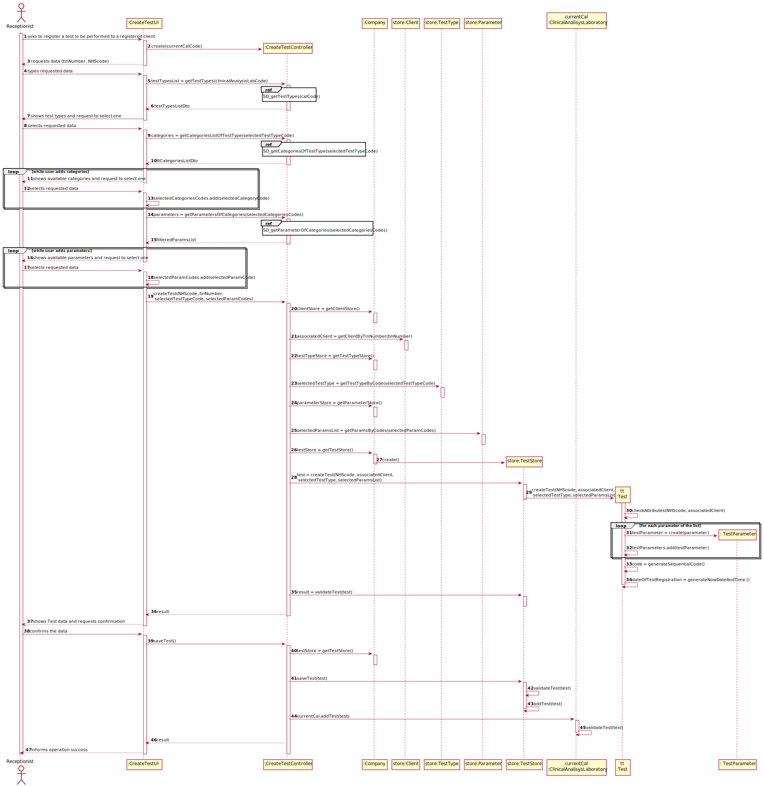
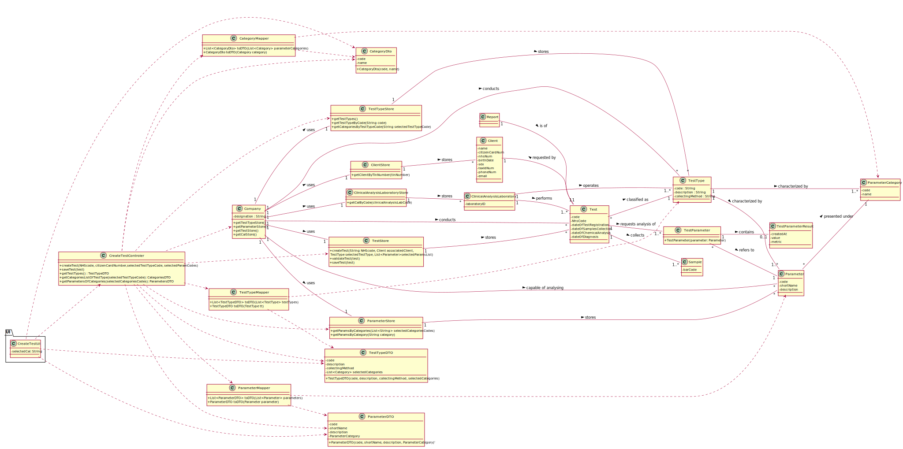

# US 04 - As a receptionist of the laboratory, I intend to register a test to be performed to a registered client.

## 1. Requirements Engineering

*In this section, it is suggested to capture the requirement description and specifications as provided by the client as well as any further clarification on it. It is also suggested to capture the requirements acceptance criteria and existing dependencies to other requirements. At last, identfy the involved input and output data and depicted an Actor-System interaction in order to fulfill the requirement.*

### 1.1. User Story Description

As a **receptionist** of the **laboratory**, I intend to register a **test** to be performed to a **registered client**.

### 1.2. Customer Specifications and Clarifications 

**From the specifications document:**
 >"Typically, the client arrives at one of the clinical analysis laboratories with a lab order prescribed by
  a doctor. Once there, a receptionist asks the client’s citizen card number, the lab order (which
  contains the type of test and parameters to be measured), and registers in the application the test to
  be performed to that client"
>
 **From the client clarifications:**
 
 >Q1: When the receptionist chooses the test type, should the categories appear, and then when selecting the category, the receptionist can choose the parameters for the test? Or when the Receptionist chooses the test type, should appear all the parameters that it includes immediately?
 >
 >A1:Firstly, the receptionist should choose a test type. Then choose a category from a set of categories. Last, the receptionist should choose a parameter.
>
>Q1 Link [here](https://moodle.isep.ipp.pt/mod/forum/discuss.php?d=8181).

>Q2: What are the attributes of a test and the acceptance criteria?
>
>A2: A test has the following attributes:
    Test code : Sequential number with 12 digits. The code is automatically generated.
    NHS code: 12 alphanumeric characters.
>
>Q2 Link [here](https://moodle.isep.ipp.pt/mod/forum/discuss.php?d=8181).

>Q3:When the receptionist is registering a test for a client, the test can have more than one category and many parameters of the chosen categories or it only can have one category?
>
>A3: Each test can have more than one category.
>
>Q3 Link [here](https://moodle.isep.ipp.pt/mod/forum/discuss.php?d=8522).

>Q4:On the project description we have multiple attributes of date and time ("date and time when the samples were collected", etc). Are these attributes filled by the author of the respective act or is it generated by the system when those acts are performed?
>
>A4: The system should automatically generate the date and time of the event (test registration, chemical analysis, diagnosis and validation).
>
>Q4 Link [here](https://moodle.isep.ipp.pt/mod/forum/discuss.php?d=8442).

>Q5: How is it possible to know in which laboratory the test is being registered? Should the Receptionist select the Laboratory before selecting the Test Type?
>
>A5: After login the receptionist should select the laboratory where she is working. Then, the receptionist has access to the system's features/functionalities.
>
>Q5 Link [here](https://moodle.isep.ipp.pt/mod/forum/discuss.php?d=8472).

>Q6: Shouldn't the receptionist locate the Client by the Citizen Card Number instead of TIN Number?
>
>A6:The receptionist should use the TIN number to find the client.
>
>Q6 Link [here](https://moodle.isep.ipp.pt/mod/forum/discuss.php?d=8684).

### 1.3. Acceptance Criteria

* **AC1**: The receptionist must select the parameters to be analysed from all possible parameters in accordance with the test type.
* **AC2**: The test code must be sequential and have 12 digits.
* **AC3**: The NHS code must hold 12 alphanumeric digits.
* **AC4**: The test object must hold the date and time of test registration, chemical analysis, diagnosis and validation

### 1.4. Found out Dependencies

* There is a dependency with "US7 - To register a new employee" since the Receptionist must be registered in the system.
* There is a dependency with "US3 - To register a client" since the Client must be registered.
* There is a dependency with "US9 - To specify a new test type" since the test must be classfied in a test type.

### 1.5 Input and Output Data

* Typed data:
    * NHS code
    * Client's TIN number
* Selected data:
    * Test type
    * Parameters

### 1.6. System Sequence Diagram (SSD)

### 1.7 Other Relevant Remarks

The present US has a high utilization rate since it is the main existent business transaction.

## 2. OO Analysis

### 2.1. Relevant Domain Model Excerpt 

### 2.2. Other Remarks

n/a

## 3. Design - User Story Realization 

### 3.1. Rationale

**The rationale grounds on the SSD interactions and the identified input/output data.**

| Interaction ID | Question: Which class is responsible for... | Answer  | Justification (with patterns)  |
|:-------------  |:--------------------- |:------------|:---------------------------- |
| Step 1: Asks to register a test to be performed to a registered client               |	...Instantiating a new Test?                                           | TestStore       | Creator: R1|
| Step 2: requests data (TINnumber, NHScode)                                           |  n/a                                                                    |                           |               |
| Step 3: Types requested data                                                         |... Saving input data?	                                               | Test                               | IE: The object created in step 1 has its own data.|
|                                                                                      |... Getting client to be associated from TIN number                    | ClientStore                        | IE: The client store knows it's clients tin numbers.|
| Step 4: shows test types and request to select one                                   | ...knowing the types of test to show?                                 | ClinicalAnalisysLaboratory         | IE: The clinical analysis laboratory in which the receptionist works knows which tests it supports|
|                                                                                      | ...Creating a test type dto                                           | TestTypeMapper                     | LC: Pass a DTO to reduce coupling between layers|
| Step 5: selects test type                                                            |... Saving input data?	                                               | Test                                | IE: The object created in step 1 has its own data.|
| Step 6: shows categories associated with test type request to select one            | ...knowing which categories to be shown?                               | TestType                              | IE: The test type selected in step 5 has it's category of parameters|              
| Step 7: Selects category                                                            |... Saving input data?	                                               | Test                               | IE: The object created in step 1 has its own data.|
| Step 8: shows all parameters associated selected category                          | ...knowing which category of parameters to be shown?                    | TestType                           | IE: The test type selected in step 5 has it's category of parameters|              
|                                                                                    | ...knowing the parameters to show?                                      | ParameterStore                     | IE: The parameter store knows its parameters|
|                                                                                    | ...Creating a parameters dto	                                           | ParameterMapper                    | LC: Pass a DTO to reduce coupling between layers|
| Step 9: Selects parameter                                                          |... Saving input data?	                                               | Test                               | IE: The object created in step 1 has its own data.|
| Step 10: Shows Test data and requests confirmation                                  |... validating the data locally (e.g.: mandatory vs. non-mandatory data)?| Test                              | IE: Knows its own data.|              
|                                                                                    |... validating the data globally (e.g.: duplicated)?				       | TestStore                          | IE: Knows all Test objects.|      
| Step 11: confirms the data                                                         |... saving the created test?				                               | TestStore                          | IE: Records/adopts all the Test objects.|
| Step 12: Informs operation success                                                 |... informing operation success?				                           | TestUI                             | IE: responsible for user interaction                 |              
  
### Systematization ##

According to the taken rationale, the conceptual classes promoted to software classes are: 

* Test
* TestType
* Parameter
* Client
* ClinicalAnalysisLaboratory

Other software classes (i.e. Pure Fabrication) identified: 

* TestTypeStore
* ClientStore
* TestStore
* ParameterStore
* TestTypeDTO
* ParameterDTO
* TestTypeMapper
* ParameterMapper
* TestUI

## 3.2. Sequence Diagram (SD)

*In this section, it is suggested to present an UML dynamic view stating the sequence of domain related software objects' interactions that allows to fulfill the requirement.* 

## 3.3. Packages Diagram - Low in details

### 3.4. Packages Diagram with classes

## 3.5. Class Diagram (CD)

# 4. Tests 
###4.1 Test instances values:

**Test 1:** Check that it is not possible to create an instance of the TestType class with null values. 

	@Test(expected = IllegalArgumentException.class)
    public void createTestWithNullParameters(){
        app.domain.model.Test test = new app.domain.model.Test(null, null, null, null);
    }
	
**Test 2:** Check if it's not possible to create a Test with empty field for each attribute.  
**For Example:**

    @Test(expected = IllegalArgumentException.class)
    public void createTestWithemptyNHScode(){
        Client client = new Client("1234567890123456", "1234567890", d1, "Male", "1234567890", "alex@gmail.com", "Alex", "12345678901");
        app.domain.model.Test test = new app.domain.model.Test("", client, t1, parametersBlood);
    }

 
**Test 3:** Check if it is not possible to create a Test with each attribute's lenght not following the specified criteria.
> * **AC3**: The NHS code must hold 12 alphanumeric digits.

**For Example:**

    @Test(expected = IllegalArgumentException.class)
    public void createTestWithMore12CharsNHScode(){
        Client client = new Client("1234567890123456", "1234567890", d1, "Male", "1234567890", "alex@gmail.com", "Alex", "12345678901");
        app.domain.model.Test test = new app.domain.model.Test("1234567890123", client, t1, parametersBlood);
    }

**Test 4:** Check if it is not possible to create a Test with NHS code containing non alphanumeric characteres

**Test 5:** Check if the auto generated code is sequencial and have 12 digits  
**For Example:**

    @Test //this test checks if the generated number is 12 digits long
    public void ensureCodeis12digits(){
        Client client = new Client("1234567890123456", "1234567890", d1, "Male", "1234567890", "alex@gmail.com", "Alex", "12345678601");
        app.domain.model.Test test = new app.domain.model.Test("123456789012", client, t1, parametersBlood);

        Assert.assertTrue(test.getCode().length() == 12);
    }
**Test 6:** Check if samples cannot be added as null  
**For Example:**

      @Test 
      public void ensureNotPossibleToAddNullSample() {
         TestStore testStore = new TestStore();
         Client client = new Client("1234567890123456", "1234567890", d1, "Male", "1234567890", "alex@gmail.com", "Alex", "12345678601");
         app.domain.model.Test test = testStore.createTest("123456789012", client, t1, parametersBlood);
 
         Assert.assertFalse(test.addSample(null));
      }
**Test 7:** Check if tests with of without samples are being evaluated correctly by hasSamples method

###4.1 Test Store:

**Test 8:** Check if it is not possible to add a test with being null

**Test 9:** Check if it is not possible to add two identical tests to the test store

**Test 10:** Check if tests with no samples are being found correctly  
**For Example:**

     public void ensureTestsWithNoSamplesAreFound(){
        TestStore testStore = new TestStore();
        Client client = new Client("1234567890123456", "1234567890", d1, "Male", "1234567890", "alex@gmail.com", "Alex", "12345678601");
        Client client2 = new Client("1234567890123458", "1234567890", d1, "Male", "1234567890", "alex1@gmail.com", "Alex", "12345675901");
        Client client3 = new Client("1234567890123457", "1234567890", d1, "Male", "1234567890", "alex3@gmail.com", "Alex", "12345688901");
        app.domain.model.Test test = testStore.createTest("123456789012", client, t1, parametersBlood);
        app.domain.model.Test test2 = testStore.createTest("123456789012", client2, t2, parametersCovid);
        app.domain.model.Test test3 = testStore.createTest("123456789012", client3, t1, parametersBlood);
        testStore.saveTest(test);
        testStore.saveTest(test2);
        testStore.saveTest(test3);

        Assert.assertEquals(testStore.getTestsWithNoSamples(), testStore.getTests());
    }
    
**Test 11:** Check if tests are being found by barcode number and by code

**Test 12:** Check if getting tests with not existent barcode numbers or codes are throwing exceptions

**Test 13:** Check if tests ready to be diagnosed are being evaluated correctly

*It is also recommended to organize this content by subsections.* 

# 5. Construction (Implementation)

## Class CreateTestController

    public boolean createTest(String nhsCode, String citizenCardNumber, String selectedTestTypeCode, List<String> selectedParamsCodes){
        TestStore testStore = this.company.getTestStore();
        ClientStore clientStore = this.company.getClientStore();
        TestTypeStore testTypeStore = this.company.getTestTypeStore();
        ParameterStore parameterStore = this.company.getParameterStore();

        Client associatedClient = clientStore.getClientByCitizenCardNum(citizenCardNumber);
        TestType testType = testTypeStore.getSingleTestTypeByCode(selectedTestTypeCode);
        List<Parameter> parameters = parameterStore.getParamsByCodes(selectedParamsCodes);

        this.test = testStore.createTest(nhsCode, associatedClient, testType, parameters);

        return testStore.validateTest(test);
    }

    //...Omitted
    
    public boolean saveTest() {
        TestStore testStore = this.company.getTestStore();
        return testStore.saveTest(test);
    }
    
## Class TestStore

    public Test createTest(String nhsCode, Client associatedClient, TestType testType, List<Parameter> parameters) {
        return new Test(nhsCode, associatedClient, testType, parameters);
    }

    //...Omitted
    
    public boolean validateTest(Test test) {
        if (test == null)
            return false;
        return !this.testList.contains(test);
    }

    public boolean saveTest(Test test) {
        if (!validateTest(test))
            return false;
        return this.testList.add(test);
    }

## Class Test

    public Test(String nhsCode, Client client, TestType testType, List<Parameter> parameters) {
        checkNhsCode(nhsCode);
        totalTests++;
        this.code = generateCode();
        this.nhsCode = nhsCode;
        this.client = client;
        this.testType = testType;
        this.testParameters = addTestParameters(parameters);
        this.samples = new ArrayList<>();
        this.dateOfTestRegistration = generateNowDateAndTime();
        this.diagnosisReport = null;
    }

    //...Omitted
    
    private String generateCode(){
        return String.format("%012d", totalTests);
    }
    
    private String generateNowDateAndTime(){
        SimpleDateFormat simpleDateFormat = new SimpleDateFormat("dd/MM/yyyy HH:mm");
        return simpleDateFormat.format(new Date());
    }
    
    private List<TestParameter> addTestParameters(List<Parameter> parameters){
        List<TestParameter> testParameters = new ArrayList<>();
        for(Parameter parameter : parameters){
            testParameters.add(new TestParameter(parameter));
        }
        return testParameters;
    }

# 6. Integration and Demo 

To create a Test several lists of existent participants of the system are needed, such as: TestTypes, ParameterCategories and Parameters. 
Therefore in order to reduce coupling all of those objects are passed to the UI layer through DTO's, with the assistance of Mappers for each to convert the data objects.

# 7. Observations

*In this section, it is suggested to present a critical perspective on the developed work, pointing, for example, to other alternatives and or future related work.*

