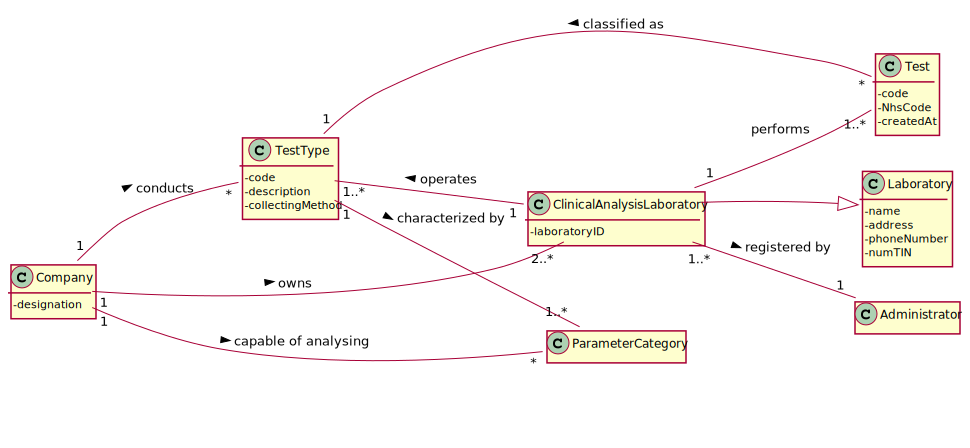

# US 008 - Register a new clinical analysis laboratory 
 
## 1. Requirements Engineering
 
*In this section, it is suggested to capture the requirement description and specifications as provided by the client as well as any further clarification on it. It is also suggested to capture the requirements acceptance criteria and existing dependencies to other requirements. At last, identfy the involved input and output data and depicted an Actor-System interaction in order to fulfill the requirement.* 
 
### 1.1. User Story Description
 
As an administrator, I want to register a new clinical analysis laboratory stating which
kind of test(s) it operates.
 
### 1.2. Customer Specifications and Clarifications 


**From the specifications document:**
>_Many Labs_ is an English company that (...) has a network of clinical analysis laboratories in England where analysis of blood (samples are collected) are performed, as well as Covid-19 tests.  
> 
> All _Many Labs_ clinical analysis laboratories perform clinical blood tests, and a subset of these laboratories also performs Covid-19 tests.
> 
> The set of _Many Labs_ clinical analysis laboratories form a network that covers all England, and it is responsible for collecting samples and interacting with clients.
> 
> The samples collected by the network of laboratories are then sent to the chemical laboratory located in the company headquarters and the chemical analysis are performed there.

**From the client clarifications:**
>**Question**: What kind of information does the company store about their employees and owned laboratories?  
> **Answer**: Each Clinical Analysis Laboratory is characterized by the following attributes:  
>Laboratory ID;  
> Name;  
> Address;  
> Phone Number;  
> TIN number.

You can read the whole discussion [here](https://moodle.isep.ipp.pt/mod/forum/discuss.php?d=7126).

>**Question**: Does it have any specific acceptance criteria you want to introduce?  
> **Answer**: For now I have nothing more to say about the acceptance criteria of US8.  

You can read the whole discussion [here](https://moodle.isep.ipp.pt/mod/forum/discuss.php?d=7744).

>**Question**: Do you prefer that when registering a new CLA that you can register the employees who will work there at the same time or do you prefer to be able to register first and fill in later? And in that order, would it be okay to register a new CLA without employees?   
> **Answer**: These are two different user stories in the requirements introduced in Sprint B. The application should include a functionality for creating CLAs and another one to register employees.  
> Each Receptionist and each Medical Lab Technician can work in any Clinical Analysis Laboratory of the Many Labs network.  
> 
>**Question**: Of all the information that we have about the CLA, what would be the bare minimum to be able to successfully register a new CLA?  
>**Answer**: All information is required.

You can read the whole discussion [here](https://moodle.isep.ipp.pt/mod/forum/discuss.php?d=7536#p10174).  

>**Question**: Is there a maximum limit of types of tests a clinical analysis laboratory can operate?  
>**Answer**: No.  
> 
>**Question**:We know through the specifications document that "All Many Labs clinical analysis laboratories perform clinical blood tests".
>My question therefore is: When creating a new Clinical Analysis Laboratory, should the system automatically record that it operates that type of test or should the person who is creating it select it manually while selecting other types of tests? Or other option?  
>**Answer**: The administrator should select, manually, all the types of tests to be performed by the Clinical Analysis Laboratory.  
 
You can read the whole discussion [here](https://moodle.isep.ipp.pt/mod/forum/discuss.php?d=7553#p10176).  

>**Question**: Which type/format has LaboratoryID, address, name, phone number, and TIN number on Clinical Analysis Laboratory?  
>**Answer**: Each Clinical Analysis Laboratory is characterized by the following attributes:  
>- Laboratory ID: five alphanumeric characters;  
>- Name: A string with no more than 20 characters;  
>- Address: A string with no more than 30 characters;  
>- Phone Number: 11 digit number;  
>- TIN number: 10 digit number; 
>- Type of tests performed by the lab.  

You can read the whole discussion [here](https://moodle.isep.ipp.pt/mod/forum/discuss.php?d=7636#p10191).  

>**Question**: Are two Clinical Analysis Laboratories with the same:  
>a) Laboratory ID OR  
>b) name OR  
>c) address OR  
>d) phone Number OR  
>e) TIN number
>allowed to exist?  
>
>**Answer**: Only the name of two CAL can be same.  

You can read the whole discussion [here](https://moodle.isep.ipp.pt/mod/forum/discuss.php?d=7911#p10390).  

>**Question**: when the administrator is registering a Clinical Analysis Laboratory and typing the information does he type the laboratory ID or is it generated by the system afterwards?  
>**Answer**: The Laboratory ID is introduced manually.  

You can read the whole discussion [here](https://moodle.isep.ipp.pt/mod/forum/discuss.php?d=7862#p10398).  


### 1.3. Acceptance Criteria

* **AC1:** All required field must be filled in.  
* **AC2:** The Laboratory ID must have five alphanumeric characters.  
* **AC3:** The name is a string with no more than 20 characters.  
* **AC4:** The address is a string with no more than 30 characters.
* **AC5:** The Phone Number is a 11 digit number.
* **AC6:** The TIN Number is a 10 digit number.
* **AC7:** Type of tests must be an attribute of the Clinical Analysis Laboratory.  


### 1.4. Found out Dependencies

There is a dependency to "US009 To specify a new type of test and its collecting methods" since at least a type of test (specifically the blood test) must exist to determine the type of test(s) the clinical analysis laboratory operates.

### 1.5 Input and Output Data  

**Input Data:**  

* Typed data:
    * a Laboratory ID
    * an Address
    * a Phone Number  
    * a TIN Number

* Selected data:
    * Determining type(s) of test    

**Output Data:**

* List of existing types of test
* (In)Success of the operation


### 1.6. System Sequence Diagram (SSD)


### 1.7 Other Relevant Remarks


The present US is held mainly in the beginning of the business a couple of times, as Clinical Analysis Laboratories are required for the business functioning in its very beginning. Apart from that, it will be held scarcely.  


## 2. OO Analysis

### 2.1. Relevant Domain Model Excerpt



### 2.2. Other Remarks

n/a


## 3. Design - User Story Realization 

### 3.1. Rationale

**The rationale grounds on the SSD interactions and the identified input/output data.**

| Interaction ID | Question: Which class is responsible for... | Answer  | Justification (with patterns)  |
|:-------------  |:--------------------- |:------------|:---------------------------- |
| Step 1: asks to register a new Clinical Analysis Laboratory 		 |  ...interacting with the actor?							 |  RegisterNewCalUI           |   Pure Fabrication: there is no reason to assign this responsibility to any existing class in the Domain Model.                           |
| 			  		 |	...coordinating the US? | RegisterNewCalController | Pure Fabrication: it refers to the Controller. there is no reason to assign this responsibility to any existing class in the Domain Model.                             |
| 			  		 |	...knowing who instantiates a new Clinical Analysis Laboratory? | Company | Creator (Rule 1): in the DM, Company owns Laboratory (and a Clinical Analysis Laboratory is part of Laboratory)                           |
| 			  		 |	...instantiating a new Clinical Analysis Laboratory? | ClinicalAnalysisLaboratoryStore | Creator (Rule 2): ClinicalAnalysisLaboratoryStore records/stores all Clinical Analysis Laboratory objects.                          |
| Step 2: requests data (laboratory ID, name, address, phone number, TIN number)  		 |	...asking the user for this data?						 | RegisterNewCalUI            | IE: responsible for user interaction.                             |
| Step 3: types requested data		 |	...validating the data locally (e.g.: mandatory vs. non-mandatory data)?						 |  ClinicalAnalysisLaboratory           |   IE: knows its own data.                           |
|               	 |	...saving the inputted data?						 |   ClinicalAnalysisLaboratory          | IE: The object created in Step 1 has its own data as well as inherits attributes from Laboratory class.                             |
| Step 4: shows types of test list and asks to select at least one   		 |	...knowing who has the responsability to show the types of test?					 |   Company      |  HC+LC: Company uses TestTypeStore.                     |
|                                 		 |	...knowing the types of test to show?						 |   TestTypeStore       |  Pure Fabrication: for low coupling reasons. There is no reason to assign this responsibility to any existing class in the Domain Model.                          |
| 		 |	...knowing who has the responsability to process the data and convert the Types of Test to Dto?					 |   TestTypeMapper      |  Pure Fabrication: to reduce coupling. There is no reason to assign this responsibility to any existing class in the Domain Model.                                |
| Step 5: selects type(s) of test  		 | ...saving the selected type(s) of test?							 | ClinicalAnalysisLaboratory            |   IE: object created in Step 1 operates a certain number of types of test.                           |
| Step 6: shows all data and requests confirmation            		 |	...validating the data globally (e.g.: duplicated)?						 |  Company           |   IE: knows all the ClinicalAnalysisLaboratory objects.                           |
| Step 7: confirms the data  		 |	...saving the created Clinical Analysis Laboratory?						 | Company          |   IE: records all the ClinicalAnalysisLaboratory objects.                           |
| Step 8: informs operation success  		 |	...informing operation success?						 | RegisterNewCalUI            | IE: responsible for user interaction                                 |

### Systematization ##

According to the taken rationale, the conceptual classes promoted to software classes are: 

* Company  
* Laboratory  
* ClinicalAnalysisLaboratory  

Other software classes (i.e. Pure Fabrication) identified:  

* RegisterNewCalUI  
* RegisterNewCalController  
* TestTypeStore
* TestTypeDto  
* TestTypeMapper    
* ClinicalAnalysisLaboratoryDto  
* LaboratoryDto  
* ClinicalAnalysisLaboratoryStore

## 3.2. Sequence Diagram (SD)


## 3.3. Class Diagram (CD)


# 4. Tests 

Before starting to implement the tests, it was practical to **create a text fixture**, because most tests require a commmon set of objects. Therefore:  

 * I declared instance variables for the common objects.  
 * I initialized these objects in a public void SetUp method annotated with  @Before, so that JUnit framework invokes that method before each test runs.  

**Class**: ClinicalAnalysisLaboratoryTest  
```
@Before
    public void setUp() {
        pcList = new ArrayList<>();
        p1 = new ParameterCategory("CODE1","Name");
        p2 = new ParameterCategory("CODE2","Name");
        pcList.add(p1);
        pcList.add(p2);
        t1 = new TestType("CODE3","Description","swab",pcList);
        t2 = new TestType("CODE4","Description","swab",pcList);
        selectedTT = new ArrayList<>();
        selectedTT.add(t1);
        selectedTT.add(t2);
    }
```

**Class**: CompanyTest  
```
@Before
    public void setUp() {
        pcList = new ArrayList<>();
        p1 = new ParameterCategory("CODE1","Name");
        p2 = new ParameterCategory("CODE2","Name");
        pcList.add(p1);
        pcList.add(p2);
        company = new Company("Many Labs");
        t1 = company.getTestTypeStore().createTestType("CODE3","Description","swab", pcList);
        t2 = company.getTestTypeStore().createTestType("CODE4","Description","swab", pcList);
        company.getTestTypeStore().saveTestType(t1);
        company.getTestTypeStore().saveTestType(t2);
        selectedTT = new ArrayList<>();
        selectedTT.add(t1);
        selectedTT.add(t2);
        testTypeCodes = new ArrayList<>();
        testTypeCodes.add("CODE3");
        testTypeCodes.add("CODE4");


        c1Dto = new ClinicalAnalysisLaboratoryDTO("CAL12",
                "CAL","Lisboa","91841378811","1234567890", testTypeCodes);
        c2Dto = new ClinicalAnalysisLaboratoryDTO("LAB23",
                "Laboratorio","Porto","91899998811","1239999890", testTypeCodes);
        c3Dto = new ClinicalAnalysisLaboratoryDTO("SON55",
                "SYNLAB","Guarda","00899998811","0039999890", testTypeCodes);
        c1 = company.createClinicalAnalysisLaboratory(c1Dto);
        c2 = company.createClinicalAnalysisLaboratory(c2Dto);
        c3 = company.createClinicalAnalysisLaboratory(c3Dto);
    }
```


### **Class**: ClinicalAnalysisLaboratoryTest 

**Test 1:** Check that it is not possible to create an instance of the ClinicalAnalysisLaboratory class with null values.  

```
@Test(expected = IllegalArgumentException.class)
public void ensureNullIsNotAllowed() {

        ClinicalAnalysisLaboratory instance = new ClinicalAnalysisLaboratory(null,
                null,null,null,null,null);
    }  
```  

**For each attribute** of the Clinical Analysis Laboratory (laboratory ID, name address, phone number, TIN number), I checked **it is not possible for them to be blank**.  
This encompasses three situations:  

 * Null  
 * Empty  
 * Whitespace  


For the list containing the types of test the Clinical Analysis Laboratory operates, it wasn't necessary to verifiy for the whitespace.  

**Test 2**: Check that it is not possible to create a Clinical Analysis Laboratory with a null laboratory ID.  
```
@Test(expected = IllegalArgumentException.class)
public void ensureAC2LaboratoryIDNotNull() {

        ClinicalAnalysisLaboratory instance = new ClinicalAnalysisLaboratory(null,
                "CAL","Lisboa","91841378811","1234567890", selectedTT);
    }  
```

**Test 3**: Check that it is not possible to create a Clinical Analysis Laboratory with an empty laboratory ID.  
```
@Test(expected = IllegalArgumentException.class)
public void ensureAC2LaboratoryIDNotEmpty() {

        ClinicalAnalysisLaboratory instance = new ClinicalAnalysisLaboratory("",
                "CAL","Lisboa","91841378811","1234567890", selectedTT);
    }  
```    
  
**Test 4**: Check that it is not possible to create a Clinical Analysis Laboratory with a whitespace laboratory ID.  

```
@Test(expected = IllegalArgumentException.class)
    public void ensureAC2LaboratoryIDNotWhiteSpace() {

        ClinicalAnalysisLaboratory instance = new ClinicalAnalysisLaboratory(" ",
                "CAL","Lisboa","91841378811","1234567890", selectedTT);
    }
```  

**For each attribute** of the Clinical Analysis Laboratory, I checked **they have the right length**.  

**Test 5**: Check that the it is not possible to create a Clinical Analysis Laboratory with a name with the wrong length (more than 20 characters).

```
@Test(expected = IllegalArgumentException.class)
public void ensureAC3NameWithRightLength() {

        ClinicalAnalysisLaboratory instance = new ClinicalAnalysisLaboratory("CAL12",
                "Clinical Laboratory ManyLabs ","Lisboa","91841378811","1234567890", selectedTT);
    }  
```  

**For each necessary attribute** of the Clinical Analysis Laboratory, I checked they **only contain the allowed characters.**  

 * Laboratory ID: alphanumeric  
 * Phone and TIN number: digits  


**Test 6**: Check that it is not possible to create a Clinical Analysis Laboratory with a laboratory ID that doesn't contain only alphanumeric characters.  
```
@Test(expected = IllegalArgumentException.class)
    public void ensureAC2LaboratoryIDIsAlphanumeric() {

        ClinicalAnalysisLaboratory instance = new ClinicalAnalysisLaboratory("C.L1@",
                "CAL","Lisboa","91841378811","1234567890", selectedTT);
    }
```  

**Test 7**: Check that it is not possible to create a Clinical Analysis Laboratory with a phone number that doesn't contain only digits.  
```
@Test(expected = IllegalArgumentException.class)
    public void ensureAC5PhoneNumberOnlyDigits() {

        ClinicalAnalysisLaboratory instance = new ClinicalAnalysisLaboratory("CAL12",
                "CAL","Lisboa","918413a7881","1234567890", selectedTT);
    }
```

#### Equals Method 
Finally, I checked if the **Equals method was functioning properly**.  

In order to do that, I had an instance of Clinical Analysis Laboratory which would be compared to another instance of that class with every attribute the same **except one**.  
Following next will be one of this tests.  

**Test 8**: Check that two Clinical Analysis Laboratories are different only because they have a different address.  
```
@Test
public void ensureNotEqualsObjectsWithDifferentAddress() {
        ClinicalAnalysisLaboratory object = new ClinicalAnalysisLaboratory("CAL12",
        "CAL","Lisboa","91841378811","1234567890", selectedTT);

        ClinicalAnalysisLaboratory objectOnlyWithDifferentAddress = new ClinicalAnalysisLaboratory("CAL12",
                "CAL","Porto","91841378811","1234567890", selectedTT);

        boolean resultDifferentAddress = object.equals(objectOnlyWithDifferentAddress);

        Assert.assertFalse(resultDifferentAddress);

    }
```

**Other tests to cover the rest of the branches of Equals method**

**Test 9**: Check that two objects aren't equal if they are from different classes.


```
@Before
public void setUp() {
  ...
  t1 = new TestType("CODE3","Description","swab",pcList);
  ...
}

@Test
public void ensureEqualsMethodObjectsFromDifferentClasses() {
  ClinicalAnalysisLaboratory c1 = new ClinicalAnalysisLaboratory("CAL12",
  "CAL","Lisboa","91841378811","1234567890", selectedTT);

  boolean resultDifferentClasses = c1.equals(t1);

  Assert.assertFalse(resultDifferentClasses);
}
```

**Test 10**: Check that a non null object is not equal to a null one.  

```
@Test
    public void ensureEqualsMethodNullObjectNotEqualToExistingObject() {
    
        ClinicalAnalysisLaboratory c1 = new ClinicalAnalysisLaboratory("CAL12",
                "CAL","Lisboa","91841378811","1234567890", selectedTT);
        ClinicalAnalysisLaboratory c2 = null;
    
        boolean resultWithNull = c1.equals(c2);
       
        Assert.assertFalse(resultWithNull);
    }
```


### **Class**: CompanyTest 

**Test 1**: Check that createClinicalAnalysisLaboratory method returns an instance of Clinical Analysis Laboratory correctly.

```
@Test
public void createClinicalAnalysisLaboratory() {
System.out.println("createClinicalAnalysisLaboratory (CompanyTest)");

        ClinicalAnalysisLaboratory expObj = new ClinicalAnalysisLaboratory("CAL12",
                "CAL","Lisboa","91841378811","1234567890", selectedTT);
        ClinicalAnalysisLaboratoryDTO calDto = new ClinicalAnalysisLaboratoryDTO("CAL12",
                "CAL","Lisboa","91841378811","1234567890", testTypeCodes);

        ClinicalAnalysisLaboratory obj = company.createClinicalAnalysisLaboratory(calDto);

        Assert.assertEquals(expObj, obj);
    }
```

**Test 2**: Check that a non registered Clinical Analysis Laboratory is saved.  
This means the Clinical Analysis Laboratory must have all the attributes different, besides its name. 
```
@Test
public void ensureDifferentClinicalAnalysisLaboratoryIsSaved() {
System.out.println("ensureDifferentClinicalAnalysisLaboratoryIsSaved (CompanyTest)");

        ClinicalAnalysisLaboratoryDTO c1Dto = new ClinicalAnalysisLaboratoryDTO("CAL12",
                "CAL","Lisboa","91841378811","1234567890", testTypeCodes);
        ClinicalAnalysisLaboratory c1 = company.createClinicalAnalysisLaboratory(c1Dto);
        company.saveClinicalAnalysisLaboratory(c1);

        ClinicalAnalysisLaboratoryDTO c2Dto = new ClinicalAnalysisLaboratoryDTO("LAB23",
                "Laboratorio","Outeiro","91841378810","1234467890", testTypeCodes);
        ClinicalAnalysisLaboratory c2 = company.createClinicalAnalysisLaboratory(c2Dto);
        boolean result = company.saveClinicalAnalysisLaboratory(c2);

        Assert.assertTrue(result);
    }
```

**Test 3**: Check that it ts not possible to save the same Clinical Analysis Laboratory more than once.
```
@Test(expected = IllegalArgumentException.class)
public void ensureClinicalAnalysisLaboratoryIsNotSavedExistingAlreadyTheSameObject() {
System.out.println("ensureClinicalAnalysisLaboratoryIsNotSavedExistingAlreadyTheSameObject (CompanyTest)");

        ClinicalAnalysisLaboratoryDTO c1Dto = new ClinicalAnalysisLaboratoryDTO("CAL12",
                "CAL","Lisboa","91841378811","1234567890", testTypeCodes);
        ClinicalAnalysisLaboratory c1 = company.createClinicalAnalysisLaboratory(c1Dto);
        company.saveClinicalAnalysisLaboratory(c1);

        boolean result = company.saveClinicalAnalysisLaboratory(c1);
        
        Assert.assertFalse(result);
    }
```

**Test 4**: Check that it is not possible to register a Clinical Analysis Laboratory equal to a already registered Clinical Analysis Laboratory.
```
@Test(expected = IllegalArgumentException.class)
public void ensureClinicalAnalysisLaboratoryIsNotSavedExistingEqualObject() {
System.out.println("ensureClinicalAnalysisLaboratoryIsNotSavedExistingEqualObject (CompanyTest)");

        ClinicalAnalysisLaboratoryDTO c1Dto = new ClinicalAnalysisLaboratoryDTO("CAL12",
                "CAL","Lisboa","91841378811","1234567890", testTypeCodes);
        ClinicalAnalysisLaboratory c1 = company.createClinicalAnalysisLaboratory(c1Dto);
        ClinicalAnalysisLaboratoryDTO c2Dto = new ClinicalAnalysisLaboratoryDTO("CAL12",
                "CAL","Lisboa","91841378811","1234567890", testTypeCodes);
        ClinicalAnalysisLaboratory c2 = company.createClinicalAnalysisLaboratory(c2Dto);
        company.saveClinicalAnalysisLaboratory(c1);

        boolean result = company.saveClinicalAnalysisLaboratory(c2);

        Assert.assertFalse(result);
    }
```

**Test 5**: Check that it is not possible to save a null Clinical Analysis Laboratory.
```
@Test
public void ensureNullClinicalAnalysisLaboratoryIsNotSaved() {
System.out.println("ensureNullClinicalAnalysisLaboratoryIsNotSaved (CompanyTest)");

        boolean result = company.saveClinicalAnalysisLaboratory(null);

        Assert.assertFalse(result);
    }
```

The goal of the following tests I implemented was to check that **no Clinical Analysis Laboratory is saved** if it has the **same attribute** as an already registered Clinical Analysis Laboratory.  
This does **not** apply to the **name** or **type of tests** attribute.  

**Test 6**: Check that it is not possible to save a Clinical Analysis Laboratory with a Phone Number already registered in the system.  
```
@Test(expected = IllegalArgumentException.class)
public void ensureNoCalWithDuplicatedPhoneNumberIsNotSaved() {
System.out.println("ensureNoCalWithDuplicatedPhoneNumberIsNotSaved");

        company.saveClinicalAnalysisLaboratory(c1);
        company.saveClinicalAnalysisLaboratory(c2);
        company.saveClinicalAnalysisLaboratory(c3);

        ClinicalAnalysisLaboratoryDTO c0Dto = new ClinicalAnalysisLaboratoryDTO("MEL23",
                "BMAC","Bragança","91899998811","1777767890", testTypeCodes);
        ClinicalAnalysisLaboratory c0 = company.createClinicalAnalysisLaboratory(c0Dto);

        boolean result = company.saveClinicalAnalysisLaboratory(c0);
    }
```


# 5. Construction (Implementation)

*In this section, it is suggested to provide, if necessary, some evidence that the construction/implementation is in accordance with the previously carried out design. Furthermore, it is recommeded to mention/describe the existence of other relevant (e.g. configuration) files and highlight relevant commits.*

*It is also recommended to organize this content by subsections.* 

## Class RegisterNewCalController

		public boolean createClinicalAnalysisLaboratory(ClinicalAnalysisLaboratoryDTO calDto) {
        this.cal = this.company.createClinicalAnalysisLaboratory(calDto);
        return this.company.validateClinicalAnalysisLaboratory(cal);
      }


      public boolean saveClinicalAnalysisLaboratory(){
          return this.company.saveClinicalAnalysisLaboratory(cal);
      }

      public List<TestTypeDTO> getTestTypes() {
          TestTypeStore storeTest = this.company.getTestTypeStore();
          List<TestType> listTestType = storeTest.getTestTypes();
  
          TestTypeMapper mapper = new TestTypeMapper();
          return mapper.toDTO(listTestType);
        }

## Class Company


		public ClinicalAnalysisLaboratory createClinicalAnalysisLaboratory(ClinicalAnalysisLaboratoryDTO calDTO) {
        TestTypeStore storeTest = getTestTypeStore();
        List<TestType> selectedTT = storeTest.getTestTypesByCode(calDTO.getTestTypeCodes());

        return new ClinicalAnalysisLaboratory(calDTO.getLaboratoryID(), calDTO.getName(),
                calDTO.getAddress(), calDTO.getPhoneNumber(), calDTO.getNumTIN(), selectedTT);
    }

    public boolean validateClinicalAnalysisLaboratory(ClinicalAnalysisLaboratory cal){
        if(cal == null)
            return false;
        checkCalDuplicates(cal);
        return ! this.calList.contains(cal);
    }

    public boolean saveClinicalAnalysisLaboratory(ClinicalAnalysisLaboratory cal){
        if (!validateClinicalAnalysisLaboratory(cal))
            return false;

        return this.calList.add(cal);
    }

    public void checkCalDuplicates(ClinicalAnalysisLaboratory cal) {
        for (ClinicalAnalysisLaboratory item : calList) {
            if(cal.getLaboratoryID().equalsIgnoreCase(item.getLaboratoryID()))
                throw new IllegalArgumentException("Laboratory ID already registered in the system.");
            if(cal.getAddress().equalsIgnoreCase(item.getAddress()))
                throw new IllegalArgumentException("Address already registered in the system.");
            if(cal.getPhoneNumber().equals(item.getPhoneNumber()))
                throw new IllegalArgumentException("Phone Number already registered in the system.");
            if(cal.getNumTIN().equals(item.getNumTIN()))
                throw new IllegalArgumentException("TIN Number already registered in the system.");
        }
    }


# 6. Integration and Demo

To create a Clinical Analysis Laboratory, it is necessary to know the list of test types available in the system.  
Therefore, in order to reduce coupling, it was created a TestTypeDto as well as a TestTypeMapper to process the data and convert the list of test types to a Dto.  

**In Sprint C, it was added a ClinicalAnalysisLaboratoryStore** to reduce the responsabilities the Company has.  


# 7. Observations

Clinical Analysis Laboratory has many arguments passing through layers, therefore a DTO could make the maintenance easier.